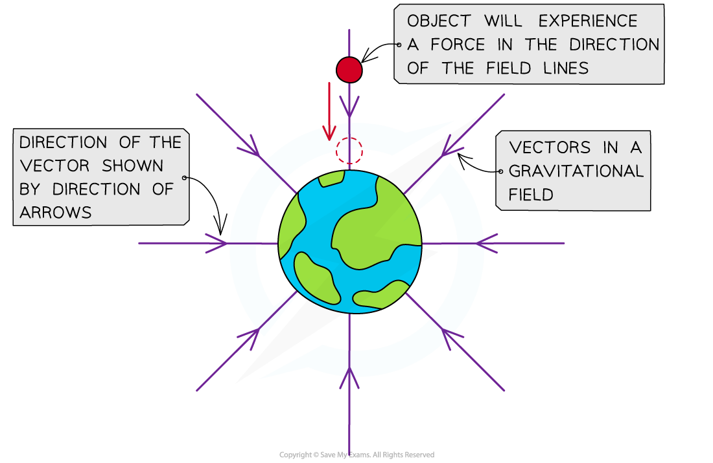

# Gravitational Fields

## Gravitational Fields

> **Spec point** — `spcpt_2MtrFVB9Rx6HrcdN`

## Gravitational Fields

- Generally, a **force field** is a region of space in which an object will experience a **force**
- A **gravitational field, **therefore, is a region of space in which any object with **mass** experiences a **gravitational force**
- The Sun, for example, creates a gravitational field around it

  - The Earth, which has mass, experiences the gravitational force due to the Sun
  - This gravitational force keeps the Earth in orbit around the Sun
- Additional effects of the Moon and Sun's gravitational fields can be seen on Earth, such as the cause of tides

#### Direction of a Gravitational Field

- The direction of a gravitational field can be represented as a ***vector***, the direction of which must be determined by inspection
- The direction of the vector shows the direction of the gravitational force that would be exerted on a mass if it was placed at that position in the field
- These vectors are known as **field lines **(or 'lines of force'), which are represented by arrows

  - Therefore, gravitational field lines also show the direction of **acceleration** of a mass placed in the field
- Gravitational field lines are therefore directed toward the centre of mass of a body

  - This is because the gravitational force is **attractive**
  - Therefore, masses always attract each other via the gravitational force
- The gravitational field around a point mass will be **radial** in shape and the field lines will always point towards the centre of mass

***The direction of the gravitational field is shown by the vector field lines***
