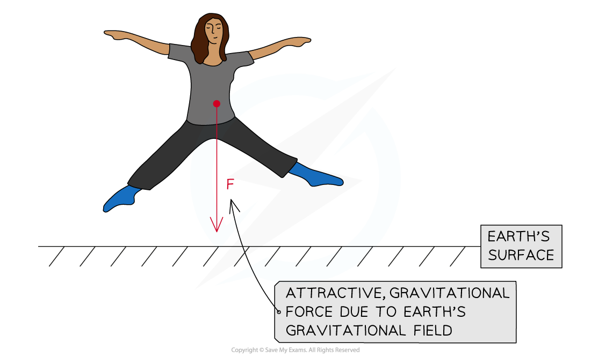

# Gravitational Field Strength

## Gravitational Field Strength

> **Spec point** — `spcpt_GWnsxg6SkTWbc6Hz`

## Gravitational Field Strength

- There is a universal force of attraction between all matter with **mass**

  - This force is known as the ‘force due to gravity’ or the **weight**
- The Earth’s gravitational field is responsible for the weight of all objects on Earth

***The Earth's gravitational field produces an attractive force F, which is equal and opposite to the attractive force produced by the person's gravitational field***

- The **gravitational field strength** *g* at a point is defined as force *F* per unit mass *m* of an object at that point:

- Where:

  - *g* = *gravitational field strength* (N kg–1)
  - *F* = force due to gravity, or weight (N)
  - *m* = mass (kg)

- This equation shows that:

  - The larger the mass of an object, the greater its pull on another mass
  - On planets with a large value of *g*, the gravitational force per unit mass is **greater** than on planets with a smaller value of *g*
- An object's mass remains the same at all points in space

  - However, on planets such as Jupiter, the weight of an object will be a lot greater than on a less massive planet, such as Earth
  - This means the gravitational force would be so high that humans, for example, would not be able to fully stand up (or, even worse...)

***The weight force on Jupiter would be so large that even standing upright would be difficult***

- Factors that affect the gravitational field strength at the surface of a planet are:

  - The **radius** (or diameter) of the planet
  - The **mass** (or density) of the planet

> **Worked Example**
> Calculate the mass of an object with weight 10 N on Earth.
> 
> **Answer:**
> 
> 

> **Exam Hint**
> There is a big difference between *g* and *G* (sometimes referred to as ‘little g’ and ‘big G’ respectively).
> 
> - *g* is the gravitational field strength, which varies depending on the size of the mass *M* producing the gravitational field and the distance *r*  from its centre of mass
> - *G* is Newton’s Universal Gravitational Constant, which always has a value of 6.67 × 10–11 N m2 kg–2
> 
> In addition, remember the equation density *ρ* = mass *m* ÷ volume *V, *which may come in handy with calculations where the density of some object is given, rather than its mass!
