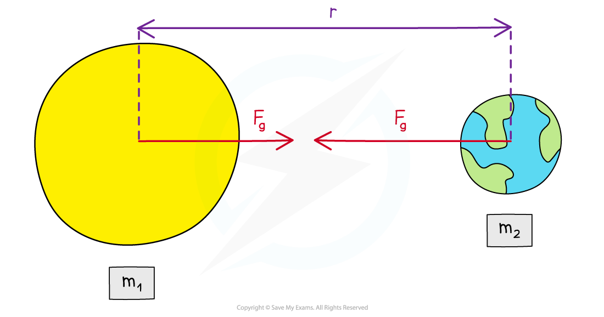

# Newton’s Law of Universal Gravitation

## Newton's Law of Universal Gravitation

> **Spec point** — `spcpt_5Ch2bCxjwxVGnVbq`

## Newton's Law of Universal Gravitation

- The gravitational force between two masses, e.g., between the Earth and the Sun, is defined by Newton’s Law of Universal Gravitation
- Newton’s Law of Universal Gravitation states: **The gravitational force *****F*****G**** between two masses *****m*****1**** and *****m*****2**** is proportional to the product of their masses and inversely proportional to the square of their separation, *****r***
- In equation form, this is written as:

- Where:

  - *F**G* = gravitational force between two masses (N)
  - *G* = *Newton’s gravitational constant*
  - *m**1* and *m**2* = mass of body 1 and mass of body 2 (kg)
  - *r* = distance between the centre of the two masses (m)
- The 1/*r*2 relation is called the ‘inverse square law’

  - This means that if the distance between two masses **doubles**, *r* becomes *2r*
  - Therefore, 1/*r*2 becomes 1/(2*r*)2, which is equal to 1/4*r*2
  - Hence, the gravitational force between the two masses **reduces** by a factor of **four**

***The gravitational force between two masses is defined by Newton’s Law of Universal Gravitation***

> **Worked Example**
> A satellite with mass 6500 kg is orbiting the Earth at 2000 km above the Earth's surface. The gravitational force between them is 37 kN.
> 
> Calculate the mass of the Earth.
> 
> (Radius of the Earth = 6400 km)
> 
> **Answer:**
> 
> 

> **Exam Hint**
> A common mistake in exams is to forget to **add together** the distance from the surface of the planet and its radius to obtain the value of *r*. The distance *r* is measured between the **centre** of each mass, which is from the **centre** of the planet to the centre of the satellite!
> 
> Another common mistake is forgetting that the distance between masses *m*1 and *m*2 is **squared**. Remember this whenever you use Newton's Law of Universal Gravitation!
