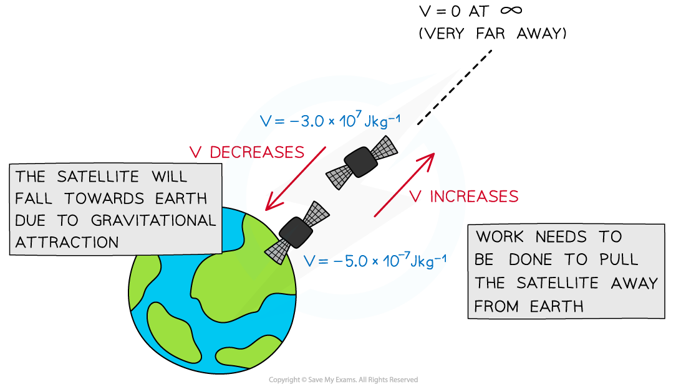

# Gravitational Potential for a Radial Field

## Gravitational Potential for a Radial Field

> **Spec point** — `spcpt_dbsK87zkbpW5jrgC`

## Gravitational Potential for a Radial Field

#### Near the Earth's Surface

- The gravitational potential energy (G.P.E) is the energy an object has when lifted off the ground given by the familiar equation:

**G.P.E = *****mg*****Δ*****h***

- When using this equation, the G.P.E on the surface of the Earth is taken to be zero

  - This means **work is done** to lift the object
- This equation is **only** used for objects that are near the Earth's surface

  - This is because, near Earth's surface, the gravitational field is approximated to be **uniform**
  - Far away from the Earth's surface, the gravitational field is **radial** because the Earth is a **sphere**

#### In a Radial Field

- In a radial field, G.P.E is defined as: **The energy an object possesses due to its position in a gravitational field**
- The gravitational potential at a point is the **gravitational potential energy per unit mass** at that point
- Gravity is always attractive, so work must be done on a mass to move it away to a point infinitely far away from every other mass

  - 'Infinity' is the point at which the gravitational potential is **zero**
  - Therefore, since the potential energy of all masses **increases** as work is done on them to move them infinitely far away, the value of the potential is always **negative**
- Gravitational potential energy is defined as: **The work done per unit mass in bringing a test mass from infinity to a defined point**
- It is represented by the symbol, *V* and is measured in **J kg****–1**

- Gravitational potential *V*grav can be calculated at a distance *r* from a mass *M* using the equation:

$V_{grav}=-\frac{GM}{r}$

- Where:

  - *V**grav* = gravitational potential (J kg–1)
  - *G* = *Newton’s gravitational constant*
  - *M* = mass of the body producing the gravitational field (kg)
  - *r* = distance from the centre of the mass to the *point mass* (m)

- This means that the gravitational potential is negative on the surface of a mass (such as a planet), and **increases** with distance from that mass (becomes less negative)
- Work has to be done **against** the gravitational pull of the planet to take a unit mass **away** from the planet
- The gravitational potential at a point depends on the mass of the object producing the gravitational field and the distance the point is from that mass

***Gravitational potential decreases as the satellite moves closer to the Earth***

> **Worked Example**
> Calculate gravitational potential at the surface of Mars.
> 
> Radius of Mars = 3400 km
> 
> Mass of Mars = 6.4 × 1023 kg
> 
> **Answer:**
> 
> **Step 1: Write the gravitational potential equation**
> 
> $V_{grav}=-\frac{GM}{r}$
> 
> **   Step 2: Substitute known quantities**
> 
> $V_{grav}=-\frac{(6.67\times10^{-11})\times(6.4\times10^{23})}{3400\times10^{3}}$**= –**1.3 × 107 J kg–1

> **Exam Hint**
> The equation for gravitational potential in a radial field looks very similar to the equation for gravitational field strength in a radial field, but there is a **very important difference**! Remember, for gravitational potential:
> 
> $V_{grav}=-\frac{GM}{r}$ so $V_{grav}\propto\frac{1}{r}$
> 
> However, for gravitational field strength:
> 
> $g=\frac{GM}{r^{2}}$ so $g\propto\frac{1}{r^{2}}$
> 
> Additionally, remember that both *V*grav and *g* are measured from the **centre of the mass *****M***** **causing the field!
