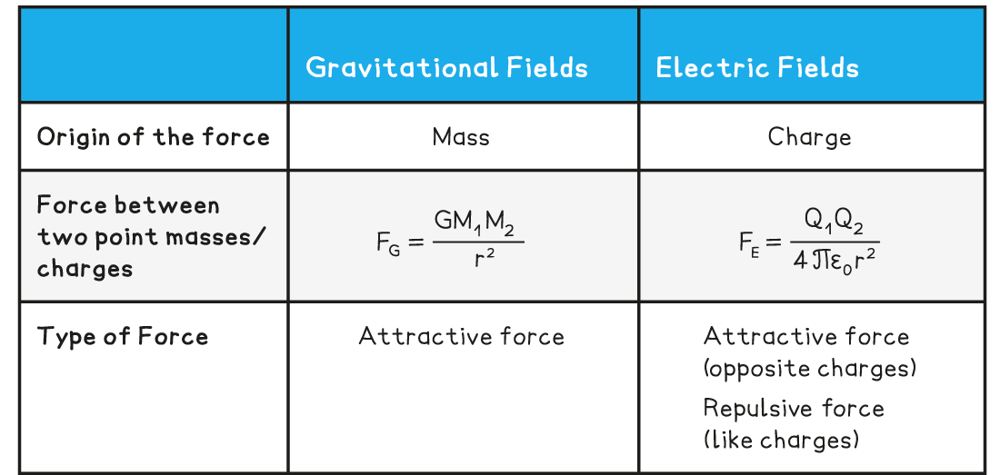
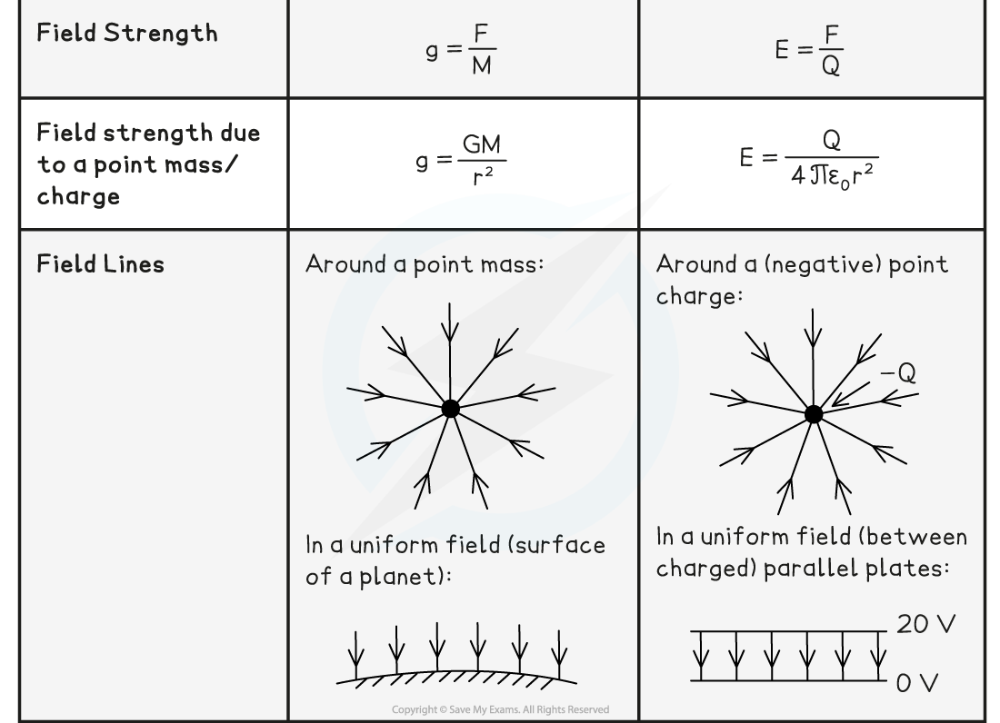
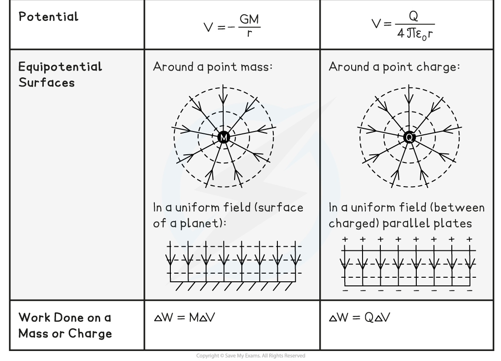

# Comparing Electric & Gravitational Fields

## Comparing Electric & Gravitational Fields

> **Spec point** — `spcpt_ChMHWScQrj9nbbTB`

## Comparing Electric & Gravitational Fields

- The similarities and differences between gravitational and electrostatic forces are listed in the table below:

**Table Comparing G and E Fields **

#### Similarities between Gravitational & Electric Fields

- The key **similarities** are:

  - The magnitude of the gravitational and electrostatic force between two point masses or charges follow ***inverse square law*** relationships
  - The field lines around a **spherical masses** and **spherical charges** are **radial**
  - The field lines in a **uniform** gravitational and electric field are identical (they are **parallel** and **equally** **spaced**)
  - The ***gravitational field strength*** and ***electric field strength*** both have a $\frac{1}{r^{2}}$ relationship in a **radial field**
  - The ***gravitational potential*** and ***electric potential*** both have a $\frac{1}{r}$ relationship

#### Differences between Gravitational & Electric Fields

- The key **differences** are:

  - The gravitational force acts on particles with **mass** whilst the electrostatic force acts on particles with **charge**
  - The gravitational force is **always **attractive whilst the electrostatic force can be attractive **or** repulsive
  - The gravitational potential is **always** negative whilst the electric potential can be either negative **or** positive

> **Exam Hint**
> This topic could require a long structured-answer, so practice summing up this information as you would for a 6 mark question.
