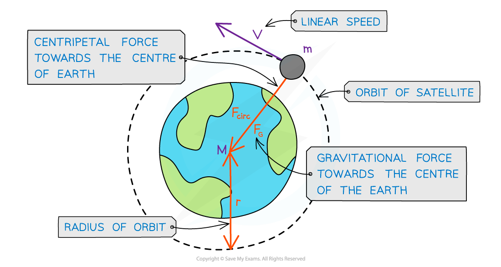

# Orbital Motion

## Orbital Motion

> **Spec point** — `spcpt_WSF6xzR2c4xfypnT`

## Orbital Motion

#### Newton's Law of Gravitation & Orbits

- Since most planets and satellites have a near circular orbit, the gravitational force *F**G* between the sun or another planet provides the *centripetal force* needed to stay in an orbit

  - This centripetal force is **perpendicular** to the velocity of the planet
- Consider a satellite with mass *m* orbiting Earth with mass *M* at a distance *r* from the centre travelling with linear speed *v*

  - Equating the gravitational force from Newton's Law of Gravitation to the centripetal force for a planet or satellite in orbit gives:

***F******G***** = *****F******centripetal***

- The mass of the satellite *m* will cancel out on both sides to give:

- Where:

  - *v* = linear speed of the mass in orbit (m s–1)
  - *G* = *Newton's Gravitational Constant* (N m2 kg–2)
  - *M* = mass of the object being orbited (kg)
  - *r* = orbital radius (m)
- This means that all satellites, whatever their mass, will travel at the same speed *v* in a particular orbital radius *r*

#### Newton's Laws of Motion & Orbits

- Newton's first law of motion states that a body remain at rest or at constant velocity unless a **resultant force** acts on it
- Bodies in orbit do have a resultant force acting on them

  - This is the gravitational force due to the mass *M* being orbited
  - This force is a **centripetal force** because it acts towards the centre of *M*, perpendicular to the velocity of the planet or satellite
- Therefore, since the direction of a planet or satellite orbiting in circular motion is constantly changing, it must be **accelerating**

  - This is called **centripetal acceleration**

***A satellite in orbit around the Earth travels in circular motion***

#### Time Period & Orbital Radius Relation

- A planet or a satellite orbits in circular motion

  - Therefore, its orbital time period *T* is the time taken to travel the circumference of the orbit 2π*r*
  - This means the linear speed, or orbital speed *v* is:

- This is a result of the well-known equation speed = distance / time
- Equating the two equations for orbital speed gives:

- Squaring out the brackets and rearranging for *T*2 gives the equation relating the time period *T* and orbital radius *r*:

- Where:

  - *T* = *time period* of the orbit (s)
  - *r *=* *orbital radius (m)
  - *G* = *Newton's Gravitational Constant* (N m2 kg–2)
  - *M* = mass of the object being orbited (kg)

- The equation shows the relationship between the **orbital** **period** and the **orbital** **radius** for any planet or satellite in orbit
- It is summarised mathematically as:

> **Worked Example**
> A binary star system constant of two stars orbiting about a fixed point **B**.The star of mass *M**1* has a circular orbit of radius *R**1* and mass *M**2* has a radius of *R**2*. Both have linear speed *v* and an angular speed ⍵ about **B**.
> 
> 
> 
> State the following formula, in terms of *G*, *M**2*, *R**1* and *R**2*
> 
> (i) The angular speed ⍵ of *M**1*
> 
> (ii) The time period *T* for each star in terms of angular speed ⍵
> 
> **Answer:**
> 
> **Part (i)**
> 
> 
> 
> **Part (ii)**
> 
> 

> **Exam Hint**
> This worked example helps you practise two crucial techniques that are often examined:
> 
> 1. The centripetal force is expressed as $\frac{mv^{2}}{r}$ or equivalently as $mω^{2}r$. In our case the angular speed is given in the question, so it is best to use the latter expression $mω^{2}r$ when equating the centripetal force to the gravitational force.
> 2. The gravitational force is given as $\frac{GMm}{r^{2}}$but note that the distance *r* in this question is given as a sum, *R*1 + *R*2*. *You should remember that *r* is defined as the distance between the **centre of masses **of *M* and *m*, therefore, *r* = *R*1 + *R*2 and so *r*2 = (*R*1 + *R*2)2.
