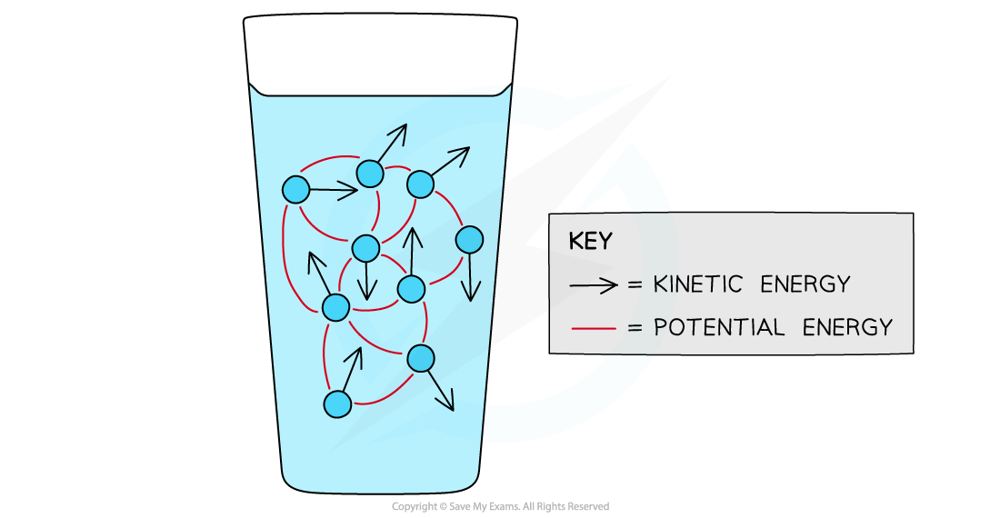
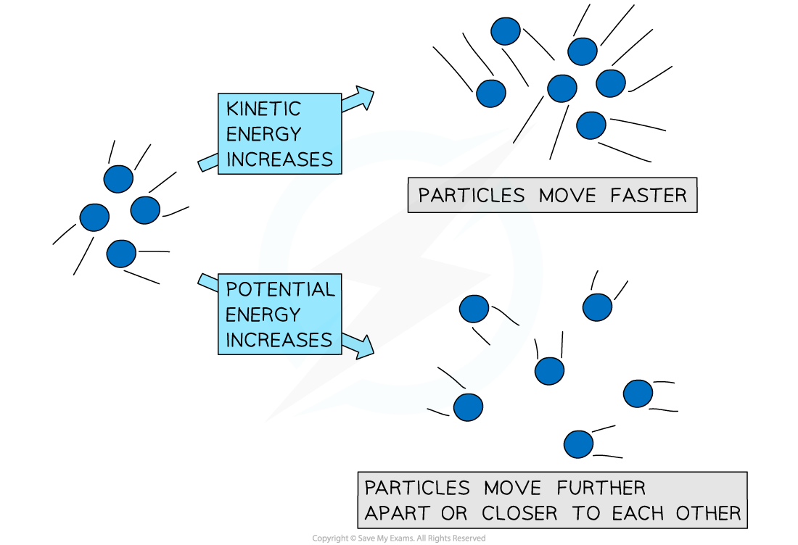

# Internal Energy

## Internal Energy

> **Spec point** — `spcpt_C4D65t6bSjpKqytm`

## Internal Energy

- Energy can be classified into two forms: kinetic or potential energy
- The molecules of all substances contain both kinetic and potential energies

  - Kinetic energy is due to the speed of the molecules and gives the material its temperature
  - Potential energy is due to the separation between the molecules and their position within the structure

- The amount of kinetic and potential energy a substance contains depends on its phase of matter (solid, liquid or gas)

  - This is known as the **internal energy**
- The internal energy of a substance is defined as: **The sum of the kinetic and potential energies of all the molecules within a given mass of a substance **

- The symbol for internal energy is *U*, with units of **Joules** (J)
- Particles are randomly distributed, meaning they all have different speeds and separations
- The internal energy of a system is determined by:

  - **Temperature** (higher temperature, higher kinetic energy and vice versa)
  - The **random motion** of molecules
  - The **phase of matter**: gases have the highest internal energy, solids have the lowest
  - **Intermolecular forces** between the particles (greater intermolecular forces, higher potential energy and vice versa) - this is linked to the phase (solid, liquid, gas) that the matter is in

- The internal energy of a system can increase by:

  - **Doing work** on it
  - **Adding heat** to it
- The internal energy of a system can decrease by:

  - **Losing heat** to its surroundings
  - **Changing state** from a gas to a liquid or a liquid to a solid

> **Exam Hint**
> Always remember internal energy is made up of both the kinetic and potential energy of the particles in a substance.
