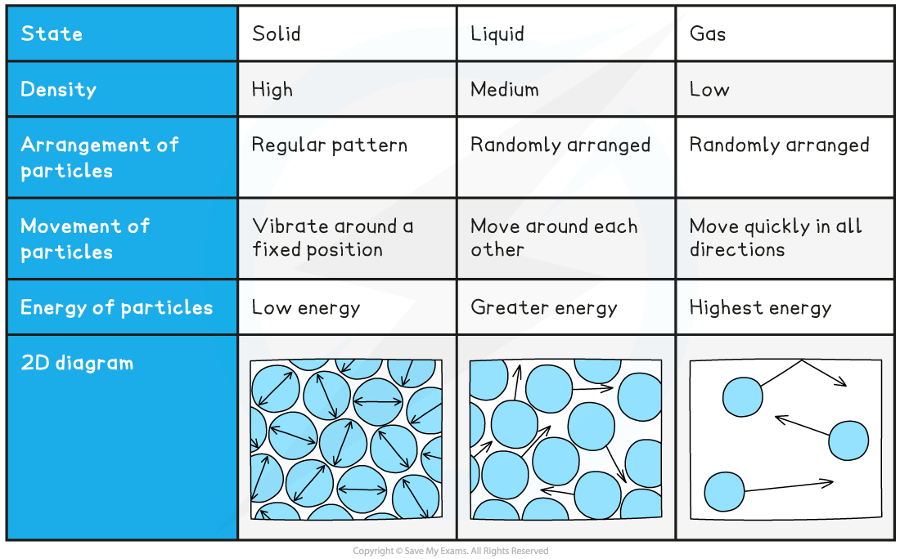
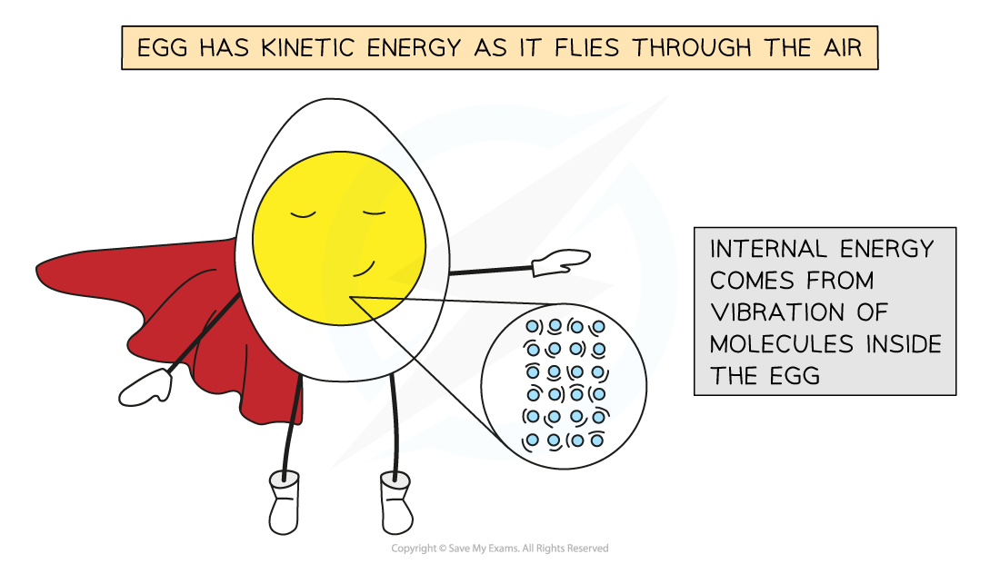

# Temperature & Absolute Zero

## Absolute Zero

> **Spec point** — `spcpt_bbH3n3jkb3CtwcqR`

## Absolute Zero

- On the thermodynamic (Kelvin) temperature scale, absolute zero is defined as: **The lowest temperature possible. Equal to 0 K or -273.15 °C **
- It is not possible to have a temperature lower than 0 K

  - This means a temperature in Kelvin will **never** be a negative value
- Absolute zero is defined  as: **The temperature at which the molecules in a substance have zero kinetic energy **
- This means for a system at 0 K, it is not possible to remove any more energy from it
- Even in space, the temperature is roughly 2.7 K, just above absolute zero

#### Using the Kelvin Scale

- To convert between temperatures *θ* in the Celsius scale, and T in the Kelvin scale, use the following conversion:

***θ *****/ ****°****C = T / K − 273.15**

**T / K = *****θ *****/ ****°****C + 273.15**

***Conversion chart relating the temperature on the Kelvin and Celsius scales***

- The divisions on both scales are equal. This means: **A change in a temperature of 1 K is equal to a change in temperature of 1 °C**
- This is why when using the specific heat capacity equation

**Δ*****E***** = *****mc*****Δ*****θ***

- Δθ does not require the temperature to be in either unit

  - This is because the difference in temperature between two values whether in Kelvin or Celsius will be exactly the same

> **Worked Example**
> In many ideal gas problems, room temperature is considered to be 300 K. What is this temperature in Celsius?
> 
> **Answer:**
> 
> **Step 1:** **Kelvin to Celsius equation**
> 
> *θ */ °C = T / K − 273.15
> 
> **Step 2:** **Substitute in value of 300 K**
> 
> 300 K − 273.15 = 26.85 °C

## Kinetic Energy & Temperature

> **Spec point** — `spcpt_CZ3tHX45tzYXbkwv`

## Kinetic Energy & Temperature

- Heating an object causes its temperature to rise
- According to **kinetic theory** when energy is supplied to an object the molecules in that object receive the energy as kinetic energy and move faster

  - In solids this is in the form of **vibrations**
  - In a gas, molecules move quickly around their container
  - This kinetic energy determines the temperature of the substance.

**Solid, Liquid & Gas Summary Table**

- The internal kinetic energy on the atomic scale is separate from the overall movement of an object
- Molecules vibrate within the material and do not cause it to move

  - For example, an egg being thrown through the air has kinetic energy because of the movement of the whole egg and not because of the movement of the individual molecules inside it.

- Taking energy away from the molecules of a substance causes its temperature to become lower

  - In a situation where kinetic energy is continuously being taken away from a collection of molecules, theoretically there would be a moment where all the kinetic energy has been removed from the substance
  - This is when the substance reaches absolute zero, which remains theoretical point, having never been achieved by scientists in a laboratory

> **Exam Hint**
> If you forget in the exam whether it’s +273.15 or −273.15, just remember that 0 °C = 273.15 K. This way, when you know that you need to +273.15 to a temperature in degrees to get a temperature in Kelvin. For example:  0 °C + 273.15 = 273.15 K.
> 
> Also remember that C is nearer the beginning of the alphabet to K. So to go back from K to C we must subtract.
