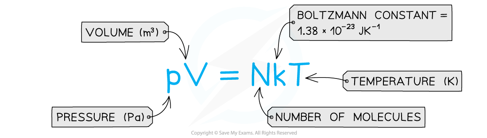
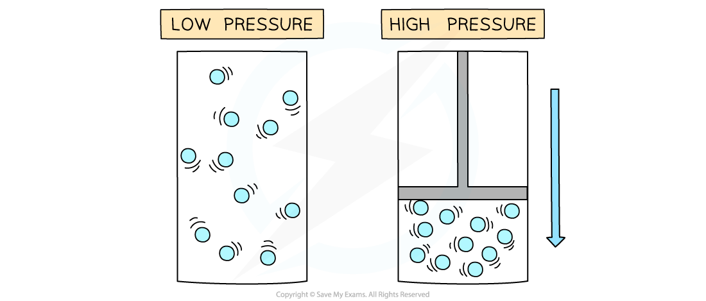
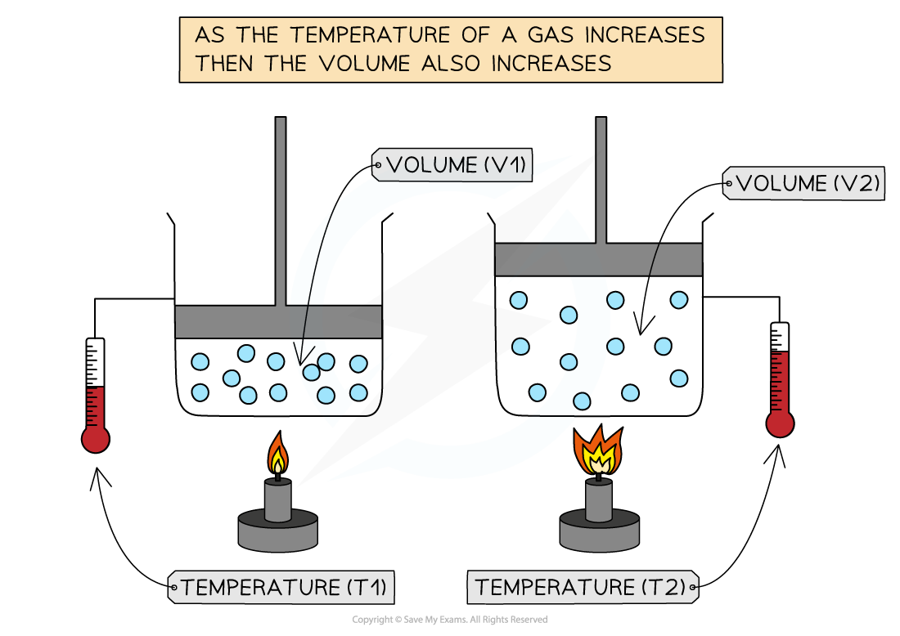
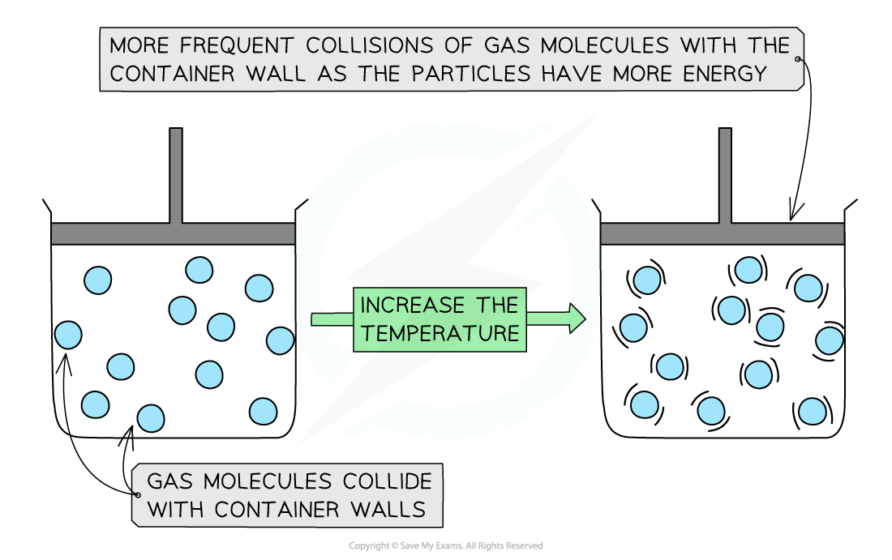

# Ideal Gas Equation

## Ideal Gas Equation

> **Spec point** — `spcpt_dZNyfcWTcTBwkbpb`

## Ideal Gas Equation

- When calculating for gases, assume that the gas is an *ideal gas*
- The ***three gas laws**** *(explained below) can be combined to create one equation in terms of pressure, volume, temperature and amount of gas.

#### The Boltzmann Constant, k

- The Boltzmann constant *k *is used in the ideal gas equation and is defined as:

$k=\frac{R}{N_{A}}$

- Where:

  - R = *molar gas constant*
  - NA = *Avogadro’s constant*
- Boltzmann’s constant therefore has a value of

$k=\frac{8.31}{6.02\times10^{23}}=1.38\times10^{-23}JK^{-1}$

- The Boltzmann constant relates the properties of microscopic particles (e.g. kinetic energy of gas molecules) to their macroscopic properties (e.g. temperature)

  - This is why the units are J K-1
- Its value is very small because the increase in kinetic energy of a molecule is very small for every incremental increase in temperature

#### The Gas Laws

- The ideal gas laws are the experimental relationships between pressure (*P*), volume (*V*) and temperature (*T*) of an ideal gas
- The mass and the number of molecules of the gas is assumed to be constant for each of these quantities

#### Boyle’s Law

- If the temperature *T* of an ideal gas is constant, then **Boyle’s Law** is given by:

- This means the pressure is **inversely proportional **to the volume of a gas

**Pressure increases when a gas is compressed**

- The relationship between the pressure and volume for a fixed mass of gas at constant temperature can also be written as:

**P****1****V****1**** = P****2****V****2**

- Where:

  - P1 = initial pressure (Pa)
  - P2 = final pressure (Pa)
  - V1 = initial volume (m3)
  - V2 = final volume (m3)

#### Charles's Law

- If the pressure *P* of an ideal gas is constant, then **Charles’s law** is given by:

**V ∝ T**

- This means the volume is **proportional **to the temperature of a gas 

  - The relationship between the volume and thermodynamic temperature for a fixed mass of gas at constant pressure can also be written as:
- Where:

  - *V**1* = initial volume (m3)
  - *V**2* = final volume (m3)
  - *T**1* = initial temperature (K)
  - *T**2* = final temperature (K)

#### Pressure Law

- If the volume *V* of an ideal gas is constant, the **Pressure law** is given by:

***P***** ∝ *****T***

- This means the pressure is **proportional** to the temperature

  - The relationship between the pressure and thermodynamic temperature for a fixed mass of gas at constant volume can also be written as:

- Where:

  - *P**1* = initial pressure (Pa)
  - *P**2* = final pressure (Pa)
  - *T**1* = initial temperature (K)
  - *T**2* = final temperature (K)

> **Worked Example**
> A storage cylinder of an ideal gas has a volume of 8.3 × 103 cm3. The gas is at a temperature of 15oC and a pressure of 4.5 × 107 Pa. Calculate the number of molecules of gas in the cylinder.
> 
> **Answer:**
> 
> **Step 1: Write down the ideal gas equation**
> 
> $pV=NkT$
> 
> **Step 2: Rearrange the equation for the number of molecules, *****N***
> 
> $N=\frac{pV}{kT}$
> 
> **Step 3: Substitute in values**
> 
> $V=8.3\times10^{3}cm^{3}=(8.3\times10^{3})\times10^{-6}=8.3\times10^{-3}m^{3}$
> 
> `T space equals space 15 space C presuperscript o space plus space 273.15 space equals space 288.15 space K`
> 
> `N space equals space fraction numerator left parenthesis 4.5 space cross times space 10 to the power of 7 right parenthesis space cross times space left parenthesis 8.3 space cross times space 10 to the power of negative 3 end exponent right parenthesis over denominator open parentheses 1.38 space cross times space 10 to the power of negative 23 end exponent close parentheses space cross times space 288.15 end fraction space equals space 9.4 space cross times space 10 to the power of 25 space end exponent molecules space left parenthesis 2 space s f right parenthesis`

> **Exam Hint**
> After you solve a problem using any of the gas laws (or all of them combined), always check whether your final result makes physical sense - e.g. if you are asked to calculate the final pressure of a fixed mass of gas being heated at constant volume, your result must be greater than the initial pressure given in the problem (since Gay- Lussac's law states that pressure and absolute temperature are directly proportional at constant volume).
