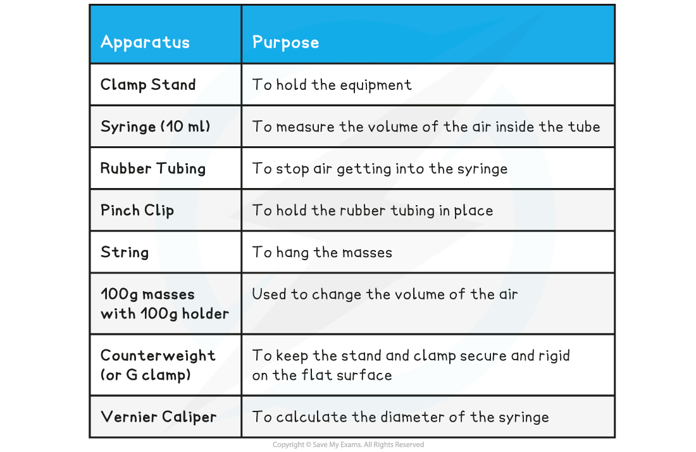
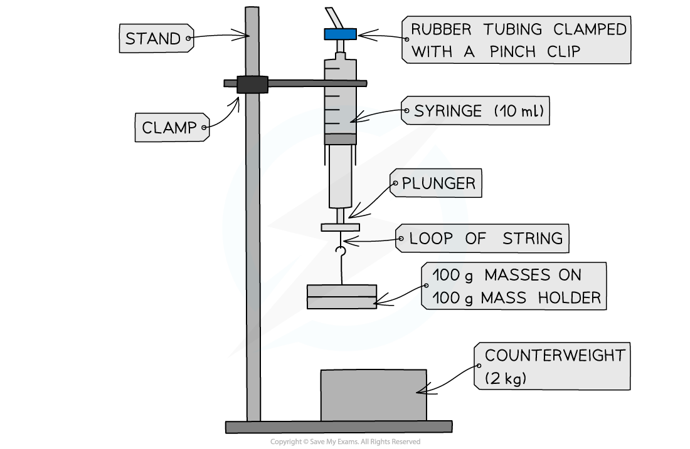
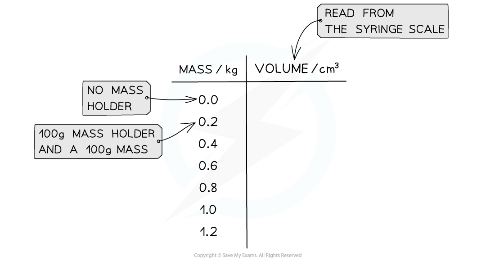
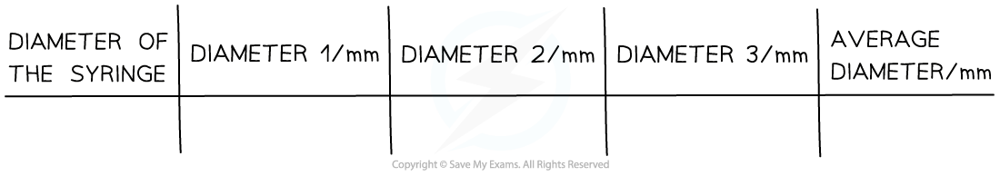
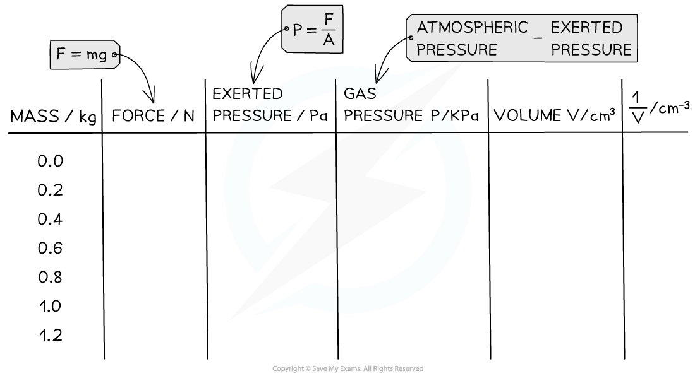
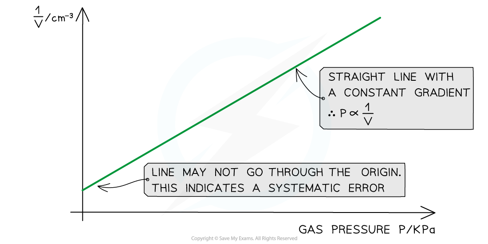

# Core Practical 14: Investigating Gas Pressure & Volume

## Core Practical 14: Investigating Gas Pressure & Volume

> **Spec point** — `spcpt_Dj425xvKdCP5SK2y`

## Investigating Gas Pressure and Volume

- Boyle's Law relates pressure and volume at constant temperature

  - This investigation is one valid example of how this required practical might be tackled, others do exist

#### Variables

- *Independent variable* = Mass, *m* (kg)
- *Dependent variable* = Volume, *V* (m3)
- Control variables:

  - Temperature
  - Cross-sectional area of the syringe

#### Equipment List

- *Resolution* of measuring equipment:

  - Pressure gauge = 0.02 × 105 Pa
  - Volume = 0.2 cm3
  - Vernier Caliper = 0.02 mm

#### Method

***Apparatus setup for Boyle’s Law***

1. With the plunger removed from the syringe, measure the inside diameter, *d* of the syringe using a Vernier caliper.

  - Take 3 readings and find an average
2. The plunger should be replaced and the rubber tubing should be fit over the nozzle and clamped with a pinch clip as close to the nozzle as possible
3. Set up the apparatus as shown in the diagram
4. Push the syringe upwards until it reads the lowest volume of air visible. Record this volume
5. Add the 100 g mass holder to the loop of string at the bottom of the plunger. Wait a few seconds before taking the reading (this allows temperature to equilibrate after work is done against the plunger when the volume increases)
6. Record the value of the new volume from the syringe scale
7. Repeat the experiment by adding 100 g masses and recording the readings up to 10 readings.

- An example table of results might look like this:

#### Analysing the Results

- Boyle’s Law can be represented by the equation:

***pV***** = constant**

- This means the pressure must be calculated from the experiment
- The exerted pressure of the masses is calculated by:

- Where:

  - *F* = weight of the masses, mg (N)
  - *A* = cross-sectional area of the syringe (m2)

- The cross-sectional area is found from the equation for the area of a circle:

- To calculate the pressure of the gas: **Pressure of the gas = Atmospheric pressure – Exerted pressure from the masses**
- Where:

  - Atmospheric pressure = 101 kPa

- The table of results may need to be modified to fit these extra calculations. Here is an example of how this might look:

- Once these values are calculated:

1. Plot a graph of *p *against 1 / *V* and draw a line of best fit
2. If this plot is a straight line graph, this means that the pressure is proportional to the inverse of the volume, hence confirming Boyle's Law (*pV* = constant)

#### Evaluating the Experiment

***Systematic Errors***:

- There may be friction in the syringe which causes a systematic error

  - Use a syringe that has very little friction or lubricated it, so the only force is from the weights pulling the syringe downwards

***Random Errors***:

- The reading of the volume should be taken a few seconds after the mass has been added to the holder to allow temperature changes to equilibrate
- Room temperature must be kept constant

#### Safety Considerations

- A counterweight or G-clamp must be used to avoid the stand toppling over and causing injury, especially if the surface is not completely flat
