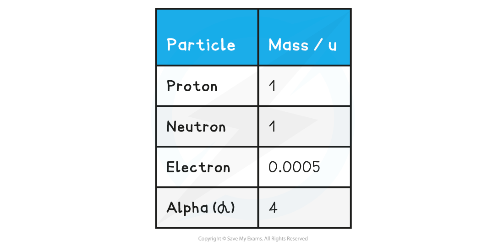

# Atomic Mass Unit

## Atomic Mass Unit

> **Spec point** — `spcpt_fNq9HRhdxT8zXwK4`

## Atomic Mass Unit

- The unified atomic mass unit **(u or sometimes a.m.u)** is roughly equal to the mass of one proton or neutron:

  - **1 u = 1.66 × 10****−27**** kg**
  - This value is provided on the exam data sheet

- The a.m.u is commonly used in nuclear physics to express the mass of subatomic particles. It is defined as

**The mass of exactly one-twelfth of an atom of carbon-12**

- Therefore, one atom of carbon-12 has a mass of exactly 12 u
- Since mass and energy are interchangeable, the a.m.u can also be expressed in MeV

  - **1 u is equivalent to 931.5 MeV**

**Table of common particles with mass in a.m.u**

- The mass of an atom in a.m.u is roughly equal to the sum of its protons and neutrons (nucleon number)

  - For example, the mass of Uranium-235 is roughly equal to 235u
  - However, note that the actual mass is slightly lower than the expected mass, due to *mass-energy equivalence*
- a.m.u might be quoted in kg or MeV since mass and energy are equivalent via $ΔE=Δmc^{2}$

  - MeV is a unit of energy whilst kg is a unit of mass

> **Worked Example**
> Estimate the mass of the nucleus of the element copernicium-285 in kg. Give your answer to 2 decimal places.
> 
> **Answer:**
> 
> 
