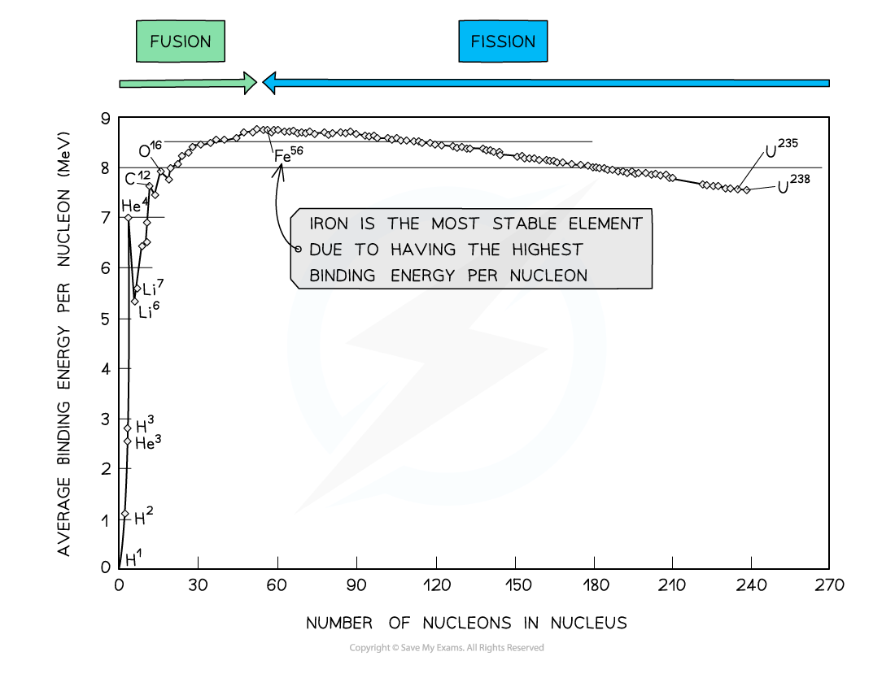

# Binding Energy per Nucleon Graph

## Binding Energy per Nucleon Graph

> **Spec point** — `spcpt_SRfdSJ3dX5Srx7kB`

## Binding Energy per Nucleon Graph

- When comparing the stability of different nuclei, it is useful to look at the ***binding energy***** per nucleon**
- The binding energy per nucleon is defined as: ***The binding energy of a nucleus divided by the number of nucleons in the nucleus***
- A higher** **binding energy per nucleon indicates a higher stability since it requires more energy to pull the nucleus apart

- Iron (A = 56) has the highest binding energy per nucleon, which makes it the most stable of all the elements

***By plotting a graph of binding energy per nucleon against nucleon number, the stability of elements can be inferred***

#### Key Features of the Graph

- At low values of A:

  - Nuclei tend to have a lower binding energy per nucleon, hence, they are generally less stable
  - This means the lightest elements have weaker electrostatic forces and are the most likely to undergo **fusion**
- Helium (4He), carbon (12C) and oxygen (16O) do not fit the trend

  - Helium-4 is a particularly stable nucleus hence it has a high binding energy per nucleon
  - Carbon-12 and oxygen-16 can be considered to be three and four helium nuclei, respectively, bound together
- At high values of A:

  - The general binding energy per nucleon is high and gradually decreases with A
  - This means the heaviest elements are the most unstable and likely to undergo **fission**

> **Worked Example**
> Determine the binding energy per nucleon of Iron-56 (`F presubscript 26 presuperscript 56 e`) in MeV
> 
> Mass of a neutron = 1.675 × 10−27 kg
> 
> Mass of a proton = 1.673 × 10−27 kg
> 
> Mass of a `F presubscript 26 presuperscript 56 e` nucleus = 9.288 × 10−26 kg
> 
> **Answer:**
> 
> **Step 1: Calculate the mass defect**
> 
> Number of protons, Z = 26
> 
> Number of neutrons, A – Z = 56 – 26 = 30
> 
> Mass defect, Δm = Zmp + (A – Z)mn – mtotal
> 
> Δm = (26 × 1.673 × 10-27) + (30 × 1.675 × 10-27) – (9.288 × 10-26)
> 
> Δm = 8.680 × 10-28 kg
> 
> **Step 2: Calculate the binding energy of the nucleus**
> 
> Binding energy, ΔE = Δmc2
> 
> E = (8.680 × 10-28) × (3.00 × 108)2 = 7.812 × 10-11 J
> 
> **Step 3: Calculate the binding energy per nucleon**
> 
> Binding energy per nucleon = $\frac{E}{A}$
> 
> $\frac{E}{H}=\frac{7.812\times10^{-11}}{56}=1.395\times10^{-12}J$
> 
> **Step 4: Convert to MeV**
> 
> J → eV: divide by 1.6 × 10-19
> 
> eV → MeV: divide by 106
> 
> binding energy per nucleon = $\frac{1.395\times10^{-12}}{1.6\times10^{-19}}=8718750eV=8.7MeV(2s.f)$

> **Exam Hint**
> Checklist on what to include (and what not to include) in an exam question asking you to draw a graph of binding energy per nucleon against nucleon number:
> 
> - You will be expected to draw the best fit curve AND a cross to show the **anomaly that is Helium**
> - Do not begin your curve at A = 0, this is not a nucleus!
> - Make sure to correctly label both axes AND units for binding energy **per nucleon**
> - You will be expected to include numbers on the axes, mainly at the peak to show the position of iron (56Fe)
