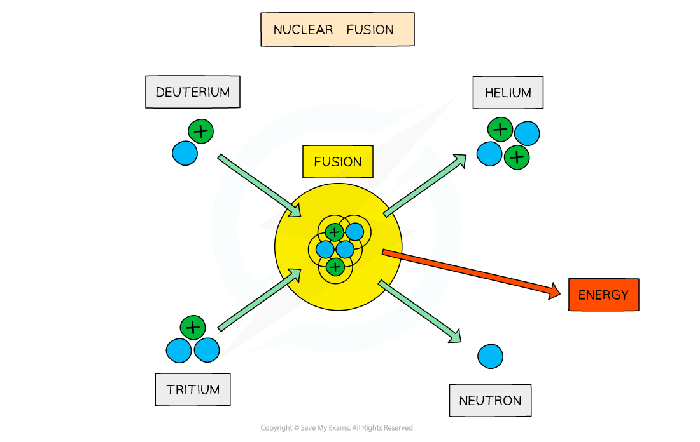

# Nuclear Fusion

## Nuclear Fusion

> **Spec point** — `spcpt_xJDfPnWt9yqjpy2c`

## Nuclear Fusion

- Fusion is defined as:

**Small nuclides that combine together to make larger nuclei, releasing energy**

- Low mass nuclei, such as hydrogen and helium, can undergo fusion and release energy
- On Earth, research is focused on achieving the deuterium-tritium (D-T) reaction
- This involves fusing a *deuterium* nucleus and a *tritium* nucleus together to produce a helium nucleus and a neutron

`straight H presubscript 1 presuperscript 2 space plus thin space straight H presubscript 1 presuperscript 3 space rightwards arrow space He presubscript 2 presuperscript 4 space plus thin space straight n presubscript 0 presuperscript 1`

#### Deuterium-tritium fusion

*The fusion of deuterium and tritium nuclei to form a helium nucleus and a neutron, with the release of energy*

### Conditions for nuclear fusion

- For two nuclei to fuse, both nuclei must have** high kinetic energy**
- This is because nuclei must be able to get close enough to fuse
- However, two forces acting within the nuclei make this difficult to achieve

  - **Electrostatic repulsion **
  
    - Protons inside the nuclei are positively charged, which means that they **electrostatically** repel one another
  - **Strong nuclear force**
  
    - The strong nuclear force, which binds nucleons together, acts at very short distances within nuclei
    - Therefore, nuclei must get very close together for the strong nuclear force to take effect
- It takes a great deal of energy to overcome the electrostatic force, hence, fusion can only be achieved in an **extremely hot**, **dense **environment, such as the core of a star

### Fusion products

- When two hydrogen nuclei (protons) fuse, a *deuterium* nucleus is produced

  - A positron and an electron neutrino are also produced as one of the protons converts into a neutron through beta-plus decay

`straight H presubscript 1 presuperscript 1 space plus thin space straight H presubscript 1 presuperscript 1 space rightwards arrow space straight H presubscript 1 presuperscript 2 space plus thin space straight e to the power of plus space plus thin space straight nu subscript straight e`

- In the centres of stars, four hydrogen nuclei `open parentheses straight H presubscript 1 presuperscript 1 close parentheses` fuse to produce a helium nucleus `open parentheses He presubscript 2 presuperscript 4 close parentheses`, plus the release of energy

  - This provides fuel for the star to continue burning

#### The proton-proton chain

*The proton-proton chain involves a series of nuclear reactions which produces a helium nucleus from the fusion of four protons*

> **Exam Hint**
> In the fusion process, the mass of the new, heavier nucleus is less than the mass of the constituent parts of the nuclei fused together, as some mass is converted into energy.
> 
> Not all of this energy is used as binding energy for the new, larger nucleus, so energy will be released from this reaction. The binding energy per nucleon afterwards is higher than at the start.
