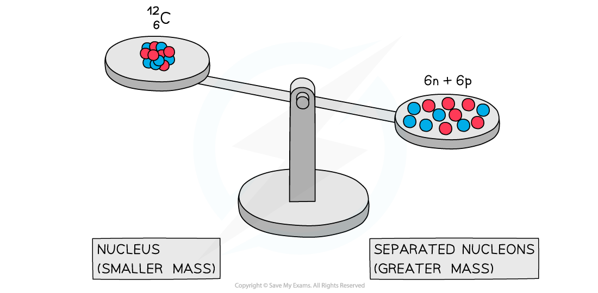

# Nuclear Binding Energy & Mass Deficit

## Nuclear Binding Energy

> **Spec point** — `spcpt_gr3XSsmP8sZBmXvK`

## Nuclear Binding Energy

- Experiments into nuclear structure have found that the total mass of a nucleus is **less** than the sum of the masses of its constituent nucleons

  - This difference in mass is known as the **mass defect **or** mass deficit**
  - Mass defect is defined as: **The difference between the measured mass of a nucleus and the sum total of the masses of its constituents**
- The mass defect Δm of a nucleus can be calculated using:

$Δm=Zm_{p}+(A--Z)m_{n}--m_{total}$

- Where:

  - *Z* = proton number
  - *A* = nucleon number
  - *m*p = mass of a proton (kg)
  - *m*n = mass of a neutron (kg)
  - *m*total = measured mass of the nucleus (kg)

***A system of separated nucleons has a greater mass than a system of bound nucleons***

- Due to *mass-energy equivalence*, this decrease in mass implies that energy is released
- Energy and mass are proportional, so, the total energy of a nucleus is **less than the sum of the energies** of its constituent nucleons

- Binding energy is defined as: **The energy required to break a nucleus into its constituent protons and neutrons**
- The formation of a nucleus from a system of isolated protons and neutrons therefore **releases energy**, making it an **exothermic **reaction

  - This can be calculated using the equation:

$ΔE=Δmc^{2}$

## Mass-Energy Equivalence

> **Spec point** — `spcpt_syPsF93p7T7dP8hz`

## Mass-Energy Equivalence

- Einstein showed in his *Theory of Relativity* that matter can be considered a form of energy and hence, he proposed:

  - Mass can be converted into energy
  - Energy can be converted into mass

- This is known as **mass-energy equivalence**, and can be summarised by the equation:

$ΔE=Δmc^{2}$

- Where:

  - *E* = energy (J)
  - *m* = mass (kg)
  - *c* = *the speed of light* (m s-1)

- Some examples of mass-energy equivalence are:

  - The **fusion** of hydrogen into helium in the centre of the sun
  - The **fission** of uranium in nuclear power plants
  - Nuclear **weapons**
  - High-energy **particle collisions** in particle accelerators

> **Worked Example**
> The binding energy per nucleon is 7.98 MeV for an atom of Oxygen-16 (16O).
> 
> Determine an approximate value for the energy required, in MeV, to completely separate the nucleons of this atom.
> 
> **Answer:**
> 
> **Step 1: List the known quantities**
> 
> - Binding energy per nucleon, *E* = 7.98 MeV
> 
> **Step 2: State the number of nucleons**
> 
> - The number of nucleons is 8 protons and 8 neutrons, therefore 16 nucleons in total
> 
> **Step 3: Find the total binding energy**
> 
> - The binding energy for oxygen-16 is:
> 
> 7.98 × 16 = 127.7 MeV
> 
> **Step 4: State the final answer**
> 
> - The approximate total energy needed to completely separate this nucleus is 127.7 MeV

> **Exam Hint**
> Binding energy is named in a confusing way, so be careful!
> 
> Avoid describing the binding energy as the energy stored in the nucleus – this is not correct – it is energy that must be put **into **the nucleus to **pull it apart.**
