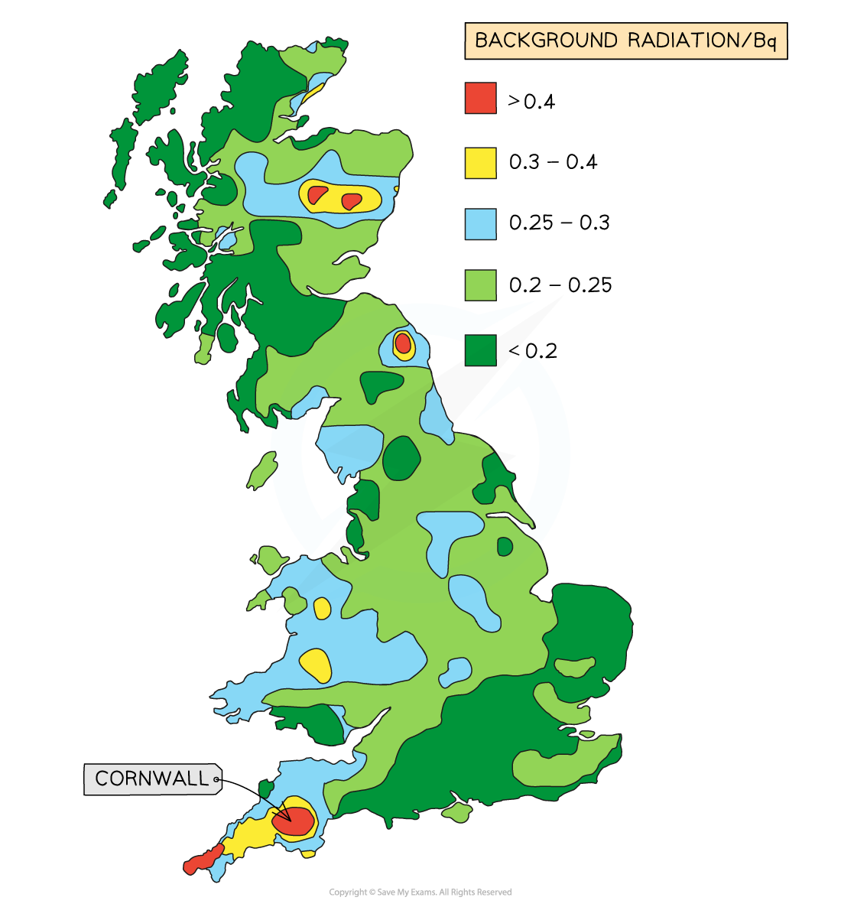

# Background Radiation

## Background Radiation

> **Spec point** — `spcpt_zQdJfq4JTVzJyrpb`

## Background Radiation

- Radiation is a natural phenomenon, with radioactive elements having always existed on Earth and in outer space

  - However, human activity has added to the amount of radiation that humans are exposed to in various ways

- Background radiation is defined as: **Low levels of radiation from environmental sources, which are always present around us**
- Radiation is measured in **counts per second **in a unit called **Becquerel (Bq)**

- Different amounts of radiation are present in different places around the world, including in the UK.

- There are two types of background radiation:

  - Natural sources
  - Man-made sources

***Background radiation is the radiation that is present all around the environment. Radon gas is given off from some types of rock***

- Every second of the day there is some radiation emanating from **natural sources** such as:

  - Rocks
  - Cosmic rays from space
  - Foods

#### Natural Sources

- **Radon gas from rocks and soil**

  - Heavy radioactive elements, such as uranium and thorium, occur naturally in rocks in the ground
  - Uranium decays into radon gas, which is an alpha emitter
  - This is particularly dangerous if inhaled into the lungs in large quantities

- **Cosmic rays from space**

  - The sun emits an enormous number of protons every second
  - Some of these enter the Earth’s atmosphere at high speeds
  - When they collide with molecules in the air, this leads to the production of gamma radiation
  - Other sources of cosmic rays are supernovae and other high energy cosmic events

- **Carbon-14 in biological material**

  - All organic matter contains a tiny amount of carbon-14
  - Living plants and animals constantly replace the supply of carbon in their systems hence the amount of carbon-14 in the system stays almost constant

- **Radioactive material in food and drink**

  - Naturally occurring radioactive elements can get into food and water since they are in contact with rocks and soil containing these elements
  - Some foods contain higher amounts such as potassium-40 in bananas
  - However, the amount of radioactive material is minuscule and is not a cause for concern

#### Man-Made Sources

- **Medical sources**

  - In medicine, radiation is commonly used in X-rays, CT scans, radioactive tracers, and radiation therapy

- **Nuclear waste**

  - While nuclear waste itself does not contribute much to background radiation, it can be dangerous for the people handling it

- **Nuclear fallout from nuclear weapons**

  - Fallout is the residue radioactive material that is thrown into the air after a nuclear explosion, such as the bomb that exploded at Hiroshima
  - While the amount of fallout in the environment is presently very low, it increases significantly in areas where nuclear weapons are tested

- **Nuclear accidents**

  - Accidents such as that in Chernobyl contributed a large dose of radiation into the environment
  - While these accidents are now extremely rare, they can be catastrophic

#### Corrected Count Rate

- Background radiation must be accounted for when taking readings in a laboratory
- This can be done by taking readings with no radioactive source present and then subtracting this from readings with the source present

  - This is known as the **corrected count rate**

#### Detecting Radiation

- When alpha or beta radiation pass close to an atom, they can deliver enough energy to remove electrons, ionising the atom
- Radiation detectors work by detecting the presence of either these ions, or the chemical changes that they produce
- Examples of radiation detectors include:

  - **Photographic film** (often used in badges)
  - **Geiger-Muller** (GM) tubes
  - **Ionisation chambers**
  - **Scintillation counters**
  - **Spark counters**

***A Geiger-Muller tube (or Geiger counter) is a common type of radiation detector***

> **Worked Example**
> A student is using a Geiger-counter to measure the counts per minute at different distances from a source of radiation. Their results and a graph of the results are shown here.
> 
> 
> 
> Determine the background radiation count.
> 
> **Answer:**
> 
> **Step 1: Determine the point at which the source radiation stops being detected**
> 
> - The background radiation is the amount of radiation received all the time
> - When the source and detector are far enough apart, the radiation is absorbed by the air before reaching the Geiger-counter
> - Results after 1 metre should not change
> - Therefore, the amount after 1 metre is only due to background radiation
> 
> **Step 2: State the background radiation count **
> 
> - The background radiation count is **15 counts per minute**

> **Exam Hint**
> Exam questions may expect you to remember about the existence of background radiation without mentioning it. Look out for count rates that do not drop to zero, or half-life graphs with a line that tends towards a value higher than zero.
> 
> When memorising lists of the causes of background radiation, make sure to choose at least one natural and one man-made cause as these are thought of quite separately.
