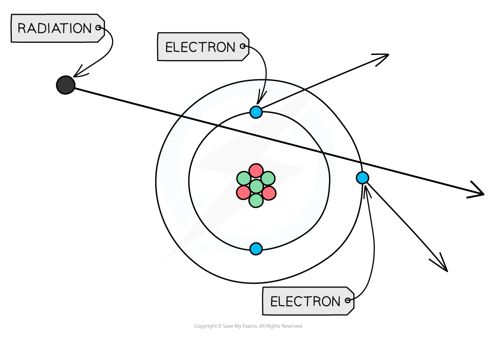
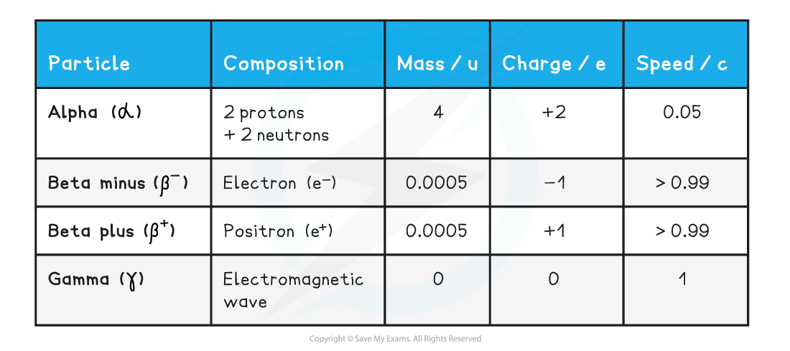

# Alpha, Beta & Gamma Radiation

## Alpha, Beta & Gamma Radiation

> **Spec point** — `spcpt_Dh9dKRp2T7cJ7qpX`

## Alpha, Beta & Gamma Particles

- Some elements have nuclei that are unstable

  - This tends to be when the number of nucleons does not balance
- In order to become more stable, they emit particles and/or electromagnetic radiation

  - These nuclei are said to be **radioactive**
- There are three different types of radioactive emission: Alpha, Beta and Gamma

#### Alpha Particles

- **Alpha (α) particles** are high energy particles made up of **2 protons and 2 neutrons** (the same as a helium nucleus)
- They are usually emitted from nuclei that are too large

#### Beta Particles

- **Beta (β****−****) particles are high energy electrons** emitted from the nucleus

  - β− particles are emitted by nuclei that have too many **neutrons**

- Beta is a **moderately** ionising type of radiation

  - This is due to it having a charge of +1*e*
  - This means it is able to do some slight damage to cells (less than alpha but more than gamma)
- Beta is a **moderately** penetrating type of radiation

  - Beta particles have a range of around 20 cm - 3 m in air, depending on their energy
- Beta can be stopped by a few millimetres of** aluminium **foil

#### Gamma Rays

- **Gamma (γ) rays are high energy electromagnetic waves**
- They are emitted by nuclei that need to lose some energy

- If these particles hit other atoms, they can knock out electrons, **ionising the atom**
- This can cause chemical changes in materials and can damage or kill living cells

***When radiation passes close to atoms, it can knock out electrons, ionising the atom***

- The properties of the different types of radiation are summarised in the table below

- *u *is the atomic mass unit (see “Atomic Mass Unit (u)”)
- *e* is the charge of the electron: 1.60 × 10-19 C
- *c *is the speed of light: 3 × 108 m s-1

> **Worked Example**
> 
> 
> **Answer: D**
> 
> 

> **Exam Hint**
> It is important to be familiar the properties of each type of radiation and their symbols.
