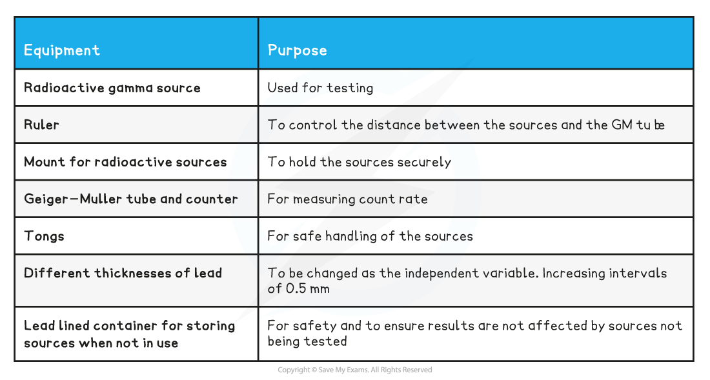
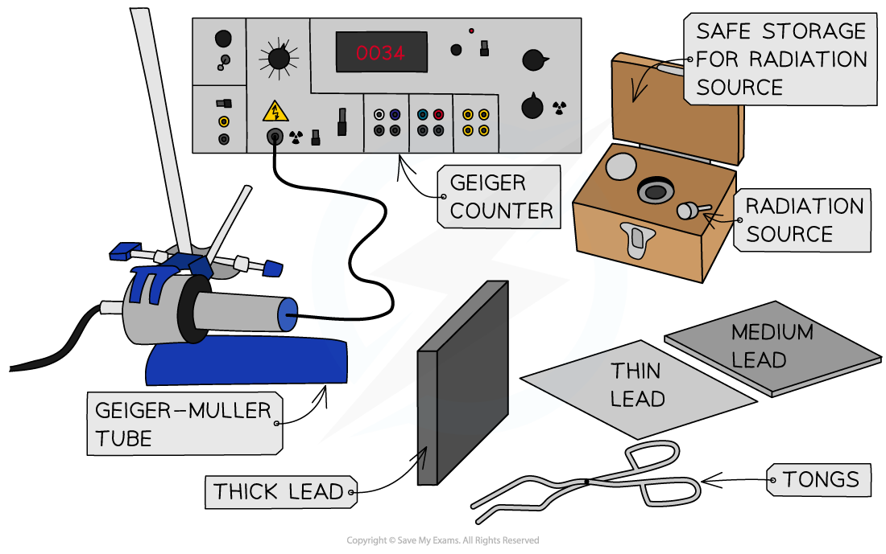
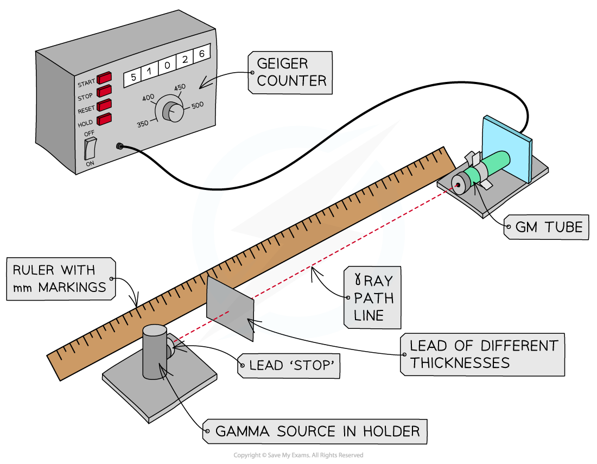

# Core Practical 15: Investigating Gamma Radiation Absorption

## Core Practical 15: Investigating Gamma Radiation Absorption

> **Spec point** — `spcpt_8V6XHfKFVVRBnZYc`

## Core Practical 15: Investigating Gamma Radiation Absorption

#### Aim of the Experiment

- To investigate the absorption of gamma rays by different thicknesses of lead

#### Variables:

- *Independent variable* = Thickness of lead
- *Dependent variable* = Count rate
- Control variables:

  - Radioactive source
  - Distance of GM tube to source
  - Location / background radiation

#### Equipment List

- *Resolution* of measuring equipment:

  - Ruler = 1 mm
  - Geiger-Müller tube = 0.01 μS/hr

#### Method

1. Connect the **Geiger-Müller tube** to the **counter** and, without any sources present, **measure background radiation** over a five-minute period

  - Record this value
  - Calculate the average background rate per minute
2. Measure the thickness of the lead absorbers using Vernier calipers at three points on each sheet.

  - For each sheet record the average thickness
3. Place the radioactive source **a fixed distance** of 10 cm away from the tube
4. Record the count rate over **one minute**
5. Repeat steps 3 and 4 a further two times, recording the count rate each time
6. Place the thinnest absorber directly in front of the gamma ray source
7. Repeat steps 3-5
8. Replace the sheet with another thickness and continue taking three readings per thickness

#### Analysis of Results

- **If the count over that interval falls to background levels** (allow for a little random variation), then the radiation has all been absorbed
- You will be able to determine the thickness of the lead required to absorb gamma radiation

#### Evaluating the Experiment

*Systematic Errors:*

- Make sure that the source is stored well away from the counter during the experiment
- Conduct all runs of the experiment in the same location to avoid changes in background radiation levels

*Random Errors:*

- The accuracy of such an experiment is improved with using a reliable source of radiation with a long half-life and an activity well above the natural background level

#### Safety Considerations

- When not using a source, keep it in a lead-lined container
- When in use, try and keep a good distance (a metre or so) between yourself and the source
- When handling the source, do so using tweezers (or tongs) and point the source away from you
- Wash your hands and remove your outer layer of clothing after handling a radioactive source

> **Exam Hint**
> When answering questions about the core practicals you could try to remember the acronym SCREAMS:
> 
> - S: Which variable will you keep the **same**
> - C: which variable should you **change**
> - R: what will you do to make your experiment **reliable**
> - E: what special **equipment and equations** are required
> - A: how will you **analyse** your results
> - M: which variable will you **measure**
> - S: what **safety** precautions will you take?
