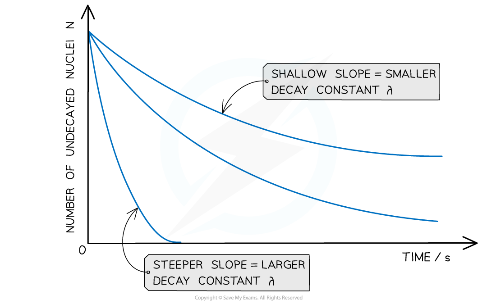

# Equations for Nuclear Physics

## Activity & The Decay Constant

> **Spec point** — `spcpt_fZ4bBtDBbkDztjnX`

## Activity & The Decay Constant

- Since radioactive decay is *spontaneous* and *random*, it is useful to consider the average number of nuclei which are expected to decay per unit time

  - This is known as the **average decay rate**
- As a result, each radioactive element can be assigned a **decay constant**
- The decay constant λ is defined as: **The probability, per second, that a given nucleus will decay**
- When a sample is highly radioactive, this means the number of decays per unit time is very high

  - This suggests it has a high level of **activity**

- Activity, or the number of decays per unit time can be calculated using:

$A=\frac{ΔN}{Δt}=-λN$

- Where:

  - *A* = activity of the sample (Bq)
  - *ΔN* = number of decayed nuclei
  - *Δt* = time interval (s)
  - *λ* = decay constant (s-1)
  - *N* = number of nuclei remaining in a sample

- The activity of a sample is measured in **Becquerels** (Bq)

  - An activity of 1 Bq is equal to one decay per second, or 1 s-1
- This equation shows:

  - The greater the decay constant, the greater the activity of the sample
  - The activity depends on the number of undecayed nuclei remaining in the sample
  - The minus sign indicates that the number of nuclei remaining decreases with time - however, for calculations it can be omitted

> **Worked Example**
> Americium-241 is an artificially produced radioactive element that emits α-particles. A sample of americium-241 of mass 5.1 μg is found to have an activity of 5.9 × 105 Bq.
> 
> (a) Determine the number of nuclei in the sample of americium-241.
> 
> (b) Determine the decay constant of americium-241.
> 
> **Answer:**
> 
> **Part (a)**
> 
> **Step 1:** **Write down the known quantities**
> 
> - Mass = 5.1 μg = 5.1 × 10-6 g
> - Molecular mass of americium = 241
> - *N**A* = *Avogadro constant*
> 
> **Step 2:** **Write down the equation relating number of nuclei, mass and molecular mass**
> 
> $\mathrm{Number} \mathrm{of} \mathrm{nuclei}=\frac{\mathrm{mass}\timesN_{A}}{\mathrm{molecular} \mathrm{mass}}$
> 
> **Step 3: Calculate the number of nuclei**
> 
> $numberofnuclei=\frac{(5.1\times10^{-6})\times(6.02\times10^{23})}{241}=1.27\times10^{16}$
> 
> **Part (b)**
> 
> **Step 1: Write the equation for activity**
> 
> Activity, A = λN
> 
> **Step 2: Rearrange for decay constant λ and calculate the answer**
> 
> $λ=\frac{A}{N}=\frac{5.9\times10^{5}}{1.27\times10^{16}}=4.65\times10^{-11}s^{-1}$

## Exponential Decay

> **Spec point** — `spcpt_Z33hS6Ckc3G4kyhc`

## Exponential Decay

- In radioactive decay, the number of nuclei falls very rapidly, without ever reaching zero

  - Such a model is known as **exponential decay**
- The graph of number of undecayed nuclei and time has a very distinctive shape

***Radioactive decay follows an exponential pattern. The graph shows three different isotopes each with a different rate of decay***

**Radioactive Decay Equation**

- The number of undecayed nuclei N can be represented in exponential form by the equation:

**N = N****0****e****–λt**

- Where:

  - N0 = the initial number of undecayed nuclei (when t = 0)
  - λ = decay constant (s-1)
  - t = time interval (s)

**The exponential function *****e***

- The symbol e represents the exponential constant

  - It is approximately equal to e = 2.718
- On a calculator it is shown by the button ex
- The inverse function of ex is ln(y), known as the natural logarithmic function

  - This is because, if ex = y, then x = ln(y)

> **Worked Example**
> Strontium-90 decays with the emission of a β-particle to form Yttrium-90. The decay constant of Strontium-90 is 0.025 year-1.
> 
> Determine the activity A of the sample after 5.0 years, expressing the answer as a fraction of the initial activity A0
> 
> **Answer:**
> 
> **Step 1: Write out the known quantities**
> 
> Decay constant, λ = 0.025 year-1
> 
> Time interval, t = 5.0 years
> 
> Both quantities have the same unit, so there is no need for conversion
> 
> **Step 2: Write the equation for activity in exponential form**
> 
> A = A0e–λt
> 
> **Step 3: Rearrange the equation for the ratio between A and A****0**
> 
> 
> 
> **Step 4: Calculate the ratio A/A****0**
> 
> 
> 
> Therefore, the activity of Strontium-90 decreases by a factor of 0.88, or 12%, after 5 years

## Half-Life

> **Spec point** — `spcpt_MsYW4VfrrGbrZwKZ`

## Half Life

- Half-life is defined as: **The time taken for half the number of nuclei in a sample to decay**
- This means when a time equal to the half-life has passed, the **activity** of the sample will also half
- This is because the activity is proportional to the number of undecayed nuclei, *A* ∝ *N*

***When a time equal to the half-life passes, the activity falls by half, when two half-lives pass, the activity falls by another half (which is a quarter of the initial value)***

- To find an expression for half-life, start with the equation for *exponential decay*:

***N***** = *****N******0 *****e****–λ*****t***

- Where:

  - *N* = number of nuclei remaining in a sample
  - *N**0* = the initial number of undecayed nuclei (when t = 0)
  - λ = decay constant (s-1)
  - *t* = time interval (s)

- When time *t* is equal to the half-life *t*½, the activity *N* of the sample will be half of its original value, so *N* = ½ *N**0*

- The formula can then be derived as follows:

- Therefore, half-life *t*½ can be calculated using the equation:

- This equation shows that half-life *t*½ and the radioactive decay rate constant λ are inversely proportional

  - Therefore, the **shorter** the half-life, the **larger** the decay constant and the **faster** the decay

> **Worked Example**
> Strontium-90 is a radioactive isotope with a half-life of 28.0 years.A sample of Strontium-90 has an activity of 6.4 × 109 Bq. Calculate the decay constant λ, in s–1, of Strontium-90.
> 
> **Answer:**
> 
> **Step 1: Convert the half-life into seconds**
> 
> - *t*½ = 28 years = 28 × 365 × 24 × 60 × 60 = 8.83 × 108 s
> 
> **Step 2: Write the equation for half-life**
> 
> 
> 
> **Step 3: Rearrange for λ and calculate**
> 
> 

> **Exam Hint**
> Although you may not be expected to derive the half-life equation, make sure you're comfortable with how to use it in calculations such as that in the worked example.
