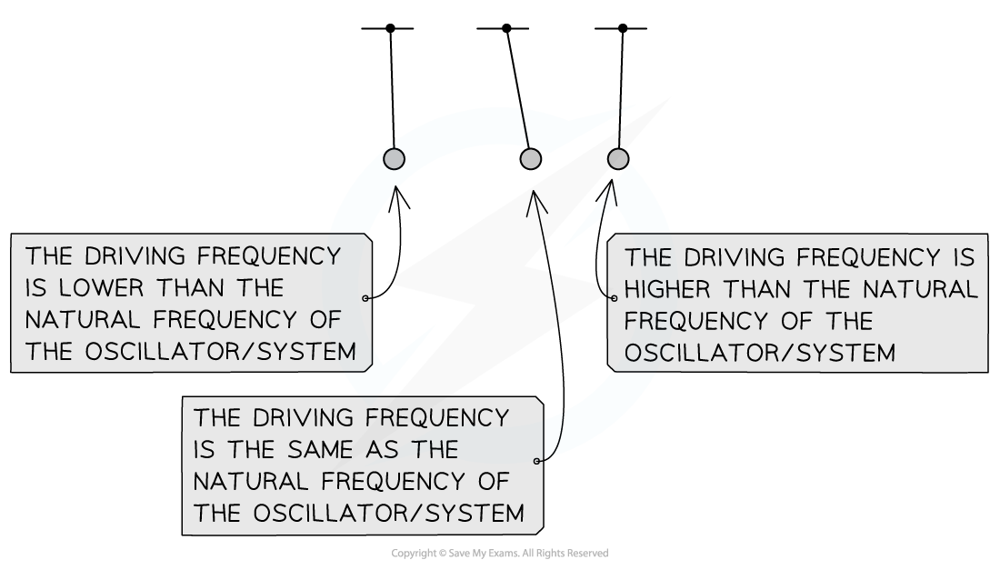
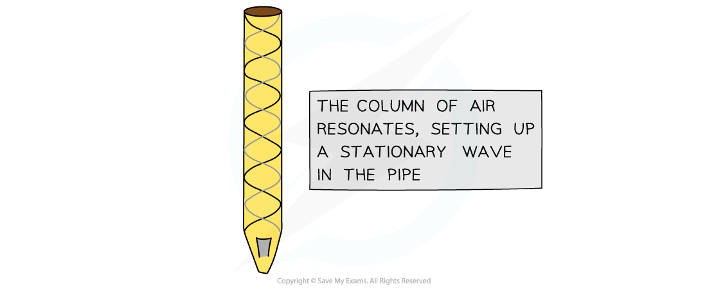

# Resonance

## Resonance

> **Spec point** — `spcpt_GRbqSB6rB8stWmDS`

## Resonance

- The frequency of forced oscillations is referred to as the **driving frequency**, *f*, or the frequency of the applied force
- All oscillating systems have a **natural frequency**, *f**0*, this is defined as the frequency of an oscillation when the oscillating system is allowed to oscillate freely

  - Oscillating systems can exhibit a property known as resonance

- When the **driving frequency** approaches the **natural frequency** of an oscillator, the system gains more energy from the driving force

  - Eventually, when they are equal, the oscillator vibrates with its maximum amplitude, this is **resonance**

- Resonance is defined as: **When the frequency of the applied force to an oscillating system is equal to its natural frequency, the amplitude of the resulting oscillations increases significantly**
- For example, when a child is pushed on a swing:

  - The swing plus the child has a fixed natural frequency
  - A small push after each cycle increases the amplitude of the oscillations to swing the child higher. This frequency at which this push happens is the driving frequency
  - When the driving frequency is exactly equal to the natural frequency of the swing oscillations, resonance occurs
  - If the driving frequency does not quite match the natural frequency, the amplitude will increase but not to the same extent as when resonance is achieved

- This is because, at resonance, energy is transferred from the driver to the oscillating system **most efficiently**

  - Therefore, at resonance, the system will be transferring the maximum kinetic energy possible

#### Resonance Effects

- Resonance occurs for any forced oscillation where the frequency of the driving force is equal to the natural frequency of the oscillator
- Examples include:

  - An organ pipe, where air resonates down an air column setting up a stationary wave in the pipe
  - Glass smashing from a high pitched sound wave at the right frequency
  - A radio tuned so that the electric circuit resonates at the same frequency as the specific broadcast

***Standing waves forming inside an organ pipe from resonance***
