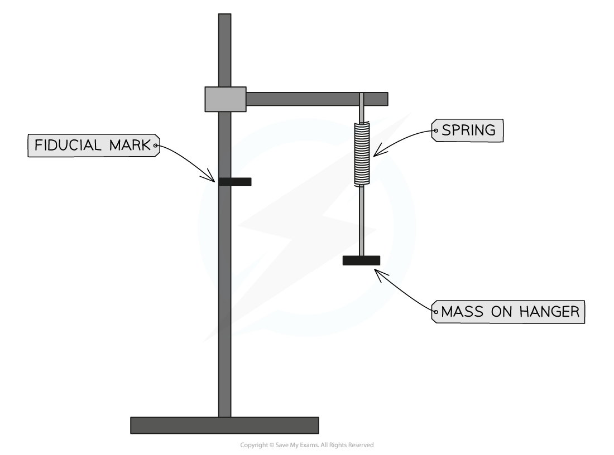
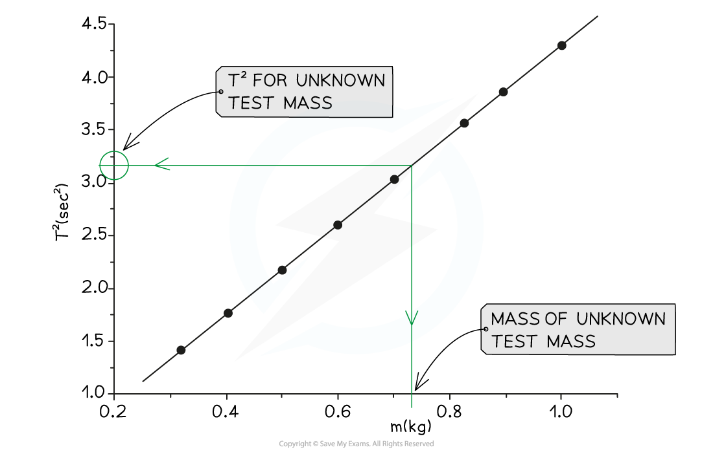

# Core Practical 16: Investigating Resonance

## Core Practical 16: Investigating Resonance

> **Spec point** — `spcpt_KcybGvpxxvVjqG5C`

## Core Practical 16: Investigating Resonance

#### Aim of the Experiment

- Determine the value of an unknown mass by a graphical method by using the resonant frequencies of the oscillation of known masses

**Variables**

- *Independent variable* = mass (kg)
- *Dependent variable* = time period (s)
- Control variables:

  - The spring / oscillator

#### Equipment

- Spring (standard 20-25 mm spring)
- Slotted 100g masses and hanger
- Retort stand and clamp
- Digital timer
- Unknown test mass
- Digital scales

#### Method

1. Set up the spring with 100 g mass attached
2. On the stand make a clear fiducial mark about 5 cm below the bottom of the spring
3. Extend the spring so that the bottom is level with the fiducial marker, release and start timing
4. Measure time for 10 oscillations
5. Repeat with the same mass two more times
6. Find the average time period of one oscillation
7. Add 100 g and adjust the fiducial mark downwards so that it is 5 cm below the new level of the spring
8. Repeat steps 3-7 until the total mass is 500 g
9. Plot a graph of *T**2* on the y-axis against *m* on the x-axis

#### Testing the unknown mass

- Follow steps 2 - 6 for the test mass
- Find the value of the time period, *T* and square it to find *T**2*
- On the graph mark a horizontal from *T**2** *to the graph line and where they intersect, take the arrow vertically down to meet the x-axis
- The value of m which this line coincides with is the mass of the test mass
- Check the result using digital scales

#### Analysis

- Analysis for this graph is based on three equations related to simple harmonic motion;

  - Angular velocity, $ω=\sqrt{\frac{k}{m}}$ **(equation 1)**
  - Where *k* = spring constant (N kg−1) and *m* = mass (kg)
  - Angular velocity, $ω=2\mathrm{πf}$  **(equation 2)**
  - Where *f* = frequency of oscillations (Hz)
  - Frequency, $f=\frac{1}{T}$ **(equation 3)**
  - Where *T* = time period for one oscillation (s)

- Substitute **equations 2** into **equation 1**;

$2πf=\sqrt{\frac{k}{m}}$

- Substitute **equation 3** into **equation 2**

$\frac{2π}{T}=\sqrt{\frac{k}{m}}$

- Square both sides

$\frac{4π^{2}}{T^{2}}=\frac{k}{m}$

- Make *T*2 the subject

`T squared equals m open parentheses fraction numerator 4 pi squared over denominator k end fraction close parentheses`

- Plot a graph of *T**2* on the y-axis against *m* on the x-axis to get a straight line through the origin with;

gradient = `open parentheses fraction numerator 4 pi squared over denominator k end fraction close parentheses`

#### Safety Considerations

- Clamp stand to the desk for stability
- Wear safety glasses in case the spring flies off or snaps
- Place a cushion or catch-mat in case of falling masses
