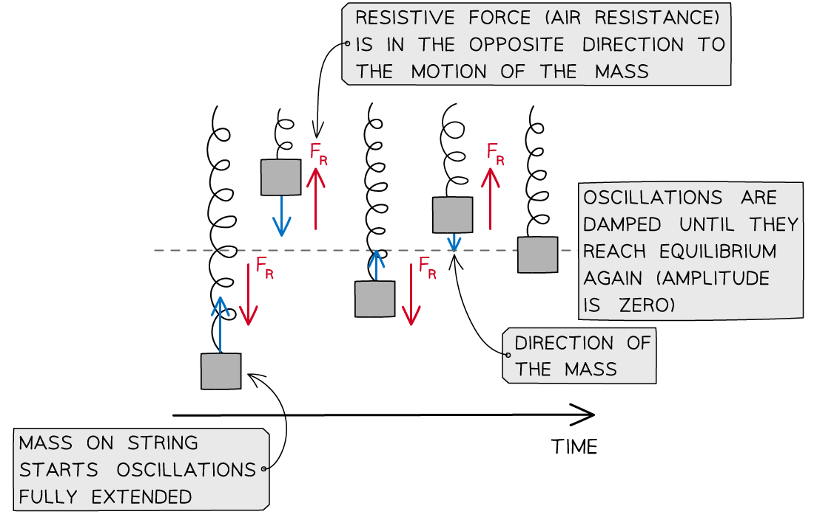
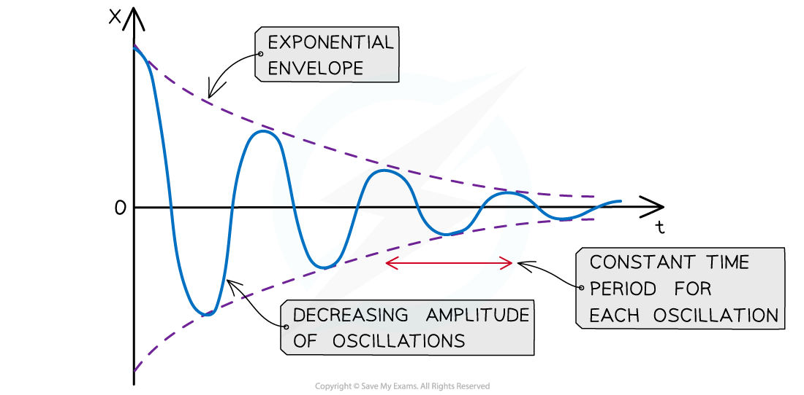
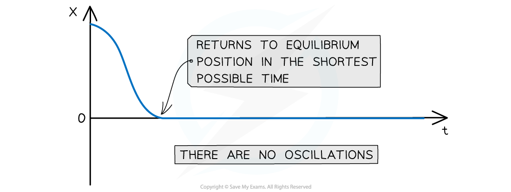
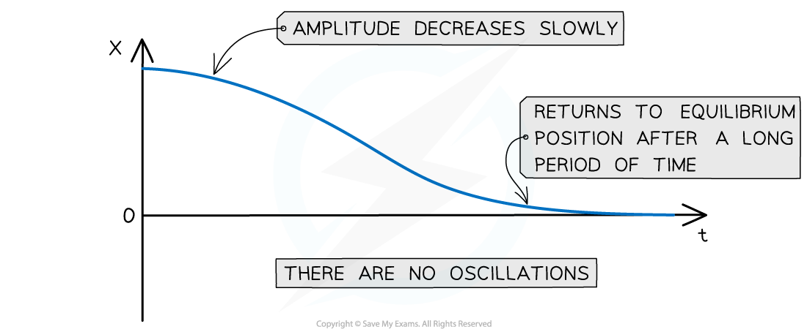

# Damped & Undamped Oscillating Systems

## Damped & Undamped Oscillating Systems

> **Spec point** — `spcpt_vdcXFJQm43S7csBn`

## Damped & Undamped Oscillating Systems

- In practice, all oscillators eventually stop oscillating

  - Their amplitudes decrease rapidly, or gradually
- This happens due to **resistive forces**, such friction or air resistance, which act in the opposite direction to the motion of an oscillator
- Resistive forces acting on an oscillating simple harmonic system cause **damping**

  - These are known as **damped **oscillations
- Damping is defined as: ***The reduction in energy and amplitude of oscillations due to resistive forces on the oscillating system***
- Damping continues until the oscillator comes to rest at the equilibrium position
- A key feature of simple harmonic motion is that the **frequency** of damped oscillations **does not change** as the amplitude decreases

  - For example, a child on a swing can oscillate back and forth once every second, but this time remains the same regardless of the amplitude

***Damping on a mass on a spring is caused by a resistive force acting in the opposite direction to the motion. This continues until the amplitude of the oscillations reaches zero***

#### Types of Damping

- There are three degrees of damping depending on how quickly the amplitude of the oscillations decrease:

  - Light damping
  - Critical damping
  - Heavy damping

**Light Damping**

- When oscillations are lightly damped, the amplitude does not decrease linearly

  - It *decays exponentially* with time
- When a lightly damped oscillator is displaced from the equilibrium, it will oscillate with gradually decreasing amplitude

  - For example, a swinging pendulum decreasing in amplitude until it comes to a stop

***A graph for a lightly damped system consists of oscillations decreasing exponentially***

- **Key features of a displacement-time graph for a lightly damped system:**

  - There are many oscillations represented by a sine or cosine curve with gradually decreasing amplitude over time
  - This is shown by the height of the curve decreasing in both the positive and negative displacement values
  - The amplitude decreases exponentially
  - The frequency of the oscillations remain constant, this means the time period of oscillations must stay the same and each peak and trough is equally spaced

**Critical Damping**

- When a critically damped oscillator is displaced from the equilibrium, it will return to rest at its equilibrium position in the shortest possible time **without** oscillating

  - For example, car suspension systems prevent the car from oscillating after travelling over a bump in the road

***The graph for a critically damped system shows no oscillations and the displacement returns to zero in the quickest possible time***

- **Key features of a displacement-time graph for a critically damped system:**

  - This system does **not** oscillate, meaning the displacement falls to 0 straight away
  - The graph has a fast decreasing gradient when the oscillator is first displaced until it reaches the x axis
  - When the oscillator reaches the equilibrium position (x = 0), the graph is a horizontal line at x = 0 for the remaining time

**Heavy Damping**

- When a heavily damped oscillator is displaced from the equilibrium, it will take a long time to return to its equilibrium position **without** oscillating
- The system returns to equilibrium more slowly than the critical damping case

  - For example, door dampers to prevent them from slamming shut

***A heavy damping curve has no oscillations and the displacement returns to zero after a long period of time***

- **Key features of a displacement-time graph for a heavily damped system:**

  - There are no oscillations. This means the displacement does not pass 0
  - The graph has a slow decreasing gradient from when the oscillator is first displaced until it reaches the x axis
  - The oscillator reaches the equilibrium position (x = 0) after a long period of time, after which the graph remains a horizontal line for the remaining time

> **Worked Example**
> A mechanical weighing scale consists of a needle which moves to a position on a numerical scale depending on the weight applied. Sometimes, the needle moves to the equilibrium position after oscillating slightly, making it difficult to read the number on the scale to which it is pointing to. Suggest, with a reason, whether light, critical or heavy damping should be applied to the mechanical weighing scale to read the scale more easily.
> 
> **Answer:**
> 
> - Ideally, the needle should not oscillate before settling
> 
>   - This means the scale should have either **critical** or **heavy damping**
> - Since the scale is read straight away after a weight is applied, ideally the needle should settle as quickly as possible
> - Heavy damping would mean the needle will take some time to settle on the scale
> - Therefore, **critical damping **should be applied to the weighing scale so the **needle can settle as quickly as possible** to read from the scale

> **Exam Hint**
> Make sure not to confuse **resistive** force and **restoring **force:
> 
> - Resistive force is what **opposes the motion **of the oscillator and causes damping
> - Restoring force is what brings the oscillator **back to the equilibrium position**
