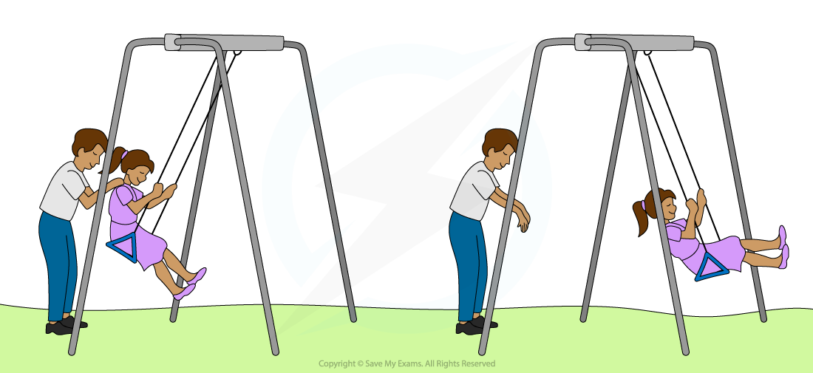

# Free & Forced Oscillations

## Free & Forced Oscillations

> **Spec point** — `spcpt_yVqFq8DBF8Gf52db`

## Free & Forced Oscillations

#### Free Oscillations

- Free oscillations occur when there is no transfer of energy to or from the surroundings

  - This happens when an oscillating system is displaced and then left to oscillate
- In practice, this only happens in a vacuum. However, anything vibrating in air is still considered a free vibration as long as there are **no external forces** acting upon it
- Therefore, a **free oscillation **is defined as: **An oscillation where there are only internal forces (and no external forces) acting and there is no energy input**
- A free vibration always oscillates at its **resonant frequency**

#### Forced Oscillations

- In order to sustain oscillations in a simple harmonic system, a periodic force must be applied to replace the energy lost in *damping*

  - This periodic force **does work** against the resistive force responsible for decreasing the oscillations
  - It is sometimes known as an external **driving** force

- These are known as** forced oscillations **(or vibrations), and are defined as: **Oscillations acted on by a periodic external force where energy is given in order to sustain oscillations**
- Forced oscillations are made to oscillate at the same frequency as the oscillator creating the external, periodic driving force
- For example, when a child is on a swing, they will be pushed at one end after each cycle in order to keep swinging and prevent air resistance from damping the oscillations

  - These extra pushes are the forced oscillations, without them, the child will eventually come to a stop

> **Worked Example**
> State whether the following are free or forced oscillations:
> 
> (i) Striking a tuning fork
> 
> (ii) Breaking a glass from a high pitched sound
> 
> (iii) The interior of a car vibrating when travelling at a high speed
> 
> (iv) Playing the clarinet
> 
> **Answer:**
> 
> **Part (i) **
> 
> **Striking a tuning fork**
> 
> This is a free vibration. When a tuning fork is struck, it will vibrate at its natural frequency and there are no other external forces
> 
> **Part (ii) **
> 
> **Breaking a glass from a high pitched sound**
> 
> This is a forced vibration. The glass is forced to vibrate at the same frequency as the sound until it breaks. The frequency of the high-pitched sound is the external driving frequency
> 
> **Part (iii) **
> 
> **The interior of a car vibrating when travelling at a particular speed**
> 
> This is a forced vibration. The interior of the car vibrates at the same frequency as the wheels travelling over a rough surface at a high speed
> 
> **Part (iv) **
> 
> **Playing the clarinet**
> 
> This is a forced vibration. The air from the player's lungs is used to sustain the vibration in the air column in a clarinet to create and hold a sound. The air column inside the clarinet mimics the vibrations at the same frequency as the air forced into the mouthpiece of the clarinet (the reed).

> **Exam Hint**
> Avoid writing 'a free oscillation is not forced to oscillate'. Mark schemes are mainly looking for a reference to internal and external forces and energy transfers
