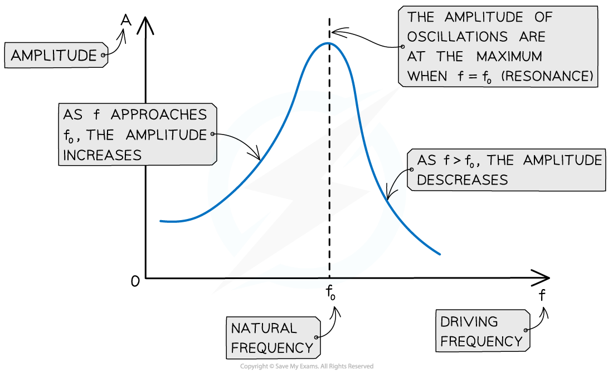
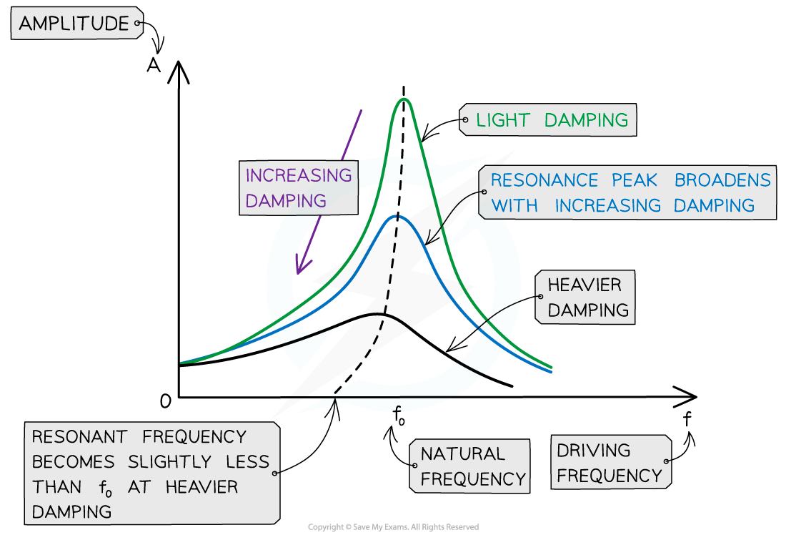

# Resonance Graphs

## Resonance Graphs

> **Spec point** — `spcpt_ptW7XSDVfVyBzCpH`

## Resonance Graphs

- A graph of driving frequency *f* against amplitude* A *of oscillations is called a **resonance curve**. It has the following key features:

  - When *f* < *f**0*, the amplitude of oscillations increases
  - At the peak where *f* = *f**0*, the amplitude is at its maximum. This is **resonance**
  - When *f* > *f**0*, the amplitude of oscillations starts to decrease

***The maximum amplitude of the oscillations occurs when the driving frequency is equal to the natural frequency of the oscillator***

## Damping & Resonance

> **Spec point** — `spcpt_P7PprtGBgHpVVzRd`

## Damping & Resonance

- Damping **reduces** the amplitude of resonance vibrations
- The height and shape of the resonance curve will therefore change slightly depending on the degree of damping

  - **Note:** the natural frequency *f**0** *of the oscillator will remain the same
- As the degree of damping is increased, the resonance graph is altered in the following ways:

  - The amplitude of resonance vibrations **decrease**, meaning the peak of the curve lowers
  - The resonance peak **broadens**
  - The resonance peak moves slightly to the **left** of the natural frequency when heavily damped
- Therefore, damping reduced the sharpness of resonance and reduces the amplitude at resonant frequency

***As damping is increased, resonance peak lowers, the curve broadens and moves slightly to the left***
