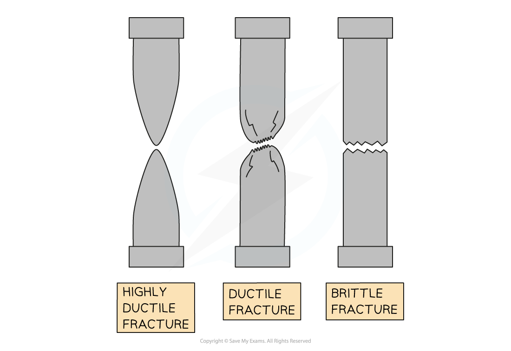
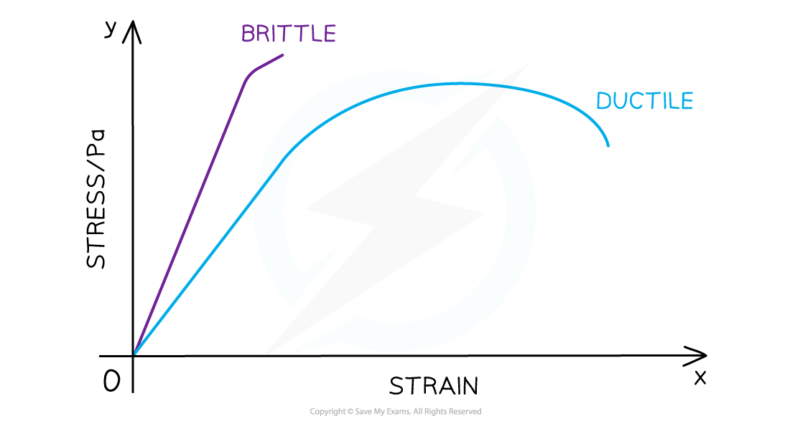
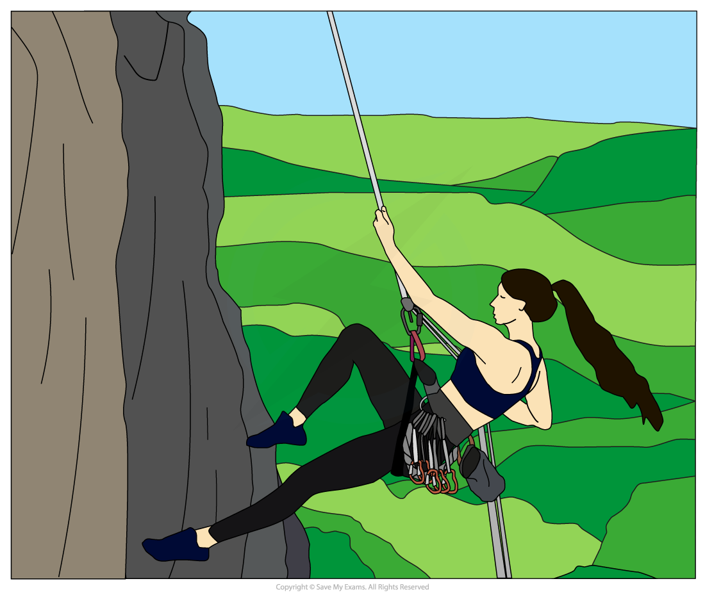

# Damping & Plastic Deformation

## Damping & Plastic Deformation

> **Spec point** — `spcpt_SRNfgcWZZZvT2bf4`

## Damping & Plastic Deformation

- **Damping** an oscillator affects its **amplitude** of oscillation:

  - When **damping** is **increased** the **amplitude decreased**
  - **damping** and** amplitude** are **inversely proportional** to each other

***As damping is increased, resonance peak lowers, the curve broadens and moves slightly to the left***

- A ***Ductile*** material can be stretched for a long time before it snaps

  - We can say it undergoes a large amount of **plastic deformation** before it is **permanently deformed**

- Examples of ductile materials include:

  - Most metals (particularly copper, gold and silver)
  - Non-metals are generally not ductile

***Brittle and ductile materials on a stress-strain graph. These are the same on a force-extension graph too***

- The **amplitude of oscillations** can be reduced due to the **plastic deformation **of a **ductile material**
- This happens because energy from the oscillations is used to deform the material

  - The kinetic energy of the oscillator is reduced and transferred into the deformation of the material
- A climbing rope is different from a rescue rope or a bungee cord:

  - A climbing rope is designed to extend when loaded suddenly
  - The rope stretches to reduce the amplitude of the oscillation when a climber falls onto it
  - It provides critical damping by immediately stopping the climber from bouncing

***A climber uses a dynamic rope that stretches when she falls onto it. This reduces the amplitude of her oscillation and the force she experiences reducing injury.***
