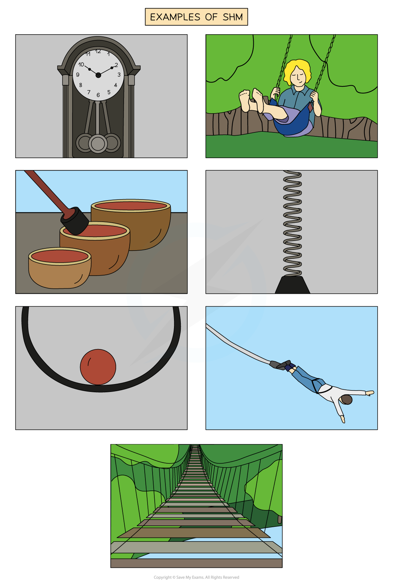
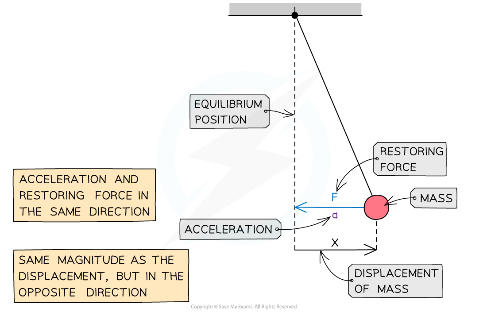

# Conditions for Simple Harmonic Motion

## Conditions for Simple Harmonic Motion

> **Spec point** — `spcpt_f43vWM56Th59jXp8`

## Conditions for Simple Harmonic Motion

- **Simple harmonic motion (SHM) **is a specific type of oscillation
- An oscillation is said to be SHM when:

  - **The acceleration is proportional to the displacement**
  - **The acceleration is in the opposite direction to the displacement**

- Examples of oscillators that undergo SHM are:

  - The pendulum of a clock
  - A mass on a spring
  - Guitar strings
  - The electrons in alternating current flowing through a wire

- **Time period, *****T:***

  - The objects swings are periodic, meaning they are repeated in regular intervals according to their frequency or time period
  - If an object swings freely it always takes the same time to complete one swing

#### Restoring force

- When an object is moving in SHM a force, called the restoring force, *F*, is always trying to return the object back to its equilibrium position.
- The force is proportional to the displacement, *x*, from that equilibrium position

**F = -kx**

- Where:

  - *F * is the restoring force
  - *x* is the displacement of the object from the equilibrium position
  - *k* is a constant depending on the system
  - the negative sign shows that the acceleration will always be towards the centre of oscillation

***Force, acceleration and displacement of a pendulum in SHM***

- This is why a person jumping on a trampoline is not an example of simple harmonic motion:

  - The restoring force on the person is **not** proportional to their distance from the equilibrium position
  - When the person is not in contact with the trampoline, the restoring force is equal to their weight, which is constant
  - This does not change, even if they jump higher

> **Worked Example**
> A 200g toy robot is attached to a pole by a spring, with a spring constant of 90 N m-1, and made to oscillate horizontally.
> 
> (a) What force will act on the robot when it is at its amplitude position of 5 cm from equilibrium?
> 
> (b) How fast will the robot accelerate whilst at this amplitude position?
> 
> **Answer:**
> 
> **Part (a) **
> 
> **Step 1: Convert amplitude into m**
> 
> 5 cm = 0.05 m
> 
> **Step 2: Substitute values into the restoring force equation**
> 
> *F *= *-kx *= -(90) x (0.05) = - 4.5 N
> 
> **Step 3: Explain the answer**
> 
> A force of 4.5 newtons will act on the robot, trying to pull it back towards the equilibrium position.
> 
> 
> 
> **Part (b)**
> 
> **Step 1: Convert mass of robot into kg**
> 
> 200 g = 0.2 kg
> 
> **Step 2: Substitute values into Newton's second law equation: **
> 
> F = ma
> 
> So, $a=\frac{F}{m}$ = $\frac{-4.5}{0.2}$ = -22.5 m s-2
> 
> **Step 3: Explain the answer**
> 
> The robot will decelerate at a rate of 22.5 m s-2 when at this amplitude position

> **Exam Hint**
> Even with this topic you must make sure you convert all quantities into standard SI units
