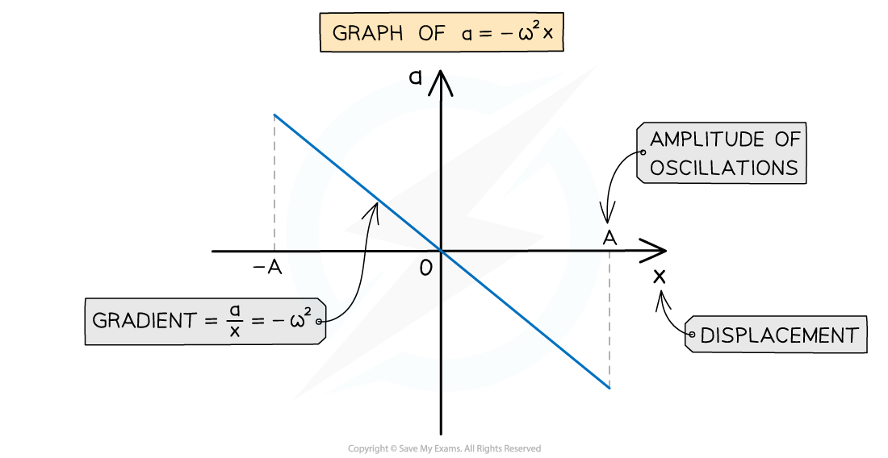
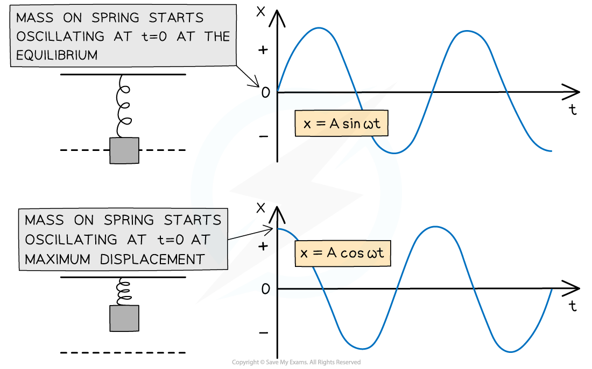

# Equations for Simple Harmonic Motion

## Equations for Simple Harmonic Motion

> **Spec point** — `spcpt_SGPWyrGnsPfnXmyX`

## Equations for Simple Harmonic Motion

#### Acceleration and SHM

- Acceleration *a* and displacement *x* can be represented by the defining equation of SHM:

***a***** ∝ −*****x***

- The acceleration of an object oscillating in *simple harmonic motion* is:

**a = −⍵****2****x**

- Where:

  - *a* = acceleration (m s-2)
  - *⍵* = angular frequency (rad s-1)
  - *x* = displacement (m)

- This is used to find the acceleration of an object with a particular angular frequency* ⍵* at a specific displacement *x*
- The equation demonstrates:

  - The acceleration reaches its **maximum** value when the displacement is at a **maximum** i.e.. x = A (*amplitude*)
  - The **minus** sign shows that when the object is displaced to the **right**, the direction of the acceleration is to the **left** and vice versa (*a* and *x* are always in opposite directions to each other)

#### Displacement and SHM

- The graph of acceleration against displacement is a straight line through the origin sloping downwards (similar to y = −x)

***The acceleration of an object in SHM is directly proportional to the negative displacement***

- The key features of the graph are:

  - The gradient is equal to −⍵2
  - The maximum and minimum displacement *x* values are the amplitudes −A and +A
- A solution to the SHM acceleration equation is the displacement equation:

***x***** = *****A***** cos (⍵*****t*****)**

- Where:

  - *A* = *amplitude* (m)
  - *t* = time (s)

- This occurs when:

  - An object is oscillating from its amplitude position (*x* = *A* or *x* = −*A* at *t* = 0)
  - The displacement will be at its maximum when cos(⍵t) equals 1 or −1, when *x *=* A*
- This equation can be used to find the position of an object in SHM with a particular angular frequency and amplitude at a moment in time

- If an object is oscillating from its equilibrium position (*x* = 0 at *t* = 0) then the displacement equation will be:

***x***** = *****A***** sin (⍵*****t*****)**

- The displacement will be at its maximum when sin(⍵t) equals 1 or −1, when *x *=* A*
- This is because the sine graph starts at 0, whereas the cosine graph starts at a maximum

***These two graphs represent the same SHM. The difference is the starting position***

> **Worked Example**
> A mass of 55 g is suspended from a fixed point by means of a spring.
> 
> The stationary mass is pulled vertically downwards through a distance of 4.3 cm and then released at t = 0.
> 
> The mass is observed to perform simple harmonic motion with a period of 0.8 s.
> 
> Calculate the displacement x, in cm, of the mass at time t = 0.3 s.
> 
> **Answer:**
> 
> **Step 1: Write down the SHM displacement equation**
> 
> Since the mass is released at t = 0 at its maximum displacement, the displacement equation will be with the cosine function:
> 
> `x space equals space A cos left parenthesis ⍵ t right parenthesis`
> 
> **Step 2: Calculate angular frequency**
> 
> $ω=\frac{2π}{T}=\frac{2π}{0.8}=7.85rads^{-1}$
> 
> Remember to use the value of the time period given, not the time passed
> 
> **Step 3: Substitute values into the displacement equation**
> 
> x = 4.3cos (7.85 × 0.3) = –3.0369… = –3.0 cm (2 s.f)
> 
> Make sure the calculator is in **radians mode**
> 
> The negative value means the mass is 3.0 cm on the opposite side of the equilibrium position to where it started (3.0 cm above it)

#### Speed and SHM

- The speed of an object in *simple harmonic motion* varies as it oscillates back and forth

  - Its speed is the magnitude of its velocity
- The greatest speed of an oscillator is at the equilibrium position ie. when its displacement *x* = 0
- How the speed *v* changes with the oscillator’s displacement *x* in SHM is defined by:

`v equals plus-or-minus omega square root of open parentheses A squared minus x squared close parentheses end root`

- Where:

  - *v* = speed (m s-1)
  - *A* = *amplitude* (m)
  - ± = ‘plus or minus’. The value can be negative or positive
  - *⍵* = angular frequency (rad s-1)
  - *x* = displacement (m)

- This equation shows that when an oscillator has a greater amplitude *A*, it has to travel a greater distance in the same time and hence has greater speed *v*
- Although the symbol *v* is commonly used to represent velocity, not speed, exam questions focus more on the magnitude of the velocity than its direction in SHM

> **Worked Example**
> A simple pendulum oscillates with simple harmonic motion with an amplitude of 15 cm.
> 
> The frequency of the oscillations is 6.7 Hz.
> 
> Calculate the speed of the pendulum at a position of 12 cm from the equilibrium position.
> 
> **Answer:**
> 
> **Step 1: Write out the known quantities**
> 
> - Amplitude of oscillations, *A* = 15 cm = 0.15 m
> - Displacement at which the speed is to be found, *x* = 12 cm = 0.12 m
> - Frequency, *f* = 6.7 Hz
> 
> **Step 2: Oscillator speed with displacement equation**
> 
> `v equals plus-or-minus omega square root of open parentheses A squared minus x squared close parentheses end root`
> 
> - Since the speed is being calculated, the ± sign can be removed as direction does not matter in this case
> 
> **Step 3: Write an expression for the angular frequency**
> 
> - Equation relating angular frequency and normal frequency:
> 
> `⍵ space equals space 2 pi f space equals space 2 pi space cross times space 6.7 space equals space 42.097 horizontal ellipsis`
> 
> **Step 4: Substitute in values and calculate**
> 
> `v equals open parentheses 2 pi cross times 6 times 7 close parentheses cross times square root of open parentheses 0 times 15 close parentheses squared minus open parentheses 0 times 12 close parentheses squared end root`
> 
> *v* = 3.789 = 3.8 m s-1 (2 s.f)

> **Exam Hint**
> Since displacement is a vector quantity, remember to keep the minus sign in your solutions if they are negative, you could lose a mark if not! Also, remember that your calculator must be in **radians** mode when using the cosine and sine functions. This is because the angular frequency ⍵ is calculated in rad s-1, **not** degrees. You often have to convert between time period *T*, frequency *f* and angular frequency ⍵ for many exam questions – so make sure you revise the equations relating to these.
