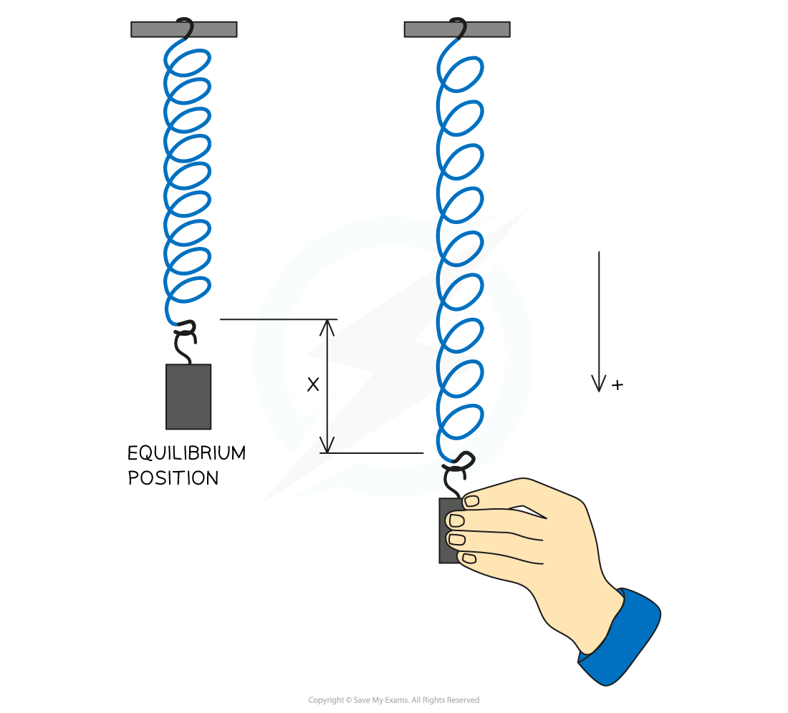
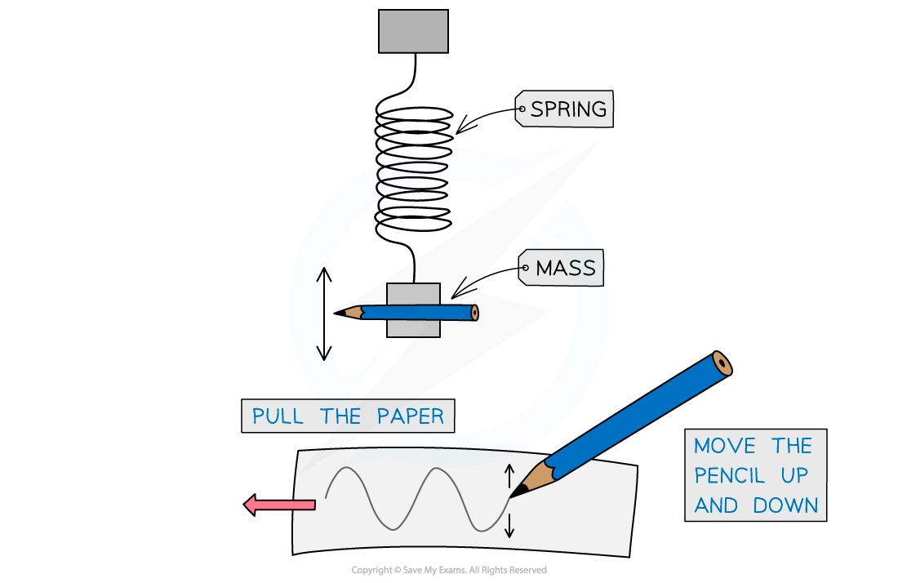

# Period of Simple Harmonic Oscillators

## Period of a simple pendulum

> **Spec point** — `spcpt_m6bcWrqZBmXqjfYv`

## Period of a simple pendulum

- A simple pendulum is:

  - an object moving from side to side
  - attached to a string which is fixed to a point above

- The period of a simple pendulum can be calculated using the equation:

$T=2π\sqrt{\frac{l}{g}}$

- Where:

  - $l$ = the length of the pendulum
  - $g$* =* the gravitational field strength on the planet on which the pendulum is set up

> **Worked Example**
> A child is sitting on a swing that is 200 cm long. What is the period of oscillation?
> 
> **Answer:**
> 
> **Step 1: Convert length to meters**
> 
> 200 cm = 2 m
> 
> **Step 2: Substitute the correct values**
> 
> *T *= 2π$\sqrt{\frac{l}{g}}$= 2π$\sqrt{\frac{2}{9.81}}$=2.84 s
> 
> **Step 3: Confirm the answer**
> 
> The time period of 1 oscillation of the swing is 2.84 s

## Period of a Mass-Spring System

> **Spec point** — `spcpt_x2y95mhPWDFVYMQJ`

## Period of a Mass-Spring System

- A mass-spring system is:

  - an object moving up and down, or side to side
  - attached to the end of a spring

- The equation for the restoring force in SHM is the same as the equation for **Hooke's law**

$F=-kx$

- The **time period *****T*** can be calculated using the equation:

$T=2π\sqrt{\frac{m}{k}}$

- Where:

  - $m$ = the mass of the object on the end of the spring
  - $k$ = the spring constant of the spring

#### Observing the Motion of a Mass-Spring System

- An experimental and graphical method can be used to observe the motion of a simple mass-spring system

  - Tie a pencil together with the mass and set the mass in free oscillations by displacing it downwards slightly
- The oscillations will move the pencil up and down

  - On a piece of graph paper, allow the pencil to trace the path of the oscillations by pulling the paper sideways as the mass-spring system oscillates up and down
- The oscillations will produce a curved, periodic graph

  - This will decrease in amplitude as the mass-spring system slows down

***The motion of an oscillator can be observed through a simple mass-spring system***
