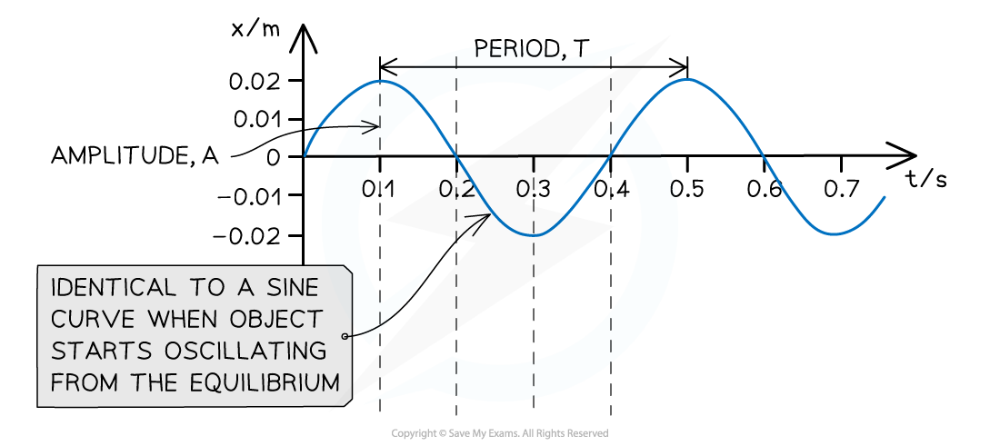

# Displacement-Time Graph for an Oscillator

## Displacement-Time graph for an oscillator

> **Spec point** — `spcpt_NQgdYYqt86zpw9ZC`

## Displacement-Time graph for an oscillator

- The displacement of an object in *simple harmonic motion* can be represented by a graph of displacement against time
- All undamped SHM graphs are represented by **periodic functions**

  - This means they can all be described by sine and cosine curves

- **Key features of the displacement-time graph:**

  - The *amplitude* of oscillations *A *can be found from the maximum value of *x*
  - The *time period* of oscillations *T* can be found from reading the time taken for one full cycle
  - The graph might not always start at 0
  - If the oscillations starts at the positive or negative amplitude, the displacement will be at its maximum

> **Exam Hint**
> This graph might not look identical to what is in your textbook, depending on where the object starts oscillating from at t = 0 (on either side of the equilibrium, or at the equilibrium). However, if there is no damping, they will all always be a general sine or cosine curve.
