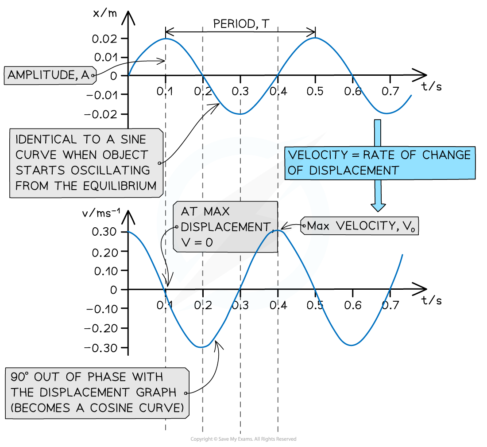

# Velocity-Time Graph for an Oscillator

## Velocity-Time Graph for an Oscillator

> **Spec point** — `spcpt_cMzK7Hw5hxhH8chQ`

## Velocity-Time Graph for an Oscillator

- The velocity of an object in *simple harmonic motion* can be represented by a graph of velocity against time

- **Key features of the velocity-time graph:**

  - It is 90o out of phase with the displacement-time graph
  - Velocity is equal to the rate of change of displacement
  - So, the velocity of an oscillator at any time can be determined from the **gradient of the displacement-time graph:** 
- An oscillator moves the fastest at its equilibrium position

  - Therefore, the velocity is at its **maximum** when the **displacement is zero**

> **Worked Example**
> A swing is pulled 5 cm and then released.
> 
> The variation of the horizontal displacement *x* of the swing with time t is shown on the graph below.
> 
> 
> 
> The swing exhibits simple harmonic motion.
> 
> Use data from the graph to determine at what time the velocity of the swing is first at its maximum.
> 
> **Answer:**
> 
> **Step 1: **The velocity is at its maximum when the displacement x = 0
> 
> **Step 2: **Reading value of time when x = 0
> 
> 
> 
> **From the graph this is equal to 0.2 s**

> **Exam Hint**
> These graphs might not look identical to what is in your textbook, depending on where the object starts oscillating from at t = 0 (on either side of the equilibrium, or at the equilibrium). However, if there is no damping, they will all always be a general sine or cosine curves.
