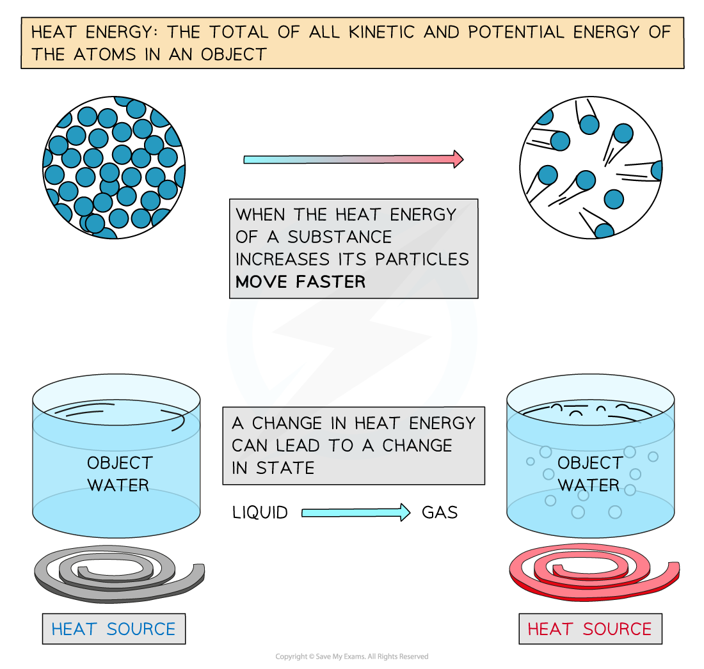
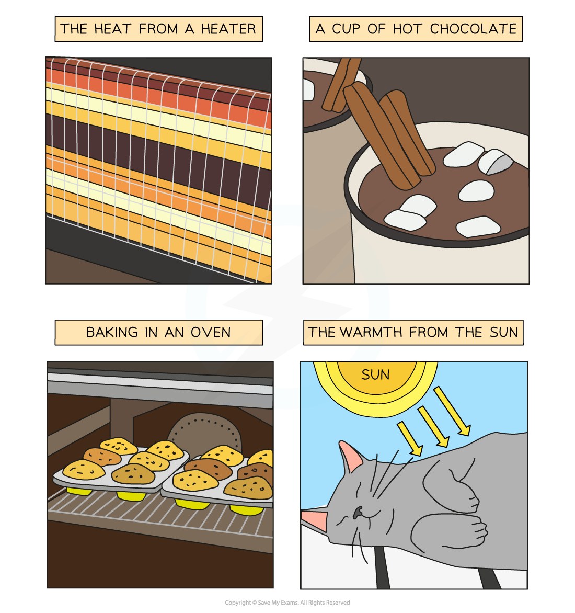
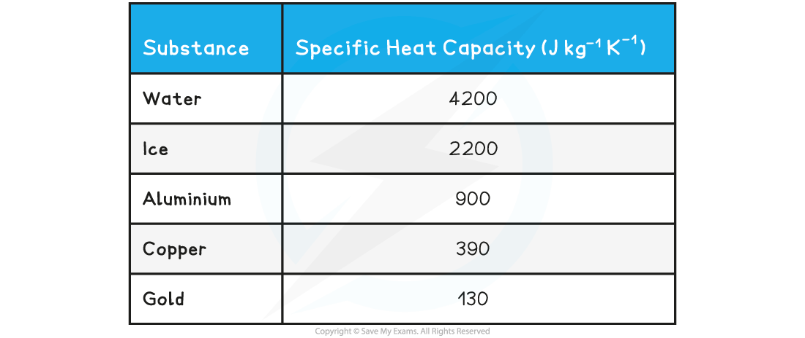
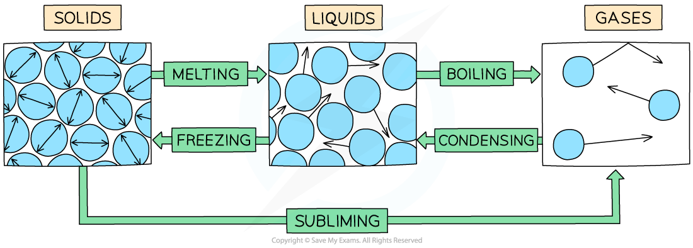
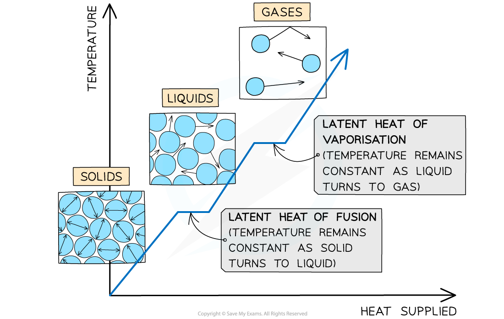

# Specific Heat Capacity & Latent Heat

## Specific Heat Capacity

> **Spec point** — `spcpt_4NkvXpp8Tmxhs4Hn`

## Specific Heat Capacity

- Specific heat capacity is defined as: **The energy required to raise the temperature of one kilogram of a substance by one kelvin**
- The increase in temperature of an object depends on:

  - The amount of heat energy transferred
  - The mass of the object
  - The specific heat capacity of the material from which the object is made

***Explanation of Heat Energy***

- The energy input is in the form of **heat** energy
- The amount of **heat** energy needed is given by the equation:

**Δ*****E***** = *****mc*****Δ*****θ***

- Where:

  - Δ*E* = change in heat energy, in joules (J)
  - *m = *mass, in kilograms (kg)
  - *c = *specific heat capacity, in joules per kilogram per degree Kelvin (J/kg K **or** J/kg °C)
  - Δ*θ = *change in temperature, in Kelvin or Celsius
- (The symbol Δ in Maths is used to denote a change in value)

***Examples of heat energy***

- The thermodynamic **Kelvin temperature scale** is defined as: **An absolute temperature scale where each degree is the same size as those on the Celsius scale**
- Different materials:

  - Have different specific heat capacities because of their molecular structure
  - Have different rises in temperature for the same change in heat energy

- Specific heat capacity is mainly used for **liquids** and **solids**
- Good electrical conductors, such as copper and lead, are **excellent conductors of heat **due to their **low** specific heat capacity

  - On the other hand, **water** has a **very high** specific heat capacity, making it ideal for **heating** homes as the water remains hot in a radiator for a long time
- The specific heat capacity of different substances determines how **useful** they would be for a specific purpose eg. choosing the best material for kitchen appliances

***Low v high specific heat capacity***

- The specific heat capacity of some substances are given in the table below as examples:

**Table of values of specific heat capacity for various substances**

> **Worked Example**
> Water of mass 0.48 kg is increased in temperature by 0.7 K. The specific heat capacity of water is 4200 J kg-1 K-1. Calculate the amount of energy transferred to the water.
> 
> **Answer:**
> 
> **Step 1: Write down the known quantities**
> 
> - Mass, *m* = 0.48 kg
> - Change in temperature, Δ*θ = *0.7 K
> - Specific heat capacity, *c* = 4200 J kg-1 K-1
> 
> **Step 2: Write down the relevant equation **
> 
> Δ*E* = *mc*Δθ
> 
> **Step 3: Calculate the energy transferred by substituting in the values**
> 
> Δ*E* = (0.48) × (4200) × (0.7) = 1411.2
> 
> **Step 4: Round the answer to 2 significant figures**
> 
> Δ*E* = 1400 J

> **Exam Hint**
> You will always be given the specific heat capacity of a substance, so you do not need to memorise any values. Make sure that Δθ is the **change** in temperature, therefore, it can be in K or °C.

## Specific Latent Heat

> **Spec point** — `spcpt_B2Zprr2kyNdR4d9w`

## Specific Latent Heat

- Energy is required to change the **state** of substance
- Examples of changes of state are:

  - Melting = solid to liquid
  - Evaporation/vaporisation/boiling = liquid to gas
  - Sublimation = solid to gas
  - Freezing = liquid to solid
  - Condensation = gas to liquid

***The example of changes of state between solids, liquids and gases***

- When a substance changes state, there is **no temperature change**
- The energy supplied to change the state is called the** latent heat **and is defined as: **The thermal energy required to change the state of one kilogram of a substance without any change of temperature**
- There are two types of latent heat:

  - Specific latent heat of **fusion** (melting)
  - Specific latent heat of **vaporisation** (boiling)

***The changes of state with heat supplied against temperature. There is no change in temperature during changes of state***

- The specific latent heat of **fusion** is defined as: ** The thermal energy required to convert one kilogram of solid to liquid with no change in temperature**

  - This is used when melting a solid or freezing a liquid
- The specific latent heat of **vaporisation** is defined as: ** The thermal energy required to convert one kilogram of liquid to gas with no change in temperature**

  - This is used when vaporising a liquid or condensing a gas

#### Calculating Specific Latent Heat

- The amount of energy Δ*E* required to melt or vaporise a mass of *m* with latent heat *L* is:

**Δ*****E = L*****Δ*****m***

** **

- Where:

  - *ΔE* =  amount of heat energy to change the state (J)
  - *L* = latent heat of fusion or vaporisation (J kg-1)
  - *Δm *= change in mass of the substance changing state (kg)
- The values of latent heat for water are:

  - Specific latent heat of fusion = 330 kJ kg-1
  - Specific latent heat of vaporisation = 2.26 MJ kg-1

- Therefore, evaporating 1 kg of water requires roughly **seven times** more energy than melting the same amount of ice to form water
- The reason for this is to do with intermolecular forces:

  - **When ice melts**: energy is required to just increase the molecular separation until molecules can flow freely over each other
  - **When water boils**: energy is required to completely separate the molecules until there are no longer forces of attraction between them, hence this requires much more energy

> **Worked Example**
> The energy needed to boil a mass of 530 g of a liquid is 0.6 MJ. Calculate the specific latent heat of the liquid and state whether it is the latent heat of vaporisation or fusion.
> 
> **Answer:**
> 
> **Step 1: Substitute in the values**
> 
> $\Deltam$ = 530 g = 530 × 10-3 kg
> 
> $\DeltaE$ = 0.6 MJ = 0.6 × 106 J
> 
> $L=\frac{0.6\times10^{6}}{530\times10^{-3}}=1.132\times10^{6}Jkg^{-1}=1.1MJkg^{-1}(2s.f.)$
> 
> **L is the latent heat of vaporisation** because the change in state is from liquid to gas (boiling)

> **Exam Hint**
> Use these reminders to help you remember which type of latent heat is being referred to:
> 
> - Latent heat of fusion = imagine ‘fusing’ the liquid molecules together to become a solid
> - Latent heat of vaporisation = “water vapour” is steam, so imagine vaporising the liquid molecules into a gas
