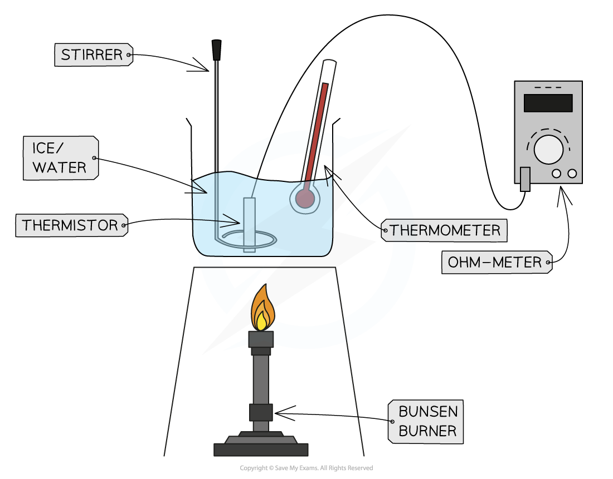
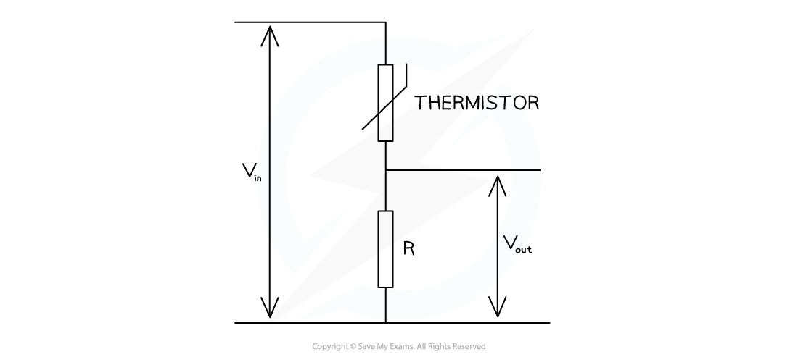

# Core Practical 12: Calibrating a Thermistor

## Core Practical 12: Calibrating a Thermistor

> **Spec point** — `spcpt_TyCcbsNq5HCQmPSf`

## Core Practical 12: Calibrating a Thermistor

#### Aim of the Experiment

- To calibrate a thermistor so it can be used as a thermometer

#### Variables

- *Independent variable* = temperature (oC)
- *Dependent variable* = resistance of thermistor (Ω)
- Control variables:

  - Temperature gradient controlled by stirring

#### Equipment

- Power source
- Thermistor
- Fixed resistor
- Ohm-meter
- Bunsen burner, tripod and gauze
- Beaker filled with crushed ice
- Stirring rod
- Liquid in glass or mercury thermometer with range -10 - 100oC

- *Resolution* of measuring equipment:

  - Thermometer = 1oC
  - Ohm-meter = 0.01 Ω

#### Method

- Set up the equipment with the thermistor immersed in the ice, the ohm-meter connected to record the resistance of the thermistor by placing it in parallel across it, and the fixed resistor in series with the thermistor
- Place the beaker of ice onto the tripod, without lighting the Bunsen burner
- Measure and record the temperature and reading on the ohm-meter
- Light the Bunsen burner and keep to a gentle flame
- Stir the ice / water gently at all times to keep the temperature as even as possible throughout the beaker
- At approximately 5oC intervals record the new temperature and resistance reading
- Continue until the water is boiling

#### Analysis

- Plot a graph of resistance against temperature
- Use the temperature graph to find the resistance at a given temperature

#### Evaluating the Experiment

***Systematic Errors:***

- Read the thermometer at eye level
- Check the zero error on the ohm-meter by connecting the leads across the terminals

***Random Errors:***

- Allow time for the temperature to reach equilibrium
- Stir the water before readings
- Ensure thermometer bulb is completely submerged in the water and level with the thermistor
- Turn off current between readings to avoid heating in the wires

#### Safety Considerations

- Risk of instability, use a stand and clamp to support leads
- Hot equipment and boiling water must be handled with care and allowed to cool down where possible
- Keep plastic cables / leads away from hot metal
- Check the voltage limit of the thermistor and stay within guidelines
