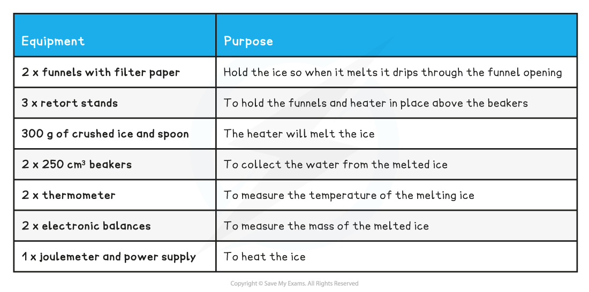
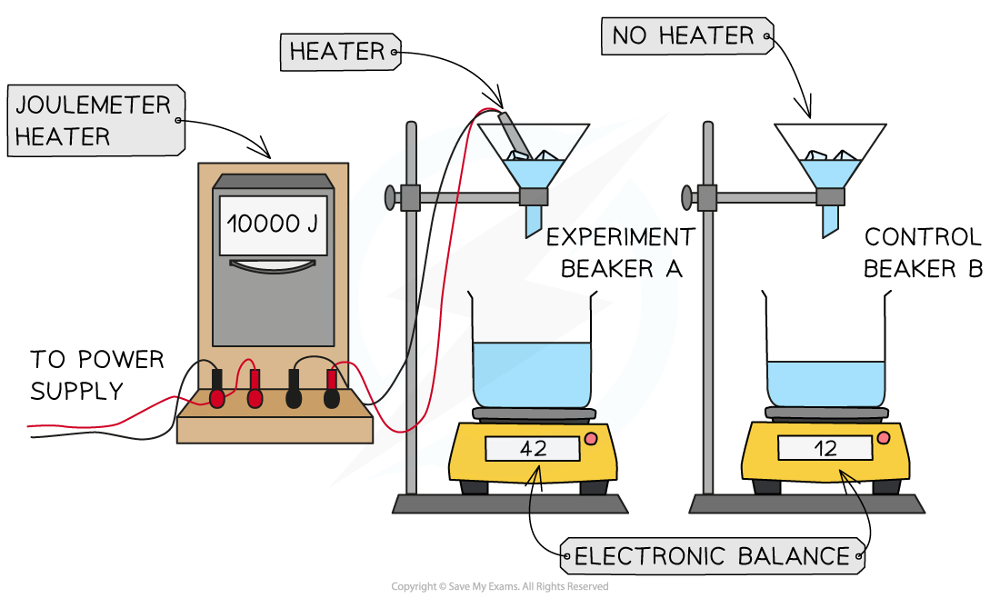
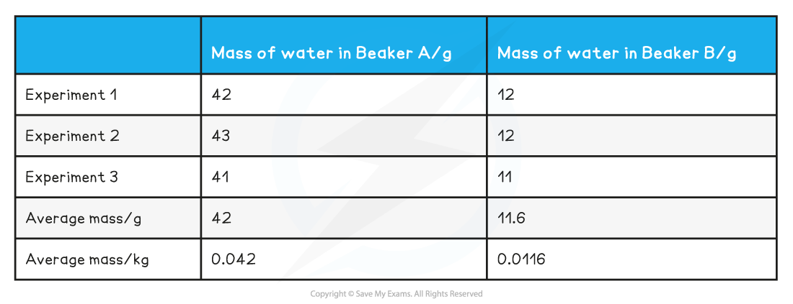

# Core Practical 13: Investigating Specific Latent Heat

## Core Practical 13: Investigating Specific Latent Heat

> **Spec point** — `spcpt_DDfmNbmHX4kHgMm8`

## Core Practical 13: Investigating Specific Latent Heat

#### Aims of the Experiment

- To determine the specific latent heat of ice

#### Variables:

- *Independent variable* = Energy of the heater (Joulemeter) (J)
- *Dependent variable* = The temperature, *T* of the ice/water (°C)
- Control variables:

  - Repeat readings with same energy supplied by heater
  - Mass of ice in each set up
  - Time for experiment in each set up

#### Equipment List

- Resolution of measuring equipment:

  - Joulemeter = 1 J
  - Electronic balance = 0.1 g
  - Thermometer = 0.1 °C

#### Method

1. Set up the experiment and the control 

  - Attach the funnels to retort stands, place the filter paper inside and add a heater (also on a retort stand) inside one of the funnels - ensure the heater is not touching the funnel

  - Use a spoon and an electronic balance to measure out 50 g of crushed ice into a beaker and pour into each funnel
  - Add a beaker below each funnel and place on top of an electronic balance
2. Wait until the ice reaches 0 °C.

  - This is when it starts to melt and water starts to drip out of both funnels into the beakers below.
  - Check the temperature with a thermometer in each funnel
3. Turn on the heater

  - Set the heater to supply 10, 000 Joules of energy to the experiment funnel
4. Wait until the reading on the Joulemeter says 10, 000 J

  - Turn the heater off
5. Read and record the mass of each beaker of water on each electronic balance
6. Repeat the experiment at least 3 times and calculate the average mass, *m* for the water in each beaker

  - *m**A **= *average mass of water in beaker A
  - *m**B **= *average mass of water in beaker B
7. Calculate the mass of the melted ice and convert into kg

  - Δ*m** *= *m**A *- *m**B*
  - Mass in g ÷ 1000 = Mass in kg
8. Calculate the specific latent heat of fusion of ice to water using the equation **Δ*****E = L*****Δ*****m*** $L=\frac{ΔE}{Δm}$

  - Δ*E**** ***= Energy supplied by the heater = 10 000 J
  - *L* = Specific latent heat of fusion
  - Δ*m *= mass of ice

#### Sample Results Table:

#### Analysis of Results

- The results obtained a latent heat of fusion of 330 000 J
- The actual value of the latent heat of fusion for ice is 334 000 J
- The percentage error in this value is $\frac{334000-330000}{334000}\times100$ = 1.2%

#### Evaluating the Experiment

*Systematic Errors:*

- Make sure you zero the electronic balances when the beakers are empty
- Always check that the ice has reached 0 °C by reading the thermometer at eye level
- This experiment requires accurate determination of energy transfers

  - To improve the accuracy, consider applying lagging or insulation to the funnels and beakers - this will reduce the amount of energy lost to the surroundings

*Random Errors:*

- The heater should be switched off and allowed to cool between readings

  - So the rate of heating and the starting temperature of the heater is the same

- Calculate the average mass of the water

  - This will reduce random errors in the reading
  - Repeat the experiment at least 3 times

#### Safety Considerations

- Ensure no water gets on the electronic balance

  - Wipe up any spillages immediately and turn off the balance
- Do not touch the heating element with your fingers, as it could be hot and burn your skin
- Do not handle ice with your bare hands, use a spoon to measure it into the beaker

> **Worked Example**
> A student conducts an experiment to find the latent heat of fusion for ice
> 
> They obtain the following table of results:
> 
> 
> 
> Calculate the latent heat of fusion.
> 
> **Answer:**
> 
> **Step 1: Complete the average mass row in the table**
> 
> - The average mass is calculated by adding all 3 masses together and then dividing by 3
> 
> 
> 
> **Step 2: Calculate the average mass in kg**
> 
> - Mass in g ÷ 1000 = Mass in kg
> 
> **Step 3: Calculate the latent heat of fusion**
> 
> - Calculate the specific latent heat of fusion of ice to water using the equation **Δ*****E = L*****Δ*****m***
> 
>   - Δ*E**** ***= Energy supplied by the heater = 10, 000 J
>   - *L* = Specific latent heat of fusion
>   - Δ*m *= mass of ice
>   - Rearrange the equation** **$L=\frac{ΔE}{Δm}$
>   - So,** **$L=\frac{10000}{0.03}$ = 340136 J kg-1 = 340 000 J
