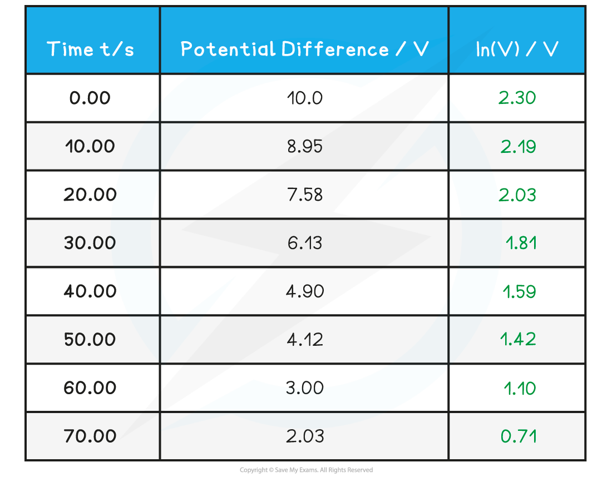
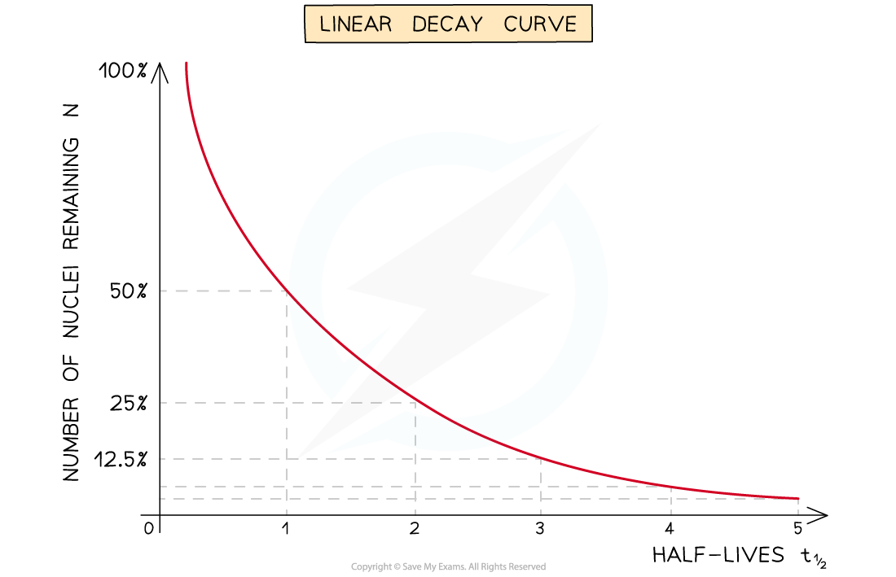
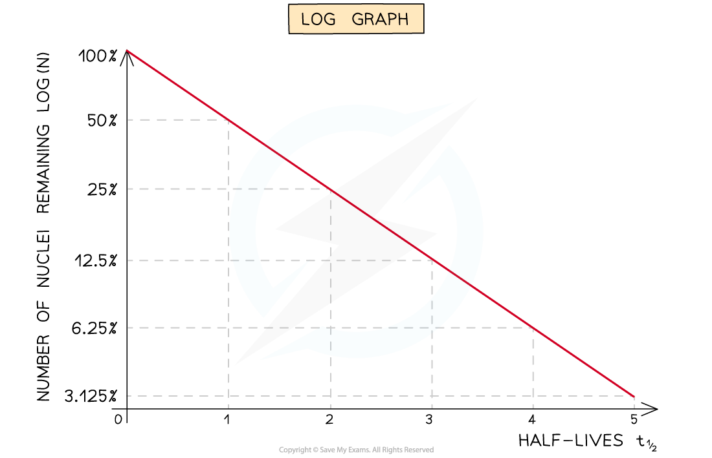

# Plotting Graphs

## Plotting Graphs

> **Spec point** — `spcpt_p8nrGMQM6QKj9BKd`

## Plotting Graphs

- When plotting graphs, it is important to consider the importance of the following factors:

  - Selecting appropriate scales
  - Labelling axes with quantities and units
  - Carefully plotting the points

#### Choice of Scale

- When choosing a scale, it must be big enough to accommodate all the collected values using as much of the graph paper as possible
- At least half of the graph grid should be occupied in both the x and y directions
- Scales should be clearly indicated and have suitable, sensible ranges that are easy to work with

  - For example, scales with multiples of 3 should be avoided
- The scales should increase outwards and upwards from the origin
- Each axis should be labelled with the quantity that is being plotted, along with the correct unit

#### Labelling the Axes

- Label each axis with the name of the quantity and its unit

  - For example, *F* / N means force measured in Newtons
- The convention is that a forward slash ( / ) is used to separate the quantity and the unit
- In general: 

  - The ***independent variable*** goes on the x-axis
  - The ***dependent variable*** goes on the y-axis

***Example of labelled axes with the name of the variable, its symbol and its unit***

#### Plotting the Points

- Points should be plotted so that they all fit on the graph grid and not outside it
- All values should be plotted, and the points must be precise to within **half a small square**
- Points must be clear, and not obscured by the line of best fit, and they need to be plotted with a sharp pencil so that they are thin
- There should be at least six points plotted on the graph, with any major outliers identified

#### Line or Curve of Best Fit

- There should be equal numbers of points above and below the line of best fit

  - Using a clear plastic ruler will help with this
- Not all lines will pass through the origin and nor should they be forced to
- The line (or curve) of best fit should not be too thick or joined dot-to-dot like a frequency polygon
- Anomalous values that have not been identified during the implementation stage should be ignored if they are obviously incorrect

  - This is because they will have a large effect on the gradient of the line of best fit

#### Determining the y-intercept

- The y-intercept is the y value obtained where the line crosses the y-axis at x = 0
- Values should be read accurately from the graph, with the scale on the y-axis being interpreted correctly

> **Worked Example**
> A student investigates the effect of placing an electric fan in front of a wind turbine. The wind turbine is connected to a voltmeter. When the wind turbine turns, it generates voltage. The student obtains the following results:
> 
> 
> 
> Plot the student’s results on the grid and draw a curve of best fit on the graph.
> 
> 
> 
> **Answer:**
> 
> **Step 1: Identify the independent and dependent variables**
> 
> - Independent variable = blade angle / °
> - Dependent variable = voltage / V
> 
> **Step 2: Choose an appropriate scale**
> 
> - The range of the blade angle is 0 – 90°
> - Ideally, every small square represents 10°
> 
> - The range of the voltage is 0 – 2.2 V
> - Ideally, each small square represents 0.5 V
> 
> - Both axes should occupy at least 50% of the grid
> 
> **Step 3: Label the axes**
> 
> - The dependent variable (voltage / V) goes on the y-axis
> - The independent variable (blade angle / °) goes on the x-axis
> - Both axes should be labelled with a quantity and a unit
> 
> **Step 4: Plot the points**
> 
> - Each point should be accurate within half a small square
> 
> 
> 
> **Step 5: Draw a curve of best fit**
> 
> - The curve should be smooth with a roughly equal distribution of points on either side of the curve
> - It must start at (0,0) and peak at (20, 2.2)
> 
> 

> **Exam Hint**
> Remember that 'sketching' and 'plotting' a graph are two different command words
> 
> - 'Sketch' means – Produce** **a freehand drawing. For a graph, this would require a line and labelled axis with important features indicated, the axes are not scaled.
> - 'Plot' means – Produce a graph by marking points accurately on a grid from data that is provided and then drawing a line of best fit through these points. A suitable scale and appropriately labelled axes must be included if these are not provided in the question
> 
> The difference between these two command words is the use of scales. A plotted graph has scaled axes, whilst a sketch doesn't have to be but both times the axes should be clearly labelled

## Logarithmic Scales

> **Spec point** — `spcpt_dGzD64bSygS4rDfy`

## Logarithmic Scales

- Graphs can be logarithmic in nature
- A logarithmic (log) scale is a non-linear scale often used for analysing a large range of quantities

  - The log of a number is always greater than 1, so all log values are only positive
  - Hence, when drawing a log-log graph, the graph will only have a positive quadrant
- Often, in practicals, if the log of a value is required, then a separate column is needed in the data table to calculate this, for example:

**Table of Results Using ln**

***A separate column is often needed to calculate *****ln(*****V*****)**

- In the above case, the potential difference *V* is determined from a voltmeter, but the ln(*V*) values are calculated using a calculator
- The most common example of this in A level physics is in:

  - Radioactive decay
  - capacitor charge and discharge equations

#### Using Natural logs (ln)

- Taking natural logs (ln) of an equation with an *exponential* function means the equation can become **linear** i.e. in the form** *****y***** = *****mx***** + *****c***
- Straight-line graphs tend to be more useful than curves for interpreting data

  - Gradients and intercepts are useful values that can be seen from a straight-line graph
- Nuclei decay exponentially, therefore, to achieve a straight-line plot, logarithms can be used
- Take the exponential decay equation for the number of nuclei

***N***** = *****N******0***** e****–λt**

- Taking the natural logs of both sides

**ln *****N***** = ln (*****N******0******e******–λt*****) = ln (N****0****) + ln(*****e******–λt***)

**ln *****N***** = ln (*****N******0*****) − λ*****t***

- In this form, this equation can be compared to the equation of a straight line

***y***** = *****mx***** + *****c***

**ln *****N = − λt +***** ln***** (N******0******) ***

- Where:

  - *y* = ln (*N*) is plotted on the y-axis
  - *x* = t is plotted on the x-axis
  - gradient, *m *= −λ
  - y-intercept = ln (*N**0*) is a constant

- The exponential decay version of the equation could produce a curve, whilst the ln(*N*) equation produces a straight line

***Linear decay curve vs. a log graph***

> **Exam Hint**
> Remember that **log** and **ln** are subtly different! There are two different functions on your calculator.
> 
> - By default, log is to the base 10, log10 E.g., log 100 = log10 100 = 2
> 
>   - This is very rarely used, if at all, in A level physics
> - 'ln' is just log to the base *e* (the exponential function). Therefore, ln = loge E.g., ln(ex) = loge(ex) = x
> 
>   - Therefore, if you ever have an exponential function, *e* in the equation - use 'ln' and not 'log'
> 
> 'ln' follows all the same laws of logarithms of addition, subtraction and power. You can find more in the 'Logarithmic Function' A level Maths notes here on Save My Exams
