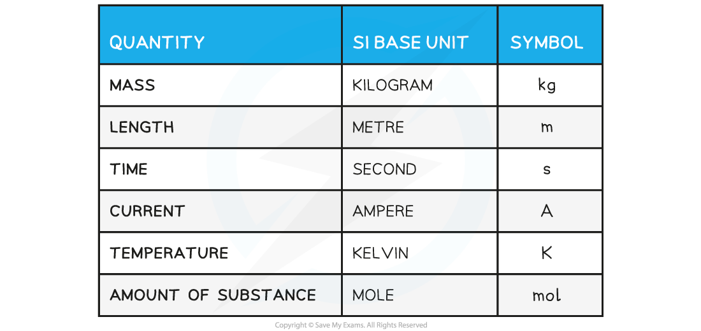
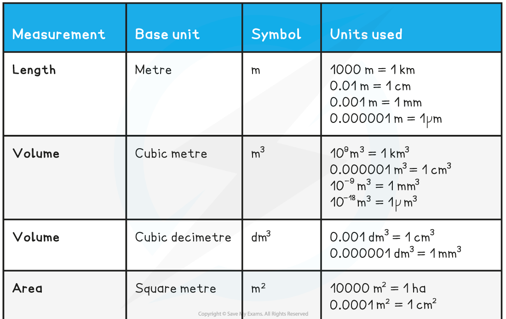
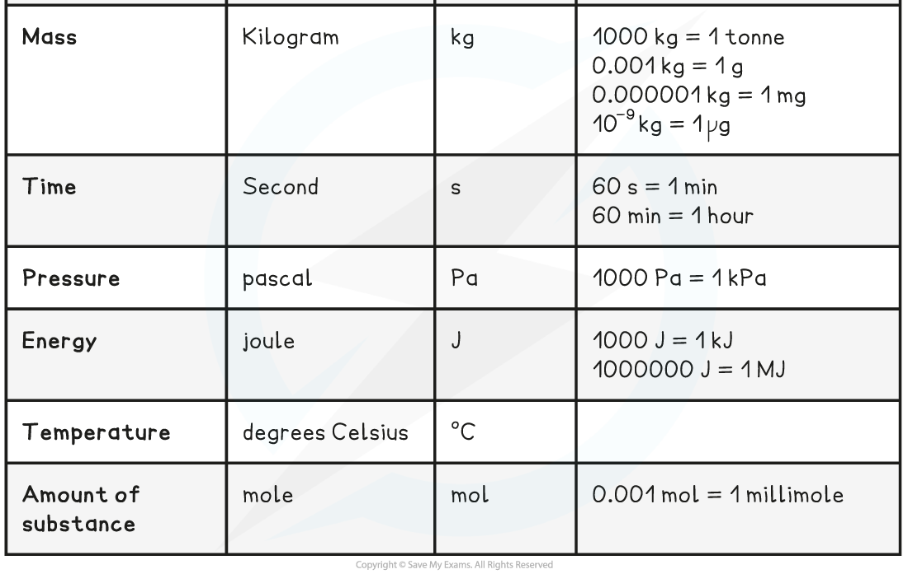

# Using Units Correctly

## Using Units Correctly

> **Spec point** — `spcpt_WTX57VsbRY3VbxsX`

## Using Units Correctly

#### SI Base Units

- Every time you measure or calculate a quantity, you need to give its **units**
- All units in Physics can be reduced to six base units from which every other unit can be derived

  - These other quantities are called derived units
- These seven units are referred to as the *SI Base Units*; this is the only system of measurement that is officially used in almost every country around the world

**SI Base Quantities Table**

#### Derived Units

- Derived units are derived from the seven SI Base units mathematically
- The base units of physical quantities such as:

  - Newtons, **N**
  - Joules, **J**
  - Pascals, **Pa, **can be deduced
- To deduce the base units, it is necessary to use the definition of the quantity
- The Newton (N), the unit of force, is defined by the equation:

  - Force = mass × acceleration
  - N = kg × m s–2 = kg m s–2
  - Therefore, the Newton (N) in SI base units is **kg m s****–2**
- The Joule (J), the unit of energy, is defined by the equation:

  - Energy = ½ × mass × velocity2
  - J = kg × (m s–1)2 = kg m2 s–2
  - Therefore, the Joule (J) in SI base units is **kg m****2**** s****–2**
- The Pascal (Pa), the unit of pressure, is defined by the equation:

  - Pressure = force ÷ area
  - Pa = N ÷ m2 = (kg m s–2) ÷ m2 = kg m–1 s–2
  - Therefore, the Pascal (Pa) in SI base units is **kg m****–1**** s****–2**

- It is essential that the correct scientific measurements are used when discussing experiments in physics
- Ensure that the **correct symbols** are used in conjunction with the unit of measurement

  - E.g. m3 for cubic metres

**Units of Measurement Table**

- Note:

  - cm3 is the same as millilitre (ml)
  - dm3 is the same as litre (l)

> **Exam Hint**
> Units are **extremely** important in physics, and should always be stated when calculating any values if they are not already given on the paper. Units should always be included on the axes for graphs (either sketches or plotted) and table headings. Some variables may not have units, such as straight, refractive index and number of particles.
