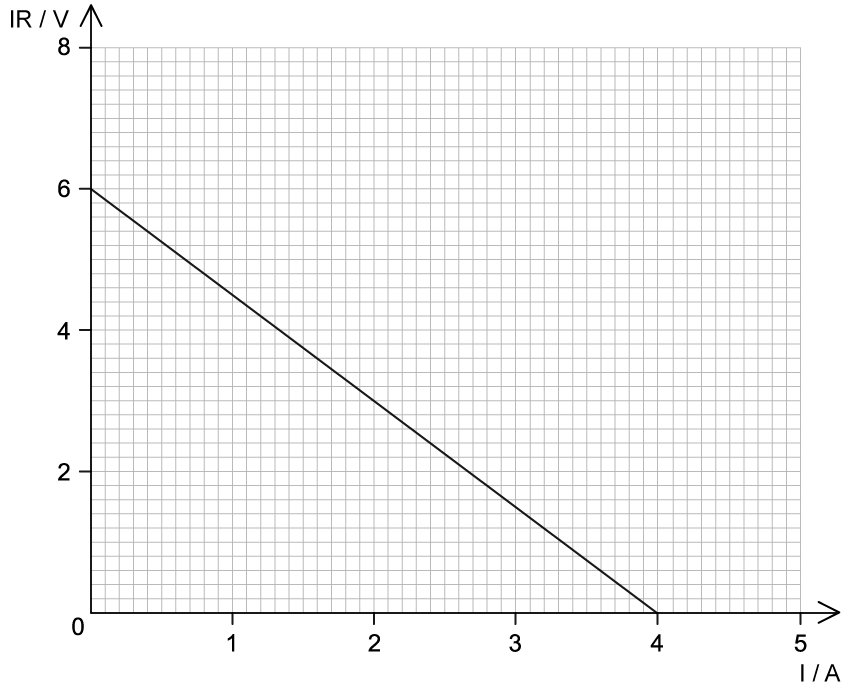

# Trend & Patterns in Experimental Data

## Trend & Patterns in Experimental Data

> **Spec point** — `spcpt_sRM2QbnnCmVfmqGh`

## Trend & Patterns in Experimental Data

- Graphs are used to visualise the relationship between two sets of data from two different variables
- Trends and patterns can be identified from experimental data
- Common trends are:

  - Linear
  - Directly proportional
  - Inversely proportional
  - Rate of change
- A **linear** graph set of data is any data that creates a **straight line**

***An example of a linear graph***

- The rate of change of a graph is how quickly a variable is increasing or decreasing with something else

  - This can be seen from the change in **gradient** of the graph, an increasing gradient has an increasing rate of change and a decreasing gradient has a decreasing rate of change
- A direct proportionality relationship is where as one amount increases, another amount increases at the same rate

  - This is represented by a **straight-line **graph with a positive gradient
- For two variables, *y* and *x* this looks like:

y ∝ x

- An inverse proportionality relationship is where as one amount increases, another amount **decreases** at the same rate

  - This is represented by a **curved **graph with a decreasing gradient
- For two variables, *y* and *x* this looks like:

y ∝ $\frac{1}{x}$

***Sketched graphs show relationships between variables***

- In the first sketch graph, above you can see that the relationship is a straight line going through the origin

  - This means as you double one variable the other variable also doubles so we say the independent variable is** directly proportional** to the dependent variable
- The second sketched graph shows a shallow curve

  - This is the characteristic shape when two variables have an** inversely proportional** relationship
- The third sketched graph shows a straight horizontal line,

  - This means as the independent variable (x-axis) increases the dependent variable does not change or is constant

> **Worked Example**
> Comment on the trend of the graph.
> 
> 
> 
> **Answer:**
> 
> - Stress and strain are proportional to each other, but not directly
> - The graph is linear with a positive gradient up to a strain of 1.0 × 10-3
> - After this, the rate of change of the strain with stress decreases, as the gradient of the graph decreases up to the breaking stress at 190 MPa
