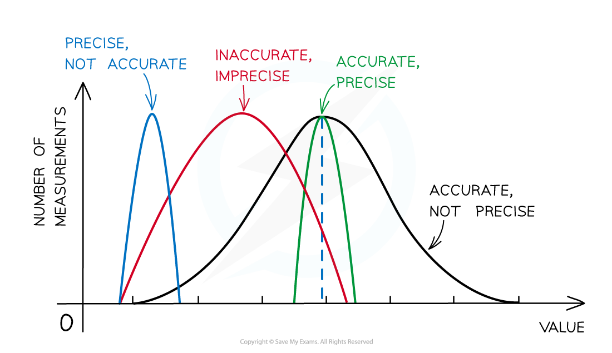

# Precision & Accuracy

## Precision & Accuracy

> **Spec point** — `spcpt_YdfzgcHx2XzbH5SW`

## Precision & Accuracy

#### Precision

- Precision is how close the measured values are to each other
- If a measurement is repeated several times, then they can be described as precise when the values are very similar to, or the same as, each other
- The precision of a measurement is reflected in the values recorded

  - Measurements to a greater number of decimal places are said to be more **precise** than those to a whole number

#### Accuracy

- Accuracy is how close a measured value is to the true value
- Accuracy can be increased by repeating measurements and finding a mean average

***The difference between precise and accurate results***

- Measurements of quantities are made with the aim of finding the *true value* of that quantity
- In reality, it is impossible to obtain the true value of any quantity, there will always be a degree of uncertainty
- The uncertainty is an estimate of the difference between a measurement reading and the true value
- Random and systematic errors are two types of measurement errors which lead to uncertainty

***Representing precision and accuracy on a graph***

#### Sensitivity

- A measuring instrument can have a sensitivity

  - This is the ratio of the changes in the output of an instrument to the change in value of the quantity being measured
- In other words, this is the smallest change the instrument can detect

- This is slightly different to *resolution*
- Resolution is the smallest change the instrument can **observe** but sensitivity is the smallest change that the instrument can **detect**
- If what you are measuring (the *dependent variable*) changes significantly when the *independent variable* is changed, then the instrument is deemed to be sensitive

  - If the value does not change significantly, with big changes to the independent variable, then the instrument is not sensitive
- An instrument with better sensitivity detects changes in a variable much better

  - For example, a thermometer could have a sensitivity of 1 °C (it only detects change of 1 °C)
  - A digital thermometer could have a sensitivity of 0.1 °C (it can detect changes as small as 0.1 °C)
- If you are taking measurements in very small intervals of temperature increase, the digital thermometer will be able to give much more accurate results

> **Exam Hint**
> Try not to confuse precision with accuracy - measurements can be precise but not accurate if each measurement reading has the same error. Precision refers to the ability to take multiple readings with an instrument that are close to each other, whereas accuracy is the closeness of those measurements to the true value.
