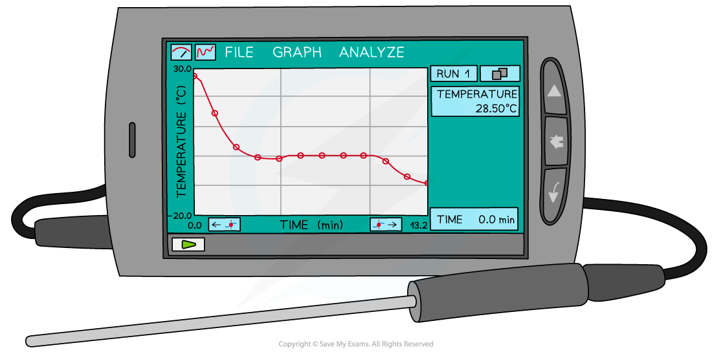
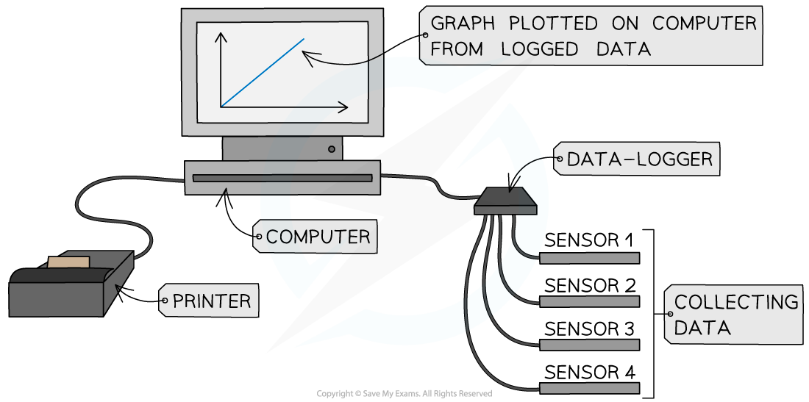

# Suggesting Improvements

## Suggesting Improvements

> **Spec point** — `spcpt_xmbGSGjwbHqry68f`

## Suggesting Improvements

- Improvements to an experiment help make it more reliable and reproducible to gain more trust in the results
- A common method is to use **digital** methods of data collection where possible

  - These subsequently reduce uncertainties that are a result of human error (e.g., reaction time)

#### Software & Tools

- Graph plotting and data analysis software, such as Microsoft Excel, can be an invaluable tool

  - Spreadsheets provide a very effective way of processing data, particularly when the amount of data is large
- **Cameras** can be used to take photos in experiments that happen too quickly to read a scale

  - A camera can be used to take a photo burst as the experiment happens
  - The scale can then be read from the photos afterwards
  - If the time each photo is taken is known, or if the frame rate is known, then properties such as velocity can be calculated

#### Data Loggers

- Data loggers are a tool that allows for the **quick and efficient gathering of data**

  - They are more accurate, quick and reliable than manual logging
- The information contained within a data logger can be inputted into a computer and formatted into a **table**
- After this is done the computer is able to calculate the **average **and** plot graphs** using the data and calculate gradients which quicker and more accurately than humans
- They are electronic devices that automatically monitor and record environmental parameters over time such as temperature, pressure, voltage or current

  - It contains multiple sensors to receive the information and a computer chip to store it

***A data logger measuring and displaying temperature using a probe***

- The benefits of using data loggers and ICT (information and communication technology) include:

  - Readings are taken with **higher** degrees of **accuracy**
  - Reduction of **human error** (e.g. human reaction times, subjectiveness)
  - Readings can be taken over a **long period of time** e.g. hourly readings of temperature over many days
  - Readings can be taken in a **very short period of time**, which would be too quick for humans to see a difference
  - Reduction in safety risks with **extreme conditions** such as measuring the temperature of boiling water

#### Computer Modelling

- Computer modelling is commonly done in conjunction with devices such as a data logger

  - Modelling is about processing the data collected from a physics experiment into software or a spreadsheet
- Graphs and charts can be generated from a table of values

  - These can then be exported to a scientific report
- One of the benefits of these computer programs is that **time** can be **sped up to predict the future outcome **of an experiment

***Computer modelling uses a computer and sensors to analyse and display data***

#### Making Methods Reproducible

- To improve upon an experimental method, it could be made more **reproducible**

  - This is the ability to be properly reproduced for other scientists to also see if they get the same results
- For example, when measuring the resistivity of a wire, a constantan wire may be used

  - If the same method is used to measure an accurate value of the resistivity of copper or aluminium, then this means the method is properly reproducible
- A further discussion of similarities and / or differences between the three wire materials can then be analysed
- Another example could be when measuring the count rate of a gamma ray source

  - By using a more or less active source, more differentiation in their readings can be achieved
