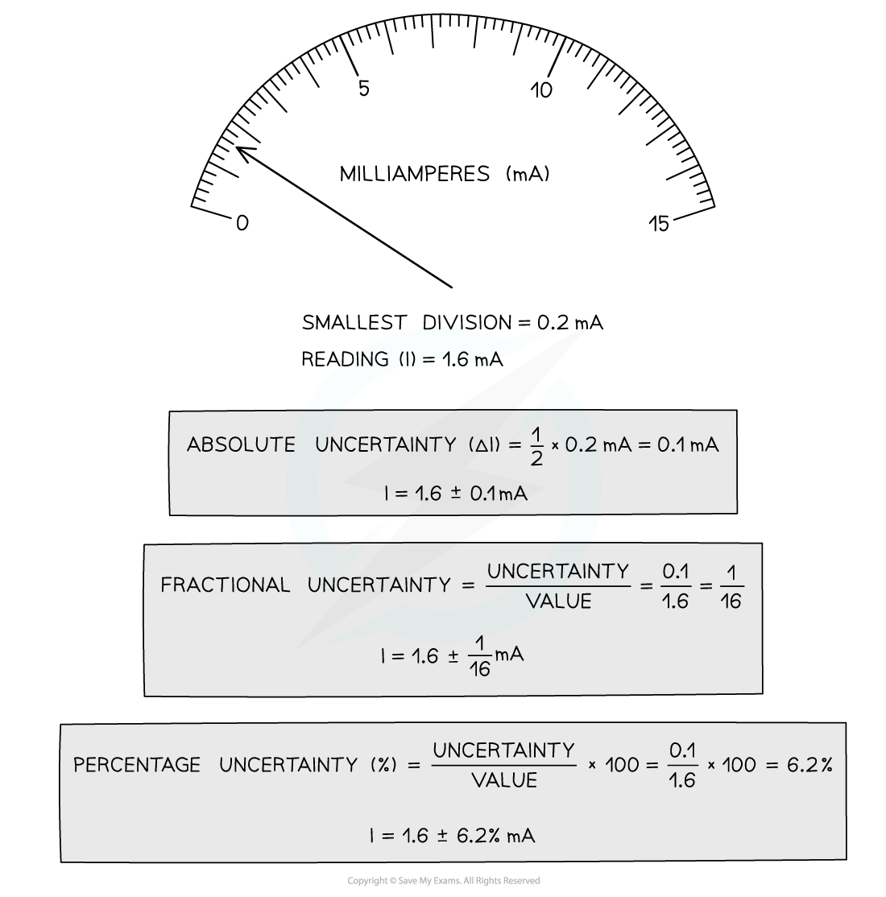
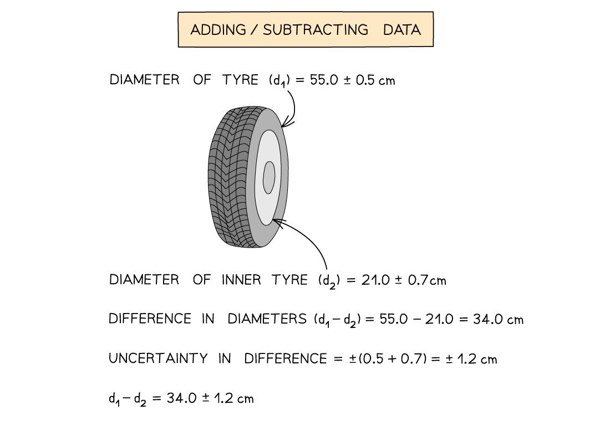

# Uncertainties

## Uncertainties

> **Spec point** — `spcpt_WrkwWBv3TxNpYMSX`

## Uncertainties

- Uncertainties can be represented in a number of ways:

  - **Absolute Uncertainty:** where uncertainty is given as a fixed quantity
  - **Fractional Uncertainty:** where uncertainty is given as a fraction of the measurement
  - **Percentage Uncertainty: **where uncertainty is given as a percentage of the measurement
- Percentage uncertainty is defined by the equation:

**Percentage uncertainty = **$\frac{uncertainty}{measuredvalue}$**× 100 %**

- To find uncertainties in different situations:
- **The uncertainty in a reading:** ± half the smallest division
- **The uncertainty in a measurement:** at least ±1 smallest division
- **The uncertainty in repeated data:** half the range i.e. ± ½ (largest - smallest value)
- **The uncertainty in digital readings:** ± the last significant digit unless otherwise quoted

***How to calculate absolute, fractional and percentage uncertainty***

- Always make sure your absolute or percentage uncertainty is, at a maximum, to the same number of **significant figures** as the reading

- Absolute uncertainties are compounded when **adding** or **subtracting** data

#### Adding / Subtracting Data

- **Add** together the absolute uncertainties

> **Exam Hint**
> Remember:
> 
> - Absolute uncertainties have the same units as the quantity
> - The uncertainty in numbers and constants, such as π, is taken to be zero
> 
> In Edexcel International A level, the uncertainty should be stated to at least one few significant figures than the data but no more than the significant figures of the data.
> 
> For example, the uncertainty of a value of 12.0 which is calculated to be 1.204 can be stated as 12.0 ± 1.2 or 12.0 ± 1.20.
