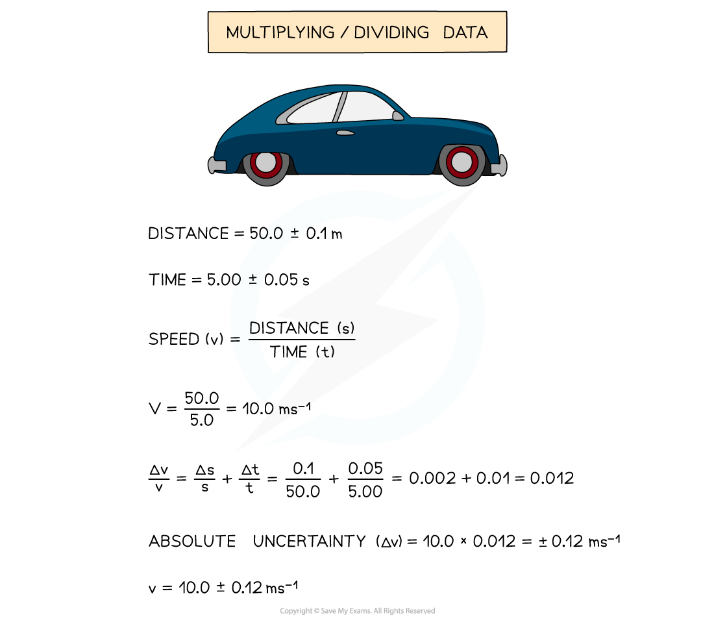

# Calculating Percentage Uncertainties

## Percentage Uncertainties

> **Spec point** — `spcpt_2mgNrWcZsRD9zV3Z`

## Percentage Uncertainties

- Percentage uncertainties are compounded when **multiplying** or **dividing** data

#### Multiplying / Dividing Data

- **Add** the percentage or fractional uncertainties

#### Raising to a Power

- **Multiply** the percentage uncertainty by the power

> **Exam Hint**
> Remember:
> 
> - Percentage uncertainties have **no** units
> - The uncertainty in numbers and constants, such as π, is taken to be zero
> 
> In Edexcel International A level, the uncertainty should be stated to at least one few significant figures than the data but no more than the significant figures of the data.
> 
> For example, the uncertainty of a value of 12.0 which is calculated to be 1.204 can be stated as 12.0 ± 1.2 or 12.0 ± 1.20.

## Single & Multiple Readings

> **Spec point** — `spcpt_yCr4RBkQ8JyHgH6b`

## Single & Multiple Readings

#### Single Reading

- Percentage uncertainty for a single reading (measured value) is defined by the equation:

**Percentage uncertainty = **$\frac{uncertainty}{measuredvalue}$**× 100 %**

- The (absolute) uncertainty in a single reading is **half** the *resolution* of the instrument

#### Multiple Readings

- The percentage uncertainty in measurements from **multiple **readings (e.g. repeat readings) use **half** the **range** of the readings

  - The range of the readings is the **difference **between the highest and lowest reading

> **Worked Example**
> A student achieves the following results in their experiment for the angular frequency, *ω.*
> 
> 0.154, 0.153, 0.159, 0.147, 0.152
> 
> Calculate the percentage uncertainty in the mean value of *ω.*
> 
> **Answer:**
> 
> **Step 1: Calculate the mean** **value **
> 
> mean *ω = *$\frac{0.154+0.153+0.159+0.147+0.152}{5}$*= *0.153 rad s–1
> 
> **Step 2: Calculate half the range (this is the uncertainty for multiple readings)**
> 
> $\frac{1}{2}$× (0.159 – 0.147) = 0.006 rad s–1a
> 
> **Step 3: Calculate percentage uncertainty**
> 
> $\frac{uncertainty}{measuredvalue}$ × 100 % = $\frac{\pmhalftherange}{mean}$ × 100 %
> 
> $\frac{0.006}{0.153}$× 100 % = 3.92 %

> **Exam Hint**
> Remember that percentage uncertainties have **no** units, only the % sign! Always make sure your percentage uncertainty is at least one **significant figures** smaller than the measurement.
