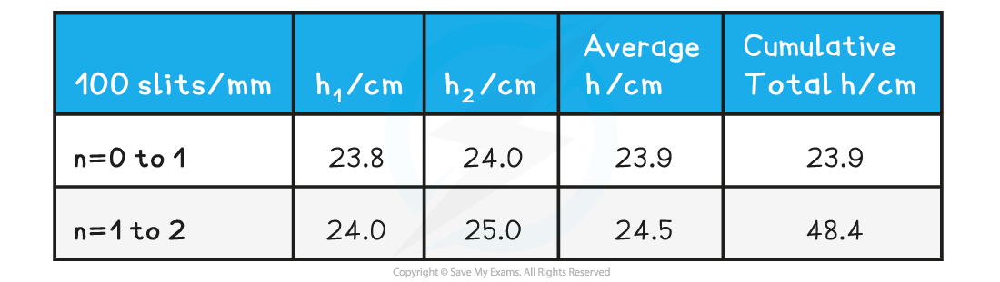

# Significant Figures

## Significant Figures

> **Spec point** — `spcpt_ZzRXFhYMrZbYkkWF`

## Significant Figures

- Significant figures must be used when dealing with **quantitative** data
- Significant figures are the digits in a number that are **reliable and absolutely necessary** to indicate the quantity of that number
- There are some important** rules** to remember for significant figures

  - All non-zero digits are significant
  - Zeros between non-zero digits are significant
  
    - 4107 (4.s.f.)
    - 29.009 (5.s.f)
  - Zeros that come before all non-zero digits are not significant
  
    - 0.00079 (2.s.f.)
    - 0.48 (2.s.f.)
  - Zeros after non-zero digits within a number without decimals are not significant
  
    - 57,000 (2.s.f)
    - 640 (2.s.f)
  - Zeros after non-zero digits within a number with decimals are significant
  
    - 689.0023 (7.s.f)
- When rounding to a certain number of significant figures:

  - Identify the significant figures within the number using the rules above
  - Count from the first significant figure to the specified number
  - Use the next number as the ‘rounder decider’
  - If the decider is 5 or greater, increase the previous value by 1

> **Worked Example**
> Write 1.0478 to 3 significant figures
> 
> **Answer:**
> 
> **Step 1: Identify the number of significant figures**
> 
> They are all significant figures
> 
> **Step 2: Count to the specified number (3rd s.f.)**
> 
> 1.0**4**78
> 
> **Step 3: Round up or down**
> 
> 1.05 (3 s.f)

> **Exam Hint**
> An exam question may sometimes specify how many significant figures the answer should be, make sure you keep an eye out for this, as a mark is often given for that!

## Correcting Data in Tables

> **Spec point** — `spcpt_vm9XCQ5KJFhjXZ4b`

## Correcting Data in Tables

- Data in tables must also be to the **same** number of significant figures in each column
- An example of data table with consistent significant figures in the data is:

**Example Table With Correct Significant Figures**

- In this table, all the data is to 3 s.f.

  - It is important that data in each **column** must be to the same number of significant figures
- A table of data with **inconsistent** significant figures would look like:

**Example Table With Incorrect Significant Figures**

| ***f***** / Hz** | ***l***** / m** |
|---|---|
| 250.0 | 0.322 |
| 320 | 0.25 |
| 348.23 | 0.2283 |
| 512 | 0.160 |

- In the first column, some are to 4 s.f., 3 s.f. and 5 s.f.

  - These should ideally all be to 3 s.f
- In the second column, some are to 2 s.f., 3 s.f. and 4 s.f.

  - These should ideally all be to 3 s.f.
- When considering how many significant figures to put the data in, the resolution of the instrument must be considered

  - A ruler has a resolution of 1 mm
  - This means all measurements in mm with a ruler, should be recorded to 1 s.f as a more precise value cannot be known due to the limitations of the measuring instrument

> **Worked Example**
> From the following data set, correct the incorrect values.
> 
> | ***f***** / Hz** | ***l***** / m** |
> |---|---|
> | 250.0 | 0.322 |
> | 320 | 0.25 |
> | 348.23 | 0.2283 |
> | 512 | 0.160 |
> 
> **Answer:**
> 
> - The correct table of results would look like
> 
> | ***f***** / Hz** | ***l***** / m** |
> |---|---|
> | **Final answer:** **250** | 0.322 |
> | 320 | **Final answer:** **0.250** |
> | **Final answer:** **348** | **Final answer:** **0.228** |
> | 512 | 0.160 |

> **Exam Hint**
> In Edexcel International A-level, questions about tables often say 'criticise these results'. One mark for these types of questions is often simply looking at the consistency of the significant figures in the given table! Although for this question you don't have to go into too much detail, simply 'inconsistent significant figures' can do.
