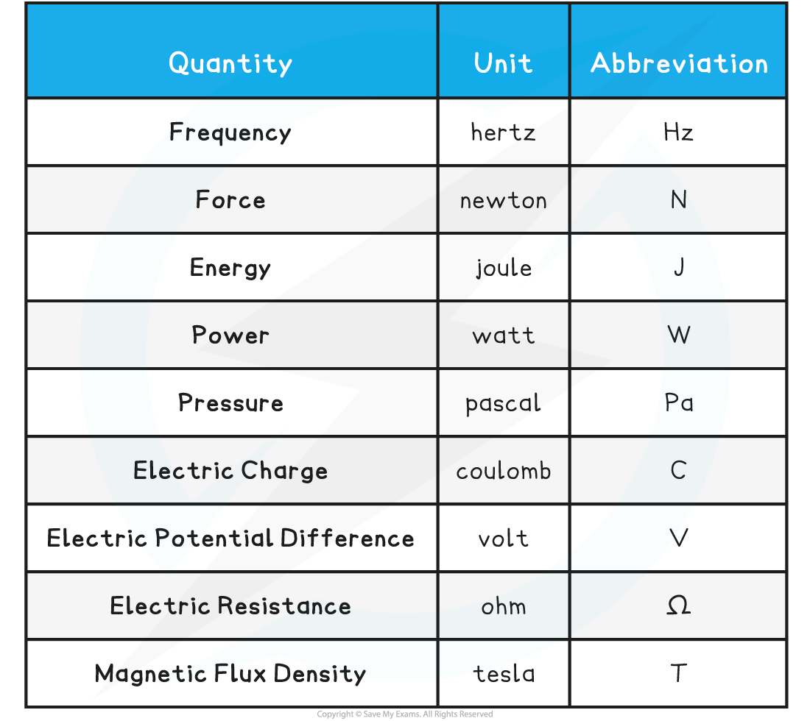

# Correcting Units

## Correcting Units

> **Spec point** — `spcpt_gV9hfy28VkWvHwG8`

## Correcting Units

- In Physics, a value without its appropriate unit doesn't really mean anything

  - For example, 5 mm or 5 km are **very** different measurements
- Some common units in A-level Physics are:

**Common Units Table**

- Sometimes practical questions require identifying units that are **incorrect**
- Learning the appropriate unit for each physical quantity in A-level physics is extremely important
- Sometimes the unit can be derived from an equation for that quantity

  - For example, the units of the resistivity *ρ* can be considered from its equation

ρ = $\frac{RA}{L}$

- Where:

  - *R* = resistance (Ω)
  - *A* = area (m2)
  - *L* = length (m)
- Therefore:

[*ρ*] = `fraction numerator left square bracket R right square bracket left square bracket A right square bracket over denominator left square bracket L right square bracket end fraction` =  $\frac{Ωm^{2}}{m}$ = Ωm

- Common units for measurements are:

  - Length = m
  - Area = m2
  - Volume = m3

> **Worked Example**
> Correct the following incorrect units:
> 
> 1. Magnetic Flux Density = 2 Webers
> 2. Electromotive Force = 7.8 N
> 3. Capacitance = 0.3 µC
> 4. Stress = 600 m2
> 
> **Answer:**
> 
> The correct units are:
> 
> 1. Magnetic Flux Density = 2 **T **(Tesla)
> 2. Electromotive Force = 7.8 **V **(Volts)
> 3. Capacitance = 0.3 µ**F** (Micro-farads)
> 4. Stress = 600 **Pa** (Pascals)
