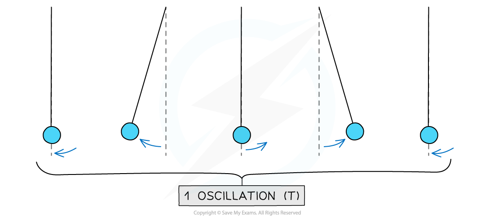
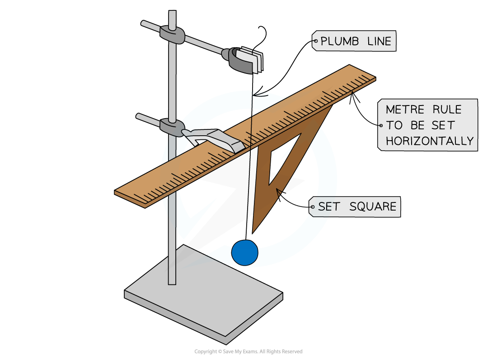
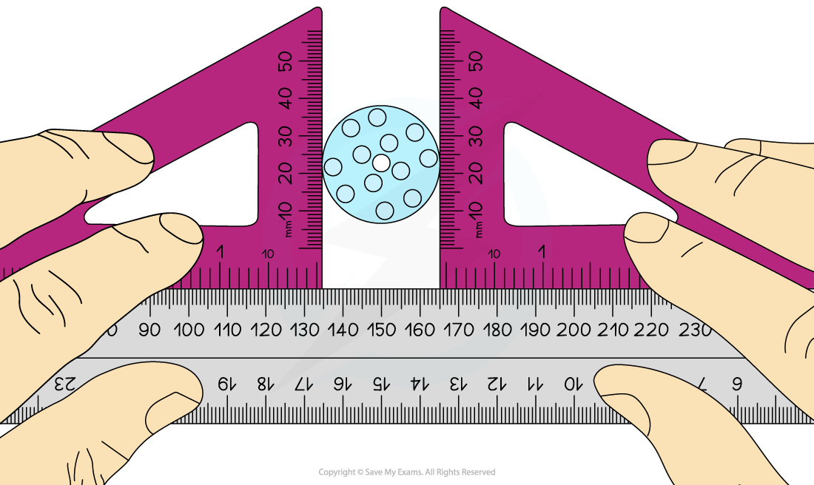
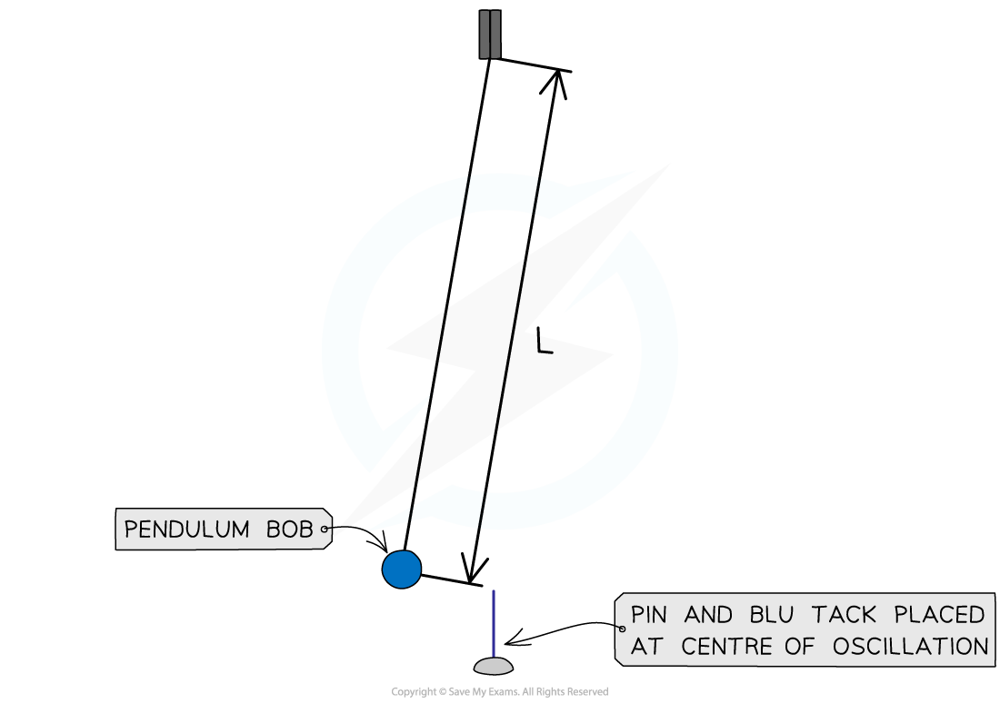

# Evaluating Experiments

## Evaluating Experiments

> **Spec point** — `spcpt_4RYZ6zt3SsKCrvwQ`

## Evaluating Experiments

- The ***accuracy*** of an experiment can be increased by repeating measurements and using mean values
- Methods seeking to reduce ***systematic errors*** result in increased accuracy
- Sometimes, additional apparatus can be used to improve the experiment, by reducing errors
- Some changes to the method could be:

  - Timing over multiple oscillations
  - Using a fiducial marker

#### Example: Oscillations

- The time period of oscillations is commonly measured using a stopwatch

  - Reaction time is a common error when measuring time
- Uncertainty in a measurement of periodic time can therefore be reduced by:

  - Measuring many oscillations to calculate the average time for one oscillation
  - Increasing the total time measured for multiple swings
- It would be ideal to measure the time taken for the pendulum to complete 10 (or more) oscillations and **divide** this time by 10 to determine the time period of **one** oscillation

***One complete oscillation of a pendulum***

> **Worked Example**
> A student wants to measure the time period of a vertical mass on a spring system. The time is measured on a stopwatch between when the mass is pulled down till after one complete oscillation.
> 
> Discuss how the student could reduce the error in their measured time period.
> 
> **Answer:**
> 
> - The student should make sure the amplitude of the oscillations is large so the time period is longer
> 
>   - This would reduce the effect of the human reaction time which causes a slight error when using a stopwatch
> - The student should measure the time period over 10 oscillations and divide the time by 10 for the time period of one oscillation
> 
>   - However, due to damping effects, the amplitude of all the oscillations, and therefore their time periods, will not be the same
>   - This effect is reduced if there is a large amplitude for the first oscillations
> - The spring must not exceed its elastic limit at any point of the experiment
> 
>   - If the spring is stretched too much, it will not go back to its original un-stretched position therefore affecting the oscillations
> - The student must make sure the oscillations are all completing vertical
> 
>   - This effect will the time period if the mass is pulled down at a slight angle, or pushed one way or another during the experiment

## Examples in Further Mechanics

> **Spec point** — `spcpt_Y7RqHKV8PkpWm8KP`

## Examples in Further Mechanics

- A set square is a right-angled triangle plane used for drawing lines and determining whether two pieces of apparatus are perpendicular to teach other
- In physics, it is used to determine whether:

  - An object is vertical
  - Two objects are at right angles to each other
  - Two lines are parallel
- A **plumb line **can also be used to determine if a setup is vertically aligned accurately

***A plumb line and set square used to make sure the setup is completely vertical***

- Another example is using a set square to determine whether a ruler is vertical to aid the measurement of the extension of a spring

  - The right-angle side of a set square is aligned with the ruler and the bottom of the spring
  - This ensures the spring and the ruler are parallel to each other (or in other words, a line joining them both is horizontal)
- If this set up is not correctly checked with a set square, the ruler could be at an angle, thus providing an inaccurate reading of the extension, which can often be very small

#### Diameter of a Cylinder

- Two set squares can be used to measure the diameter of a cylinder

  - Since a cylinder has a circular cross-section, this is the diameter of its cross-section
- If a ruler is placed directly next to the ends of the cylinder, it is subjective to measure the start and end of the line joining the diameter by eye
- Two set squares are placed on either side of the cylinder

  - These ensure that the ruler and the edges of the cylinder are perpendicular to each other to read the most accurate result

#### Additional Apparatus

- A **fiducial marker** is a useful tool to act as a clear reference point, such as when measuring the time period of a pendulum using a stopwatch
- This improves the accuracy of a measurement of periodic time by:

  - Making timings by sighting the pendulum as it passes the fiducial marker
  - Sighting the pendulum as it passes the fiducial marker at its highest speed. The pendulum swings fastest at its lowest point and slowest at the top of each swing

***A fiducial marker is used to mark the centre of the oscillation of the pendulum***
