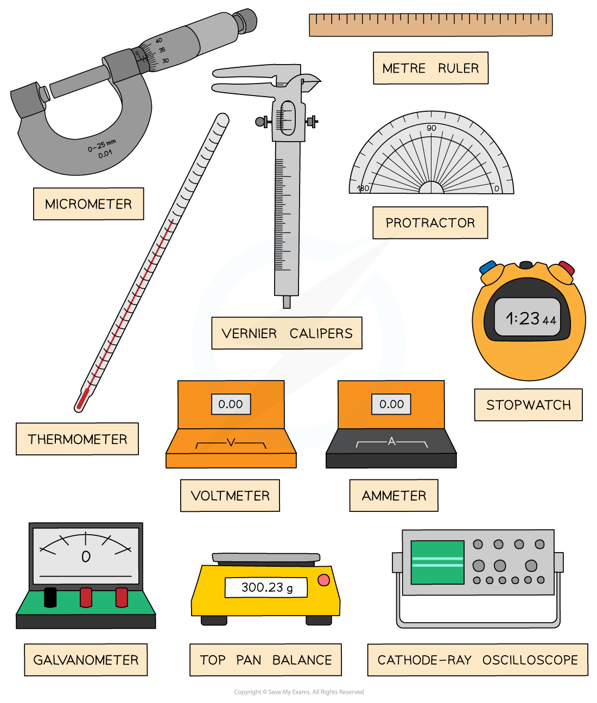
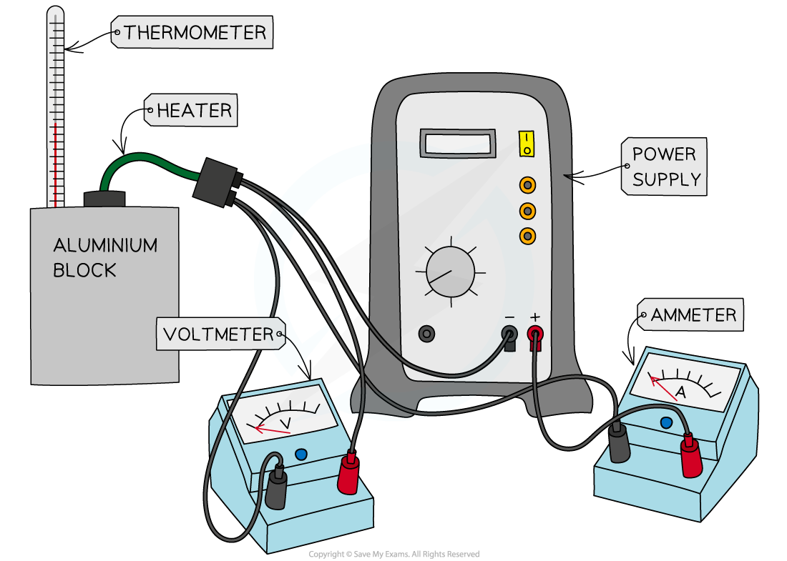

# Identifying Appropriate Apparatus

## Identifying Appropriate Apparatus

> **Spec point** — `spcpt_TCgWH7NFzjG4BFkQ`

## Identifying Appropriate Apparatus

- When planning an experiment, the first step is to identify the apparatus required

  - Each experiment will have its own unique set of apparatus
- The apparatus is the equipment needed to carry out the experiment

  - This includes both what you are measuring and how you are measuring it
- Common apparatus include:

  - Metre rulers - to measure distance and length
  - Balances - to measure mass
  - Protractors - to measure angles
  - Stopwatches - to measure time
  - Ammeters - to measure current
  - Voltmeters - to measure potential difference
- More complicated instruments such as the micrometer screw gauge and Vernier calipers can be used to more accurately measure length

***Examples of apparatus used in scientific experiments***

- The apparatus required depends on what you are trying to measure
- A few examples are shown in the table below

**Apparatus Table**

| **Quantity** | **Apparatus** |
|---|---|
| Length | Metre ruler, Micrometer, Vernier caliper |
| Mass | Top–pan balance |
| Angle | Protractor |
| Time | Stopwatch |
| Temperature | Thermometer |
| Potential difference | Voltmeter |
| Current | Ammeter |
| Frequency | Oscilloscope |

- An example of apparatus for measuring the specific heat capacity of an aluminium block is shown below:

***Apparatus needed to measure specific heat capacity***

- This includes:

  - A block of the substance (preferably 1kg in mass) or in the case of a fluid, a beaker containing a known mass of the fluid
  - A thermometer
  - An appropriate heater (e.g. an immersion heater)
  - A power source
  - A joule meter or a voltmeter, ammeter and stop-clock (I will assume we have the latter)
  - Wires and connectors

#### Range & Resolution of Instruments

- All instruments have a **range **and **resolution**

  - The range is the **highest** and **lowest** value an instrument can measure
  - The resolution is the **smallest** **increment** an instrument can measure

- Examples of resolutions for instruments are:

| **Experimental Instrument** | **Typical Resolution** | **Typical Range** |
|---|---|---|
| Metre ruler | 1 mm | 0 – 1 m |
| Vernier Calipers | 0.1 mm | 0 – 300 mm |
| Micrometer Screw Gauge | 0.01 mm | 0 – 25 mm |
| Top-pan Balance | 0.01 g | 0 – 0.1 g |
| Protractor | 1° | 0 – 180° |
| Stopwatch | 0.01 s | 0 – 9 hours 59 mins 59.99 seconds |
| Thermometer | 1 °C | –10 °C – 110 °C |
| Voltmeter | 1 mV – 0.1 V | 0 – 1000 V |
| Ammeter | 1 mA – 0.1 A | 0 – 10 A |
| Oscilloscope | 1 Hz | 0 – 200 MHz |

- These are just examples of ranges and resolutions for these devices

  - For example, some multimeters may have a bigger or smaller range depending on their model
- The resolution of an instrument gives its absolute uncertainty for a digital device

  - For an analogue device, such as a thermometer, ruler or top-pan balance, the uncertainty is ± **half** the resolution

> **Worked Example**
> The diagram below shows one possible method for determining the Young modulus of a metal in the form of a wire.
> 
> 
> 
> Describe how you can use this apparatus to determine the Young modulus of the metal. The sections below should be helpful when writing your answers.
> 
> - The measurements to be taken.
> - The equipment used to take the measurements.
> - How you would determine Young modulus from your measurements.
> 
> **Answer:**
> 
> **Step 1: State the necessary measurements to be taken**
> 
> - The **diameter** of the wire
> - The **initial length** of the wire
> - The **extension** of the wire (final length – initial length)
> - The **mass** of the hanging masses or the **weight **applied to the wire
> 
> **Step 2: State and explain which equipment would be the most suitable**
> 
> For measuring the diameter of the wire:
> 
> - A **micrometer screw gauge** or **vernier callipers**
> - Micrometer would be best as this has the highest resolution when measuring small areas
> 
> For measuring the original length / extension of the wire:
> 
> - A **metre ruler** or a **tape measure**
> - The wire has a moderate length which cannot be measured using a vernier scale
> 
> For measuring extension:
> 
> - **Travelling microscope**
> - These are designed for measuring small changes in length
> 
> For measuring the mass:
> 
> - **Scales** or a **top-pan balance**
> - A top-pan balance would be best as this has the higher resolution
> - *W = mg* equation can be used to calculate weight
> 
> For measuring the weight directly:
> 
> - A **newton-meter**
> - This is useful if ‘known’ weights are used and to check if the quoted masses are accurate
> 
> **Step 3: Explain how Young's modulus can be determined from these measurements**
> 
> - Young modulus is equal to the **gradient** of a stress-strain graph (in the linear region)
> - Stress is equal to:
> 
> 
> 
> - Strain is equal to:
> 
> 
> 
> Where:
> 
> - *F* = weight (N)
> - *A* = cross-sectional area of wire (m2)
> - Δ*L* = extension (m)
> - *L* = original length (m)
> - Young's modulus for this metal is then calculated using the following equation:
> 
> 

> **Worked Example**
> Two digital thermometers display a reading in °C.
> 
> Thermometer 1: 80.13 °C
> 
> Thermometer 2: 42.0 °C
> 
> Which thermometer has the better resolution?
> 
> **Answer:**
> 
> - The resolution is given by the smallest increment that the thermometer can read
> 
>   - For thermometer 1 this is 0.01 °C
>   - For thermometer 2 this is 0.1 °C
> - Therefore, thermometer 1 has the better resolution

> **Exam Hint**
> Exam questions can refer to different instrument with various ranges and resolutions, for example, ammeters with resolution of 0.2 mA instead. Always use the information given in the question, and look carefully at the scales given. Never just assume the resolution of a piece of instrument given in an exam question.
> 
> When listing the apparatus for an experiment, make sure you've referred to every last piece of equipment, even the small parts such as wires and power supplies
