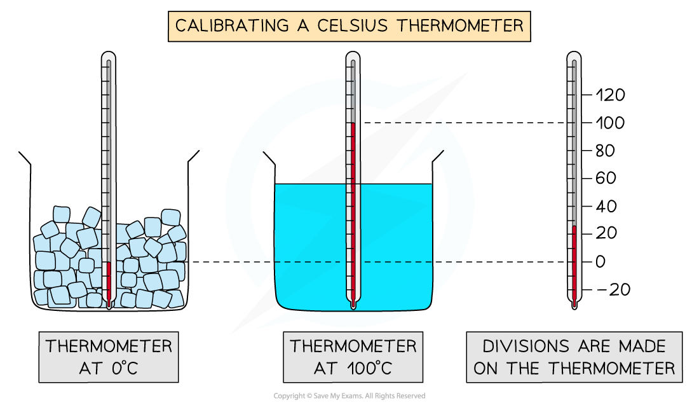
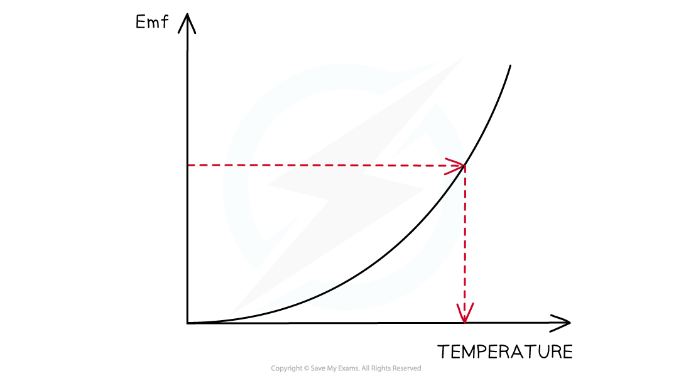
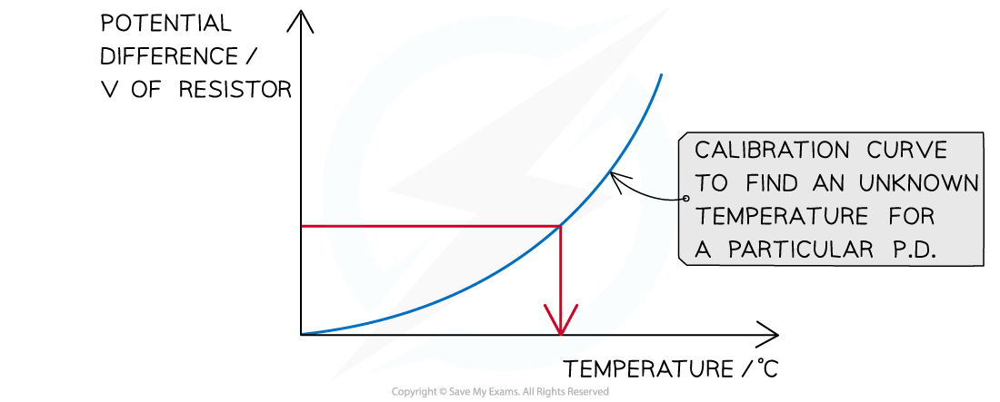

# Calibrating Instruments

## Calibrating Instruments

> **Spec point** — `spcpt_3qMqgHkRT2vZYyP3`

## Calibrating Instruments

- Calibration is a comparison between a **known** measurement and the measurement you achieve using the instrument
- This checks the *accuracy* of the instrument, especially for higher readings
- An example is checking whether a meter (e.g., voltmeter, micrometer, ammeter) reads **zero** before measurements are made

  - This helps avoid *zero error*
- To calibrate a thermometer means to put the correct mark of readings at the correct place so that other temperatures can be deduced from these marks

  - An uncalibrated thermometer may not read 0 °C for the freezing point of water, or 100 °C for its boiling point, but we know these values to be accurate

#### Calibration Curves

- Calibration curves are used to convert measurements made on one measurement scale to another measurement scale
- These are useful in experiments when the instruments used have outputs which are not proportional to the value they are measuring

  - e.g. e.m.f and temperature (thermocouple) or resistance against temperature (thermistor)
- For example, the calibration curve for a thermocouple, in which the e.m.f varies with temperature, is shown below:

***A curve of voltage against temperature can be used as a temperature sensor***

- The calibration curve for a thermistor looks like:

***Thermistor calibration curve***

- The accuracy of all measuring devices degrades over time. This is typically caused by normal wear and tear

  - Calibration improves the accuracy of the measuring device

> **Worked Example**
> A voltmeter gives readings that are larger than the true values and has a systematic error that varies with voltage. Which graph shows the calibration curve for the voltmeter?
> 
> 
> 
> **Answer: A**
> 
> - The voltmeter has a systematic error as the reading it gives is always greater than the true value
> - If the true value is zero, the voltmeter would give a value greater than zero
> - Therefore, the curve doesn’t pass through the origin (0,0) as this would indicate that the reading is the same as the true value, and not greater - this rule out graph **C**
> - So, when the true value is zero, the meter would give a reading greater than zero. This is either graph **A** or **B**
> - The systematic error varies with voltage
> 
>   - So, the amount by which the meter reading is greater than the true value changes
> - Therefore, graph **A** is correct, because the difference between the meter reading and the true value increases with voltage

> **Exam Hint**
> You will be expected to use a calibration curve for the Core Practical 12: Calibrate a thermistor in a potential divider circuit as a thermostat
