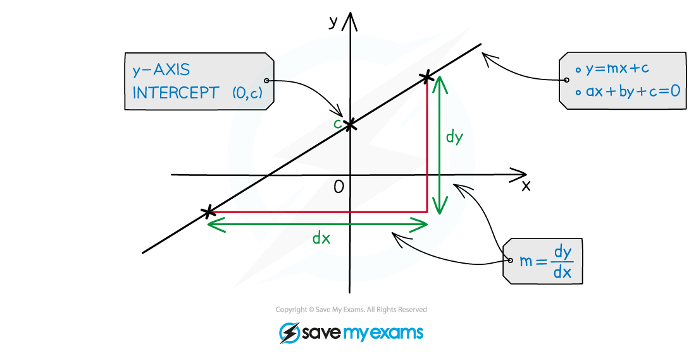
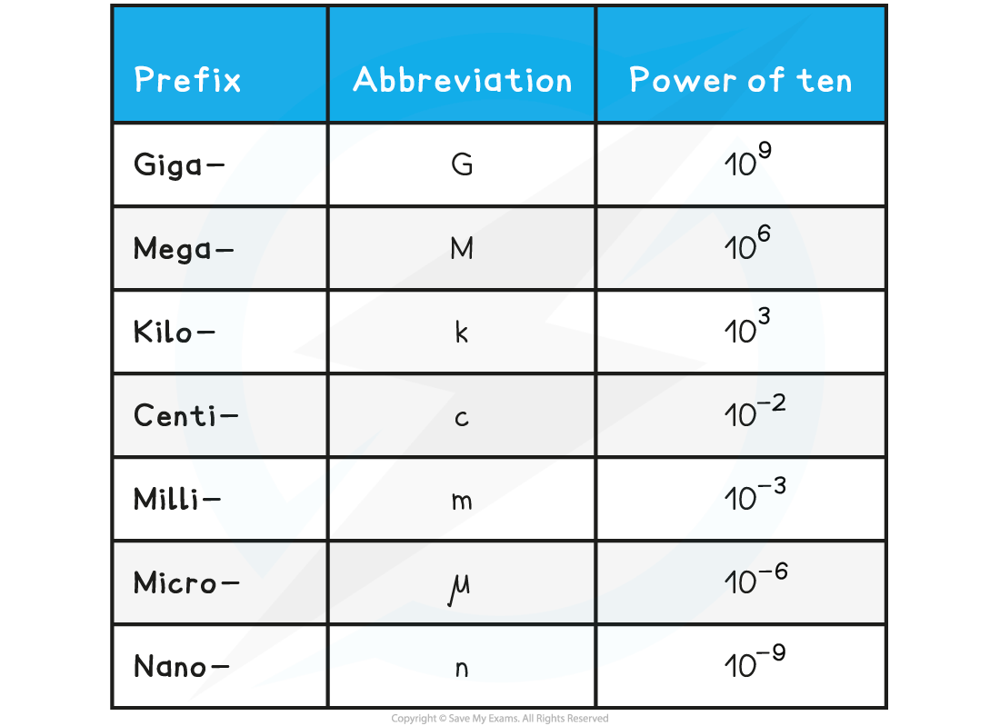
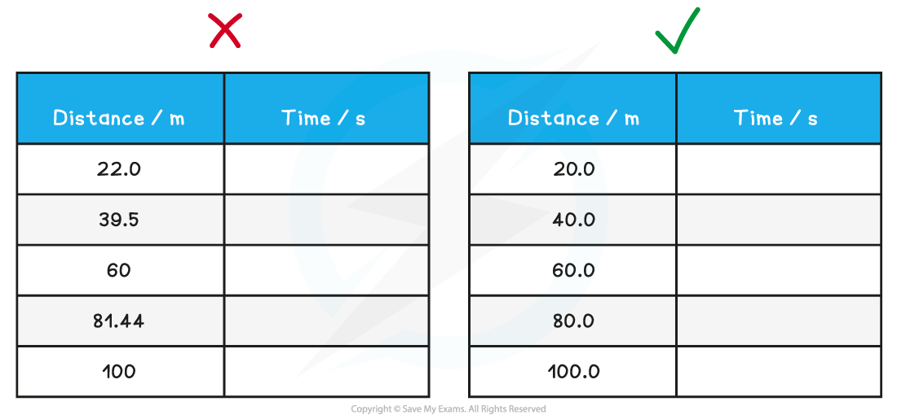
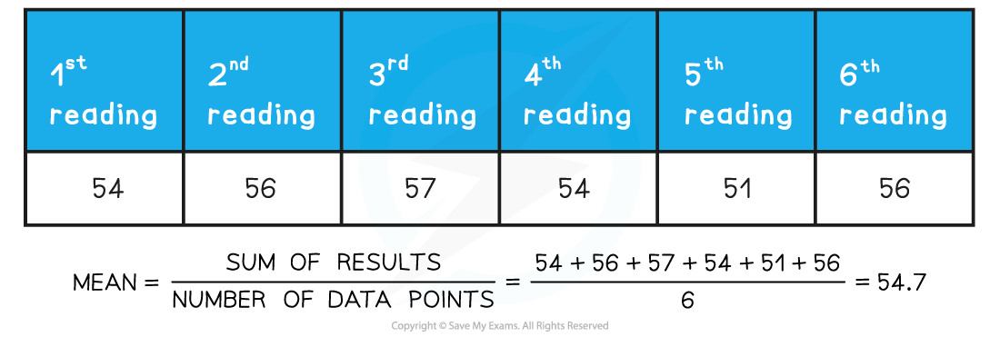

# Data Collection

## Data Collection

> **Spec point** — `spcpt_mh43bWZjFvTsV4QC`

## Data Collection

- After an experiment has been carried out, sometimes the raw results will need to be processed before they are in a useful or meaningful format
- Sometimes, various calculations will need to be carried out in order to get the data in the form of a straight line

  - This is normally done by comparing the equation to that of a straight line: **y = mx + c**

***A straight life graph showing the y-intercept and gradient, m***

- The mathematical skills required for the analysis of quantitative data include:

  - Using standard form
  - Quoting an appropriate number of significant figures
  - Calculating mean values

#### Using Standard Form

- Often, physical quantities will be presented in standard form

  - For example, the speed of light in a vacuum equal to 3.00 × 108 m s−1This makes it easier to present numbers that are very large or very small without having to repeat many zeros
- It will also be necessary to know the **prefixes** for the numbers of ten

#### Prefixes Table

#### Using Significant Figures

- Calculations must be reported to an appropriate number of significant figures
- Also, all the data in a column should be quoted to the **same** number of significant figures

***It is important that the significant figures are consistent in data***

#### Calculating Mean Values

- When several repeat readings are made, it will be necessary to calculate a mean value
- When calculating the mean value of measurements, it is **acceptable** to increase the number of significant figures by 1

#### Graph Skills

- In several experiments during A-Level Physics, the aim is generally to find if there is a relationship between two variables
- This can be done by translating information between graphical, numerical, and algebraic forms

  - For example, plotting a graph from data of displacement and time, and calculating the rate of change (instantaneous velocity) from the tangent to the curve at any point
- Graph skills that will be expected during A-Level include:

  - Understanding that if a relationship obeys the equation of a straight-line *y = mx + c* then the **gradient** and the **y-intercept** will provide values that can be analysed to draw conclusions
  - Finding the **area under a graph**, including estimating the area under graphs that are not linear
  - Using and interpreting** logarithmic** plots
  - Drawing tangents and calculating the gradient of these
  - Calculating the gradient of a straight-line graph
  - Understanding where asymptotes may be required

> **Worked Example**
> A student measures the background radiation count in a laboratory and obtains the following readings:
> 
> 
> 
> The student is trying to verify the inverse square law of gamma radiation on a sample of Radium-226. He collects the following data:
> 
> 
> 
> Use this data to determine if the student’s data follows an inverse square law.
> 
> 
> 
> **Answer:**
> 
> **Step 1: Determine a mean value of background radiation**
> 
> 
> 
> - The background radiation must be subtracted from each count rate reading to determine the corrected count rate, *C*
> 
> **Step 2: Compare the inverse square law to the equation of a straight line**
> 
> - According to the inverse square law, the intensity, *I*, of the γ radiation from a point source depends on the distance, *x*, from the source
> 
> 
> 
> - Intensity is proportional to the corrected count rate, C, so
> 
> 
> 
> - The graph provided is of the form 1/*C*–1/2 against *x*
> - Comparing this to the equation of a straight line, y = mx
> 
>   - y = 1/*C*–1/2 (counts min–1/2)
>   - x = x (m)
>   - Gradient = constant, k
> - If it is a straight-line graph through the origin, this shows they are directly proportional, and the inverse square relationship is confirmed
> 
> **Step 3: Calculate C (corrected average count rate) and C****–1/2**** **
> 
> 
> 
> **Step 4: Plot a graph of C****–1/2**** against x and draw a line of best fit**
> 
> 
> 
> - The graph shows C–1/2 is directly proportional to x, therefore, the data follows an inverse square law
