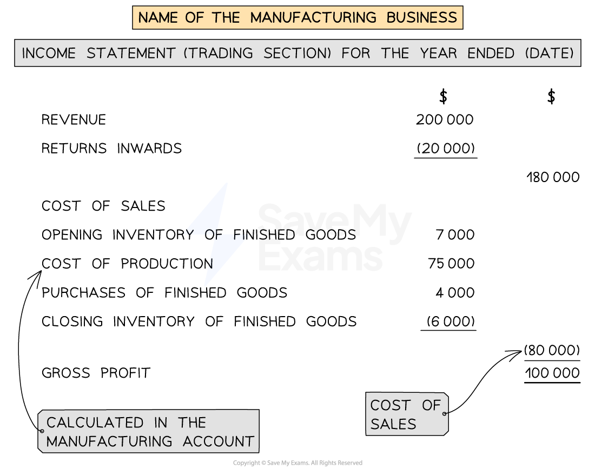
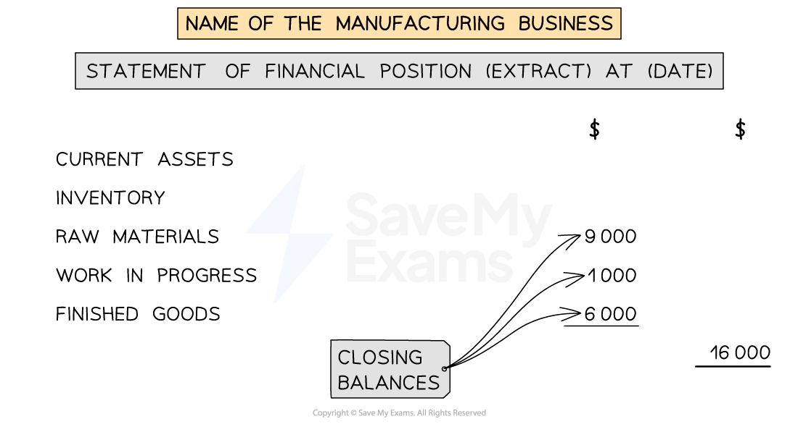

# Income Statement & Statement of Financial Position

## Income Statement for Manufacturers

> **Spec point** — `spcpt_x29yvZNwgRsCxxxQ`

## Income statement for manufacturers

### What is the layout of the income statement of a manufacturing business?

- The **income statement** of a manufacturing business is prepared in a **similar way **to the other types of retail businesses
- The income statement will be **prepared after the manufacturing account**
- For the **trading section**:

  - Use the inventory for **finished goods**
  - Use the **production cost** in place of **purchases**
  
    - The business might have also **purchased extra finished goods**
    - **Include **this in the cost of sales
- For the **profit and loss section**:

  - Only include **expenses **that  relate to the **non-production aspects** of the business
  
    - Such as advertising, carriage outwards, etc
  - The expenses related to manufacturing are included in the production cost
  - A business might use a **factory **and an **office**
  
    - The** factory expenses **are included in the **production cost**
    - The **office expenses** are included in the **profit and loss section**

*Layout of the trading section of an income statement for a manufacturing business*

## Statement of Financial Position for Manufacturers

> **Spec point** — `spcpt_f5VyXvKYFPPkwZpG`

## Statement of financial position for manufacturers

### What is the layout of the statement of financial position of a manufacturing business?

- The **statement of financial position** of a manufacturing business is prepared in a **similar way **to the other types of retail businesses
- The only difference is how the **inventory **is displayed in the current assets section
- **All three inventories** are shown separately and the total is calculated

*Layout of the inventory entry on the statement of financial position for a manufacturing business*

> **Worked Example**
> Pablo owns a small carpet and rug factory, making bespoke carpets for local furniture businesses. The following balances are provided at 31 December 2023.
> 
> |   | \$ |
> |---|---|
> | Revenue | 280 050 |
> | Inventory at 1 January 2023 |   |
> | Raw materials | 7 100 |
> | Work in progress | 10 420 |
> | Finished goods | 12 450 |
> | Purchases of raw materials | 96 200 |
> | Wages of factory workers | 38 000 |
> | Wages of factory supervisors | 28 500 |
> | Wages of office and sales staff | 48 000 |
> | Insurance and rates | 15 000 |
> | General factory expenses | 13 180 |
> | Factory equipment at cost | 120 000 |
> | Provision for depreciation of factory equipment | 40 000 |
> 
> Additional Information
> 
> - Inventory at 31 December 2023
> 
>   - Raw materials \$6 860
>   - Work in progress \$10 885
>   - Finished goods \$14 650
> - Insurance and rates are to be apportioned ⅓ to the office and ⅔ to the factory
> - Factory equipment is to be depreciated at 15% using the reducing balance method
> 
> (a) Prepare the manufacturing account for the year ended 31 December 2023.
> 
> (b) Prepare the trading section of the income statement for the year ended 31 December 2023.
> 
> (c) Prepare an extract of the statement of financial position at 31 December 2023 showing the inventories.
> 
> Answer
> 
> > *Deal with the additional information.*
> 
> - Inventory at 31 December 2023
> 
>   - *These appear as current assets on the statement of financial position*
>   - *The raw materials and work in progress appear on the manufacturing account*
>   - *The finished goods appear on the income statement*
> - Insurance and rates are to be apportioned ⅓ to the office and ⅔ to the factory
> 
>   - *Find the amount for the office*
>   
>     - *⅓ × \$15 000 = \$5 000*
>     - *This appears in the profit and loss section of the income statement*
>   - *Find the amount for the factory*
>   
>     - *⅔ × \$15 000 = \$10 000*
>     - *This appears on the manufacturing account as a factory overhead*
> - Factory equipment is to be depreciated at 15% using the reducing balance method
> 
>   - *Find the net book value of the factory equipment*
>   
>     - *\$120 000 - \$40 000 = \$80 000*
>   - *Calculate the year's depreciation charge*
>   
>     - *15% × \$80 000 = \$12 000*
>     - *This appears on the manufacturing account as a factory overhead*
> 
> (a) *Prepare the manufacturing account.*
> 
> | **Final answer:** **Pablo**  **Final answer:** **Manufacturing Account for the year ended 31 December 2023** |   |   |   |
> |---|---|---|---|
> |   |   | **Final answer:** **\$** | **Final answer:** **\$** |
> | **Final answer:** **Opening inventory of raw materials** |   |   | **Final answer:** **7 100** |
> | **Final answer:** **Purchases of raw materials** |   |   | **Final answer:** **96 200** |
> | **Final answer:** **Closing inventory of raw materials ** |   |   | **Final answer:** **(6 860)** |
> | **Final answer:** **Cost of material consumed** |   |   | **Final answer:** **96 440** |
> | **Final answer:** **Direct wages - factory workers** |   |   | **Final answer:** **38 000** |
> | **Final answer:** **Prime cost ** |   |   | **Final answer:** **134 440** |
> | **Final answer:** **Factory overheads** |   |   |   |
> | **Final answer:** **Wages - Supervisors** |   | **Final answer:** **28 500** |   |
> | **Final answer:** **Insurance and rates** |   | **Final answer:** **10 000** |   |
> | **Final answer:** **General expenses** |   | **Final answer:** **13 180** |   |
> | **Final answer:** **Depreciation of factory equipment** |   | **Final answer:** **12 000** |   |
> |   |   |   | **Final answer:** **63 680** |
> |   |   |   | **Final answer:** **198 120** |
> | **Final answer:** **Opening work in progress ** |   | **Final answer:** **10 420** |   |
> | **Final answer:** **Closing work in progress** |   | **Final answer:** **(10 885)** |   |
> |   |   |   | **Final answer:** **(465)** |
> | **Final answer:** **Production cost** |   |   | **Final answer:** **197 655** |
> 
> (b) *Prepare the trading section of the income statement.*
> 
> | **Final answer:** **Pablo**  **Final answer:** **Income statement (trading section) for the year ended 31 December 2023** |   |   |
> |---|---|---|
> |   | **Final answer:** **\$** | **Final answer:** **\$** |
> | **Final answer:** **Revenue** |   | **Final answer:** **280 050** |
> | **Final answer:** **Cost of sales** |   |   |
> | **Final answer:** **Opening inventory of finished goods** | **Final answer:** **12 450** |   |
> | **Final answer:** **Cost of production** | **Final answer:** **197 655** |   |
> | **Final answer:** **Closing inventory of finished goods** | **Final answer:** **(14 650)** |   |
> |   |   | **Final answer:** **(195 455)** |
> | **Final answer:** **Gross Profit** |   | **Final answer:** **84 595** |
> 
> (c) *Prepare an extract of the statement of financial position to show the inventories.*
> 
> | **Final answer:** **Pablo**  **Final answer:** **Statement of Financial Position (Extract) at 31 December 2023** |   |   |
> |---|---|---|
> |   | **Final answer:** **\$** | **Final answer:** **\$** |
> | **Final answer:** **Current Assets** |   |   |
> | **Final answer:** **Inventory:** |   |   |
> | **Final answer:** **Raw materials** | **Final answer:** **6 860** |   |
> | **Final answer:** **Work in progress** | **Final answer:** **10 885** |   |
> | **Final answer:** **Finished goods** | **Final answer:** **14 650** |   |
> |   |   | **Final answer:** **32 395** |
