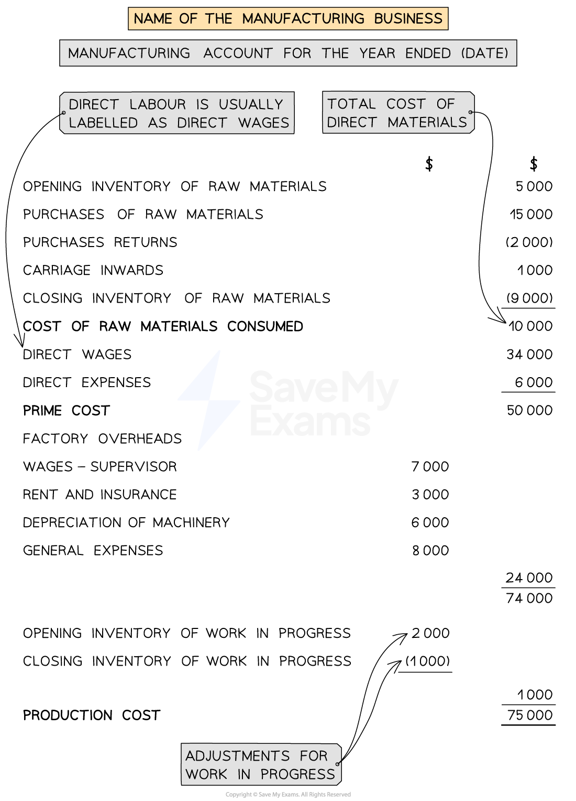

# Manufacturing Account

## Manufacturing Account

> **Spec point** — `spcpt_yVTkRB8hrfWM95Xw`

## Manufacturing account

### What is the total cost of production?

- The **production cost** is the **total **of the **direct costs** and the **indirect costs**
- This is **adjusted **due to the work in progress not being finished

  - **Add **the value of the work in progress from the **beginning **of the year
  - **Subtract **the value of the work in progress from the **end **of the year
  
    - This is similar to dealing with inventory when calculating the net purchases for a trading business
- **Cost of production**

  - = Direct materials
  - + Direct labour
  - + Direct expenses
  - + Factory overheads
  - + Opening work in progress
  - - Closing work in progress

> **Exam Hint**
> A business might use a factory and an office. Only the factory expenses are included in the cost of production.

### How do I complete a manufacturing account?

- **STEP 1**
Calculate the **cost of raw materials consumed**

  - Start with the **opening inventory of raw material**
  - **Add **the purchases of raw materials
  
    - **Subtract **returns outwards
  - **Add **carriage inwards
  - **Subtract **the closing inventory of raw materials
- **STEP 2**
Calculate the **prime cost**

  - Start with the cost of raw materials consumed
  - **Add **direct labour
  - **Add **direct expenses
- **STEP 3**
Calculate the **cost of factory overheads**

  - **Add **together any costs linked to the factory but not the production
  
    - The production costs should be included in the prime cost
- **STEP 4**
**Add **the **prime cost** and the **factory overhead**
- **STEP 5**
**Adjust **for the **work in progress** to calculate the **production cost**

  - **Add **the opening balance for the work in progress
  - **Subtract **the closing balance for the work in progress
  - This final value is the production cost

*Layout of a manufacturing account*

> **Exam Hint**
> Remember the finished goods do not appear on the manufacturing account. They appear on the income statement.

> **Worked Example**
> Comfy Chairs is a manufacturer of specialist garden chairs. The following information is available from the business for the year ended 31 August 31 2023.
> 
> |   | \$ |
> |---|---|
> | Inventory at 1 September 2022  Raw materials  Work in progress  Finished goods | 45 000  6 000  51 000 |
> | Inventory at 31 August 2023  Raw materials  Work in progress  Finished goods | 53 750  8 000  42 000 |
> | Purchases of raw materials | 160 000 |
> | Factory rent | 24 000 |
> | Royalties | 3 440 |
> | Depreciation of factory equipment | 6 400 |
> | Factory heating and lighting | 5 500 |
> | Wages of factory operatives | 16 000 |
> | Wages of factory supervisor | 8 000 |
> | Factory insurance | 4 220 |
> 
> Prepare the manufacturing account of Comfy Chairs for the year ended 31 August 2023.
> 
> Answer
> 
> - *Identify:*
> 
>   - *The direct materials*
>   
>     - *Raw materials and purchases*
>   - *The direct labour*
>   
>     - *Wages of factory operatives*
>   - *The direct expenses*
>   
>     - *Royalties*
> - *Ignore the inventory of finished goods*
> - *The other costs are the factory overheads*
> 
> > *Prepare the account in the required format.*
> 
> | **Final answer:** **Comfy Chairs**  **Final answer:** **Manufacturing Account for the year ended 31 August 2023 ** |   |   |
> |---|---|---|
> | **Final answer:** **Opening inventory of raw materials** |   | **Final answer:** **45 000** |
> | **Final answer:** **Purchases of raw materials** |   | **Final answer:** **160 000** |
> | **Final answer:** **Closing inventory of raw material** |   | **Final answer:** **(53 750)** |
> | **Final answer:** **Cost of raw material consumed** |   | **Final answer:** **151 250** |
> | **Final answer:** **Direct wages - factory operatives** |   | **Final answer:** **16 000** |
> | **Final answer:** **Direct expenses - royalties** |   | **Final answer:** **3 440** |
> | **Final answer:** **Prime cost** |   | **Final answer:** **170 690** |
> | **Final answer:** **Factory overheads** |   |   |
> | **Final answer:** **Factory rent** | **Final answer:** **24 000** |   |
> | **Final answer:** **Factory insurance** | **Final answer:** **4 220** |   |
> | **Final answer:** **Wages - supervisor** | **Final answer:** **8 000** |   |
> | **Final answer:** **Factory heating and lighting** | **Final answer:** **5 500** |   |
> | **Final answer:** **Depreciation of factory equipment** | **Final answer:** **6 400** |   |
> |   |   | **Final answer:** **48 120** |
> |   |   | **Final answer:** **218 810** |
> | **Final answer:** **Opening inventory of work in progress** | **Final answer:** **6 000** |   |
> | **Final answer:** **Closing inventory of work in progress** | **Final answer:** **(8 000)** |   |
> |   |   | **Final answer:** **(2 000)** |
