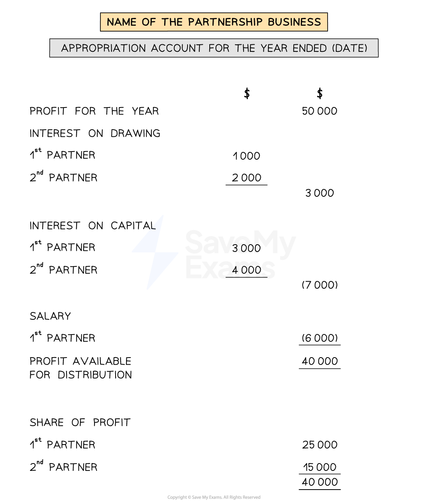

# Appropriation Account

## Appropriation Account

> **Spec point** — `spcpt_KmTMwXdrGN9Bnb7D`

## Appropriation account

### What is the profit and loss appropriation account?

- The **profit and loss appropriation account** is one of the **financial statements** prepared by businesses that operate as a **partnership**

  - The partnership prepares the **income statement first**
  - And then they prepare the profit and loss appropriation account
- It shows how the **profit or loss** from the income statement is **split **between the partners

  - The distribution of the profit for the year is based on the **terms of the partnership agreement**
- The appropriation account is part of the **double entry system**

  - The profit or loss for the year is transferred from the income statement

|   | Account to be debited | Account to be credited |
|---|---|---|
| Transferring the **profit for the year **to the appropriation account | Income statement | Appropriation account |
| Transferring the **loss for the year** to the appropriation account | Appropriation account | Income statement |

### How do I complete the profit and loss appropriation account?

- **STEP 1**
Put the **profit **for the year in the right column

  - You get this value from the income statement
- **STEP 2**
**Add **the **total interest on drawings**

  - List the interest for each partner
  - Put the total in the right column
- **STEP 3**
**Subtract** the **total interest on the partners' capital**

  - List the interest for each partner
  - Put the total in the right column
- **STEP 4**
**Subtract **the **total partner's salaries**

  - List the salary for each partner
  - Put the total in the right column
  
    - If there is only one salary you can put this in the right column straightaway
- **STEP 5**
**Calculate **the **profit **(or loss) **available for distribution**

  - Profit for the year
  - Add interest on drawings
  - Less interest on capital
  - Less partners' salaries
- **STEP 6**
**Share **the available profit in the **ratio **described in the partnership agreement

  - List the profit for each partner
  - Put the total underneath

*Layout of the profit and loss appropriation account*

> **Exam Hint**
> Students can get confused when trying to remember whether to add or subtract interest on drawings. Remember that this statement is from the point of view of the business. Therefore the interest on drawings is added as the business is owed more money from the partners.
> 
> Also remember partner's loan interest is charged to the income statement, not the appropriation account.

> **Worked Example**
> Jetlin & Leander are in partnership, their year end is 31st December 2023.
> 
> The following information was taken from their books:
> 
> |   | \$ |   |
> |---|---|---|
> | Profit for the year | 30 000 |   |
> | Capital: | Jetlin | 50 000 |
> |   | Leander | 35 000 |
> | Salaries: | Jetlin | 5 000 |
> |   | Leander | 6 000 |
> | Drawings: | Jetlin | 7 500 |
> |   | Leander | 1 000 |
> 
> The partnership agreement provides for the following:
> 
> - interest on capital of 5% per annum
> - interest on drawings of 10%
> - a salary to Leander of \$6 000 per annum
> - profits and losses are shared 75% to Jetlin and 25% to Leander.
> 
> Prepare the appropriation account for Jetlin and Leander for the year ended 31 December 2023.
> 
> Answer
> 
> > *Calculate the interest on capital by multiplying each partner's capital by 5%.*
> 
> - *Jetlin: 5% × \$50 000  = \$2 500*
> - *Leander: 5% × \$35 000 = \$1 750*
> 
> > *Calculate the interest on drawings by multiplying each partner's drawings by 10%.*
> 
> - *Jetlin: 10% × \$7 500  = \$750*
> - *Leander: 10% × \$1 000 = \$100*
> 
> > *Calculate the profit available for distribution. This is usually done in the appropriation account.*
> 
> - *Start with the profit for the year \$30 000*
> - *Add the interest on drawings: + \$750 + \$100*
> - *Subtract the interest on capital: - \$2 500 - \$1 750*
> - *Subtract the salary: - \$6 000*
> - *Profit available for distribution: \$20 600*
> 
> > *Calculate the share of profit for each partner by multiplying the residual profit by the given percentages.*
> 
> - *Jetlin: 75% × \$20 600  = \$15 450*
> - *Leander: 25% × \$20 600 = \$5 150*
> 
> > *Complete the appropriation account using the required format.*
> 
> | **Final answer:** **Jetlin & Leander**  **Final answer:** **Appropriation Account for the year ended 31 December 2023 ** |   |   |
> |---|---|---|
> | **Final answer:** ** ** | **Final answer:** **\$** | **Final answer:** **\$** |
> | **Final answer:** **Profit for the year** | **Final answer:** ** ** | **Final answer:** **30 000 ** |
> | **Final answer:** **Interest on drawings ** | **Final answer:** ** ** | **Final answer:** ** ** |
> | **Final answer:** **Jetlin** | **Final answer:** **750** |   |
> | **Final answer:** **Leander ** | **Final answer:** **100** |   |
> |   | **Final answer:** ** ** | **Final answer:** **850 ** |
> |   |   | **Final answer:** ** ** |
> | **Final answer:** **Interest on capital ** | **Final answer:** ** ** | **Final answer:** ** ** |
> | **Final answer:** **Jetlin** | **Final answer:** **2 500 ** | **Final answer:** ** ** |
> | **Final answer:** **Leander ** | **Final answer:** **1 750**** ** | **Final answer:** ** ** |
> |   | **Final answer:** ** ** | **Final answer:** **(4 250) ** |
> | **Final answer:** **Salary** |   |   |
> | **Final answer:** **Leander** | **Final answer:** ** ** | **(6 000)** ** ** |
> | **Final answer:** **Profit available for distribution** |   | **Final answer:** **20 600** |
> | **Final answer:** **Share of profit** |   | **Final answer:** ** ** |
> | **Final answer:** **Jetlin** |   | **Final answer:** **15 450** |
> | **Final answer:** **Leander ** |   | **Final answer:** **5 150 ** |
> |   |   | **Final answer:** **20 600** |
