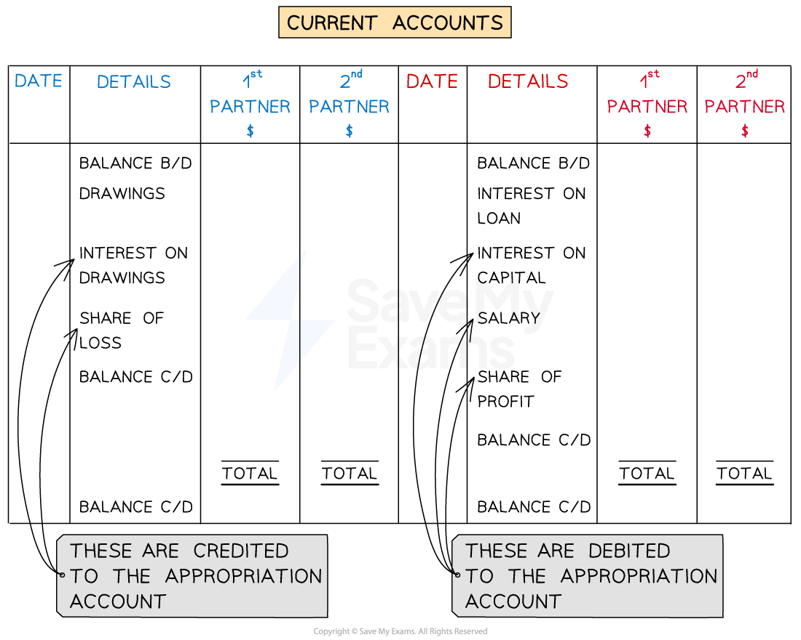

# Capital & Current Accounts

## Partners' Capital Accounts

> **Spec point** — `spcpt_hWqjGV3s2h47GC8h`

## Partners' capital accounts

### What is a partner's capital account?

- The **capital account **shows the amounts that were **originally invested** in the partnership by each partner

  - Plus any amounts of money they may put in **at a later date**
  - **Loans **to the business from a partner are **not **entered into the capital account
- The capital account of each partner is **only used **for recording the partners’ capital contribution and partners’ withdrawal of capital

  - Withdrawal of capital is **different **to taking drawings
  - **Drawings **are **not **entered into the capital account

### What is the layout of a partner's capital account?

- Each partner might have a **separate **capital account or there might be one **combined **capital account for the partnership

  - If a combined account is used then there are **columns for each partner** on both sides
- The capital account has a **credit balance** and shows the amount owed by the business to the partner(s)
- Entries are only made when the **amount of capital invested** by the partners **changes**

  - The entry is on the **credit **side if it is an **increase**
  - The entry is on the **debit **side if it is a **decrease**

## Partners' Current Accounts

> **Spec point** — `spcpt_kDPYZNNZvFT6scVb`

## Partners' current accounts

### What is a partner's current account?

- The **current **accounts are **prepared after the appropriation account**
- The current accounts are treated as **working accounts** to show the **change **in the amount owed to each partner by the business

  - **Permanent changes** go into the **capital **accounts
  
    - Such as further investments into the business
  - **Temporary changes** go into the **current **accounts
  
    - Such as profit shares, salaries and interest on capital, drawings and loans

### What is the layout of a partner's current account?

- Each partner might have a **separate **current account or there might be one **combined **current account for the partnership

  - This is same as for a capital account
- Entries are made on the **debit **side if the amount the business owes the partner(s) **decreases**

  - Loss for the year
  - Partner's drawings
  - Interest on a partner's drawings
- Entries are made on the **credit **side if the amount the business owes the partner(s) **increases**

  - Profit for the year
  - Interest on a partner's capital
  - Interest on a partner's loan
  - A partner's salary
- The closing balance of the current account shows how much** undrawn or overdrawn profits** the partner has

  - A **debit **balance indicates that the partner has **taken too much money** from the partnership in anticipation of profits
  
    - The partner owes the business money
  - A **credit **balance indicates that the partner has **not taken all of their share** of the profits
  
    - The business still owes the partner money

*Layout of the partners' current accounts*

> **Exam Hint**
> If you use a combined current account then remember to balance each column separately, similar to how you balance the cash and bank columns in the cash book.

### Why do partnerships use both a current account and a capital account?

- Partnerships use both a current account and a capital account to **keep different types of entries separate**
- The capital account only contains the amounts invested by each partner

  - This means that partners can easily see how much everyone has invested
  - This makes it **easier to calculate the interest** on capital
- The current account shows annual changes made to the amounts owed to the partners by the business

  - This allows the partners to see which partners are **withdrawing more money than their profit share**

### How are loans from partners treated in the accounts of a partnership?

- **Loans **from partners are treated in a **similar way** **to other loans**
- They are **not** treated as part of the **partner’s capital account**

  - A** loan account** is created
- The loan is a **liability **on the statement of financial position
- The **interest **is added to the **partner's current account**

  - The partner can withdraw the interest from the business bank account as drawings

### What are the journal entries for the partners' current account?

- At the** end of the year **journal entries are made for the items in the partner's current accounts
- To remember the journal entries:

  - Identify whether the entry is on the **debit **or **credit **side of the partner's current account
  - Identify **where **the amount has **come from**

|   | Account to be debited | Account to be credited |
|---|---|---|
| Awarding **interest on partners' capital** | Appropriation account | Partners' current account |
| Transferring a **partner's drawings** to the current account at the end of the year | Partner's current account | Partner's drawings account |
| Awarding **interest on partners' drawings** | Partners' current account | Appropriation account |
| Paying a **partner's salary** | Appropriation account | Partners' current account |
| Awarding** interest on a partner's loan** | Income statement | Partners' current account |
| Transferring **shares of the residual profit** to the current account | Appropriation account | Partners' current account |
| Transferring **shares of the residual loss** to the current account | Partners' current account | Appropriation account |

> **Worked Example**
> Lydia and Moses are in partnership and own a business which specialises in selling clothing to young people called *Top Trends*. The following information was extracted from their accounts for the year ended 31 December 2023:
> 
> | Capital accounts at 1 January 2023 |   |
> |---|---|
> | Lydia | 50 000 |
> | Moses | 40 000 |
> | Current accounts at 1 January 2023 |   |
> | Lydia | 3 420 credit balance |
> | Moses | 1 780 credit balance |
> | Drawings for the year ended 31 December 2023 |   |
> | Lydia | 6 000 |
> | Moses | 5 000 |
> | Share of profits for the year ended 31 December 2023 |   |
> | Lydia | 12 000 |
> | Moses | 8 000 |
> 
> The partnership agreement provides for
> 
> - 5% interest on capital
> - 10%  interest on drawings
> - \$1 500 salary for Lydia
> 
> Prepare the current accounts for Lydia and Moses for the year ended 31 December 2023. Balance the accounts and bring down the balance at 1 January 2024.
> 
> Answer
> 
> > *Calculate the interest on capital by multiplying the capital by 5%.*
> 
> - *Lydia: 5% × \$50 000 = \$2 500*
> - *Moses: 5% × \$40 000 = \$2 000*
> 
> > *Calculate the interest on drawings by multiplying the drawings by 10%.*
> 
> - *Lydia: 10% × \$6 000 = \$ 600*
> - *Moses: 10% × \$5 000 = \$500*
> 
> *Enter the amounts into a combined current ac*co*unt.*
> 
> - *Enter the opening balances on the credit side.*
> - *Enter the following on the debit side:*
> 
>   - *drawings*
>   - *interest on drawings*
> - *Enter the following on the credit side:*
> 
>   - *interest on capital*
>   - *salary*
>   - *profit share*
> - *Balance the accounts*
> 
> | **Final answer:** **Lydia and Moses**  **Final answer:** **Current Accounts** |   |   |   |   |   |   |   |
> |---|---|---|---|---|---|---|---|
> | **Final answer:** **Date** | **Final answer:** **Details** | **Final answer:** **Lydia**  **Final answer:** **\$** | **Final answer:** **Moses**  **Final answer:** **\$** | **Final answer:** **Date** | **Final answer:** **Details** | **Final answer:** **Lydia**  **Final answer:** **\$** | **Final answer:** **Moses**  **Final answer:** **\$** |
> | **Final answer:** **2023**  **Final answer:** **Jan 1** | **Final answer:** **Drawings** | **Final answer:** **6 000** | **Final answer:** **5 000** | **Final answer:** **2023**  **Final answer:** **Jan 1** | **Final answer:** **Balance b/d** | **Final answer:** **3 420** | **Final answer:** **1 780** |
> | **Final answer:** **Dec 31** | **Final answer:** **Interest on drawings** | **Final answer:** **600** | **Final answer:** **500** | **Final answer:** **Dec 31** | **Final answer:** **Interest on capital** | **Final answer:** **2 500** | **Final answer:** **2 000** |
> | **Final answer:** **Dec 31** | **Final answer:** **Balance c/d** | **Final answer:** **12 820** | **Final answer:** **6 280** | **Final answer:** **Dec 31** | **Final answer:** **Salary** | **Final answer:** **1 500** |   |
> |   |   |   |   | **Final answer:** **Dec 31** | **Final answer:** **Profit share** | **Final answer:** **12 000** | **Final answer:** **8 000** |
> |   |   | **Final answer:** **19 420** | **Final answer:** **11 780** |   |   | **Final answer:** **19 420** | **Final answer:** **11 780** |
> |   |   |   |   | **Final answer:** **2024**  **Final answer:** **Jan 1** | **Final answer:** **Balance b/d** | **Final answer:** **12 820** | **Final answer:** **6 280** |
