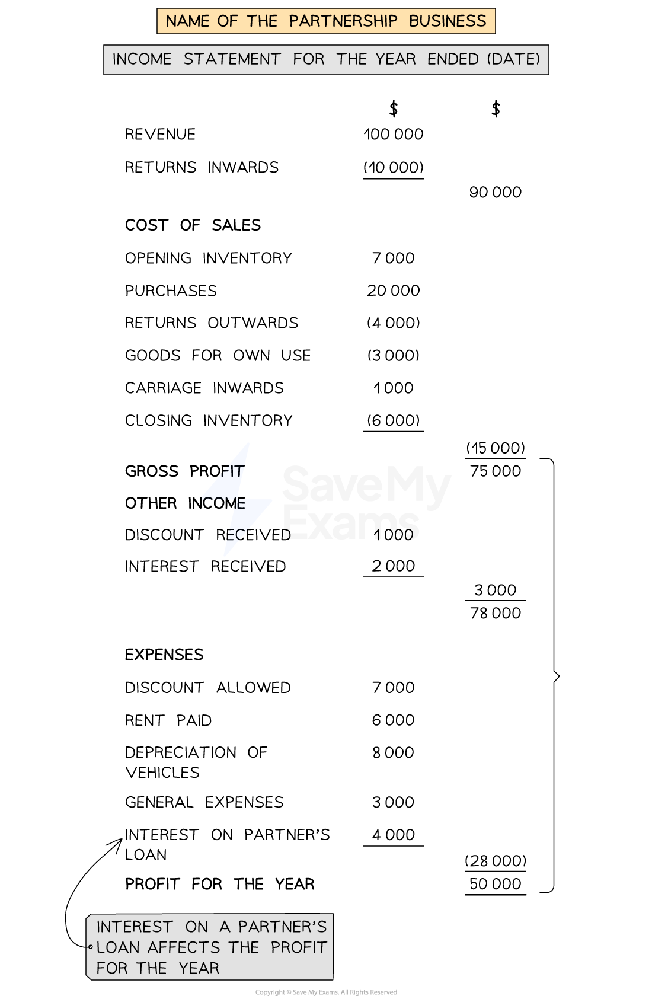

# Income Statement

## Income Statement for Partnerships

> **Spec point** — `spcpt_KZxSQjSxmQxdfKZQ`

## Income statement for partnerships

### What is the layout of the income statement of a partnership?

- The **income statement **for a partnership is **very similar **to that for a **sole trader**
- The following **do not appear **on the income statement

  - Interest on partners' capital
  - Interest on partners' drawings
  - Partners' salaries
- The **interest on a partner’s loan **is **included **as an **expense **on the income statement

*Layout of an income statement for a partnership*

> **Worked Example**
> Tam and Pan are in partnership providing car repair services in their local area.  The following is a list of their balances for the year ended 30 June 2023.
> 
> |   | \$ |
> |---|---|
> | Income from repair services | 101 260 |
> | Salaries of employees | 30 400 |
> | Electricity | 2 420 |
> | Telephone | 3 110 |
> | Rent and rates | 10 000 |
> | Trade payables | 12 190 |
> | Trade receivables | 14 220 |
> | Discount allowed | 1 400 |
> | Office expenses | 10 610 |
> | Supplies for repairs | 41 570 |
> | Irrecoverable debts | 1 200 |
> | Machinery and Equipment at cost | 52 000 |
> | Provision for depreciation on machinery and equipment | 20 800 |
> | Tam:  - Capital account - Current account - Drawings | 60 000  430  20 600 |
> | Pan  - Capital account - Current account - Drawings | 30 000  300  15 700 |
> | Bank | 21 750 |
> 
> Additional information 30 June 2023:
> 
> - Depreciate the office equipment at 20%  per year using the straight-line method
> - On 1 July 2022, Pan loaned \$5 000 to the partnership with loan interest at 5% per annum
> - Pan is to receive an annual partnership salary of \$12 000
> - Remaining profits and losses are shared as follows:  Tan ⅔, Pam ⅓
> - 5% interest is allowed on partners’ capital accounts
> - 10% interest is charged on partners’ drawings
> 
> Prepare the income statement for Tam and Pan for the year ended 30 June 2023.
> 
> Answer
> 
> > *Identify which balances affect the income statement.*
> 
> |   | \$ | Income statement? |
> |---|---|---|
> | Income from repair services | 101 260 | *IS* |
> | Salaries of employees | 30 400 | *IS* |
> | Electricity | 2 420 | *IS* |
> | Telephone | 3 110 | *IS* |
> | Rent and rates | 10 000 | *IS* |
> | Trade payables | 12 190 |   |
> | Trade receivables | 14 220 |   |
> | Discount allowed | 1 400 | *IS* |
> | Office expenses | 10 610 | *IS* |
> | Supplies for repairs | 41 570 | *IS* |
> | Irrecoverable debts | 1 200 | *IS* |
> | Machinery and Equipment at cost | 52 000 |   |
> | Provision for depreciation on machinery and equipment | 20 800 |   |
> | Tam:  - Capital - Current account - Drawings | 60 000  430  20 600 |   |
> | Pan  - Capital - Current account - Drawings | 30 000  300  15 700 |   |
> | Bank | 21 750 |   |
> 
> > *Deal with the additional information.*
> 
> - Depreciate the machinery and  equipment at 20%  per year using the straight-line method
> 
>   - *Find the year's depreciation by multiplying the cost by 20%*
>   
>     - *\$52 000 × 20% = \$10 400*
> - On 1 July 2022, Pan loaned \$5 000 to the partnership with loan interest at 5% per annum
> 
>   - *Find the year's interest by multiplying the loan amount by 5%*
>   
>     - *\$5 000 × 5% = \$250*
> - Pan is to receive an annual partnership salary of \$12 000
> 
>   - *This does not affect the income statement*
> - Remaining profits and losses are shared as follows:  Tan ⅔, Pam ⅓
> 
>   - *This does not affect the income statement*
> - 5% interest is allowed on partners’ capital accounts
> 
>   - *This does not affect the income statement*
> - 10% interest is charged on partners’ drawings
> 
>   - *This does not affect the income statement*
> 
> > *Prepare the income statement using the required format. Note that it is a service business so will not have a trading section.*

| **Final answer:** **Tam and Pan **  **Final answer:** **Income Statement for the year ended 30 June 2023** |   |   |
|---|---|---|
|   | **Final answer:** **\$** | **Final answer:** **\$** |
| **Final answer:** **Income from repair services** |   | **Final answer:** **101 260** |
| **Final answer:** **Expenses** |   |   |
| **Final answer:** **Supplies for repairs** | **Final answer:** **41 570** |   |
| **Final answer:** **Salaries** | **Final answer:** **30 400** |   |
| **Final answer:** **Offices expenses** | **Final answer:** **10 610** |   |
| **Final answer:** **Irrecoverable debts** | **Final answer:** **1 200** |   |
| **Final answer:** **Rent and rates** | **Final answer:** **10 000** |   |
| **Final answer:** **Electricity** | **Final answer:** **2 420** |   |
| **Final answer:** **Telephone** | **Final answer:** **3 110** |   |
| **Final answer:** **Discount allowed** | **Final answer:** **1 400** |   |
| **Final answer:** **Depreciation on machinery and equipment** | **Final answer:** **10 400** |   |
| **Final answer:** **Loan interest (Pan)** | **Final answer:** **250** |   |
|   |   | **Final answer:** **(111 360)** |
| **Final answer:** **Loss for the year** |   | **Final answer:** **(10 100)** |
